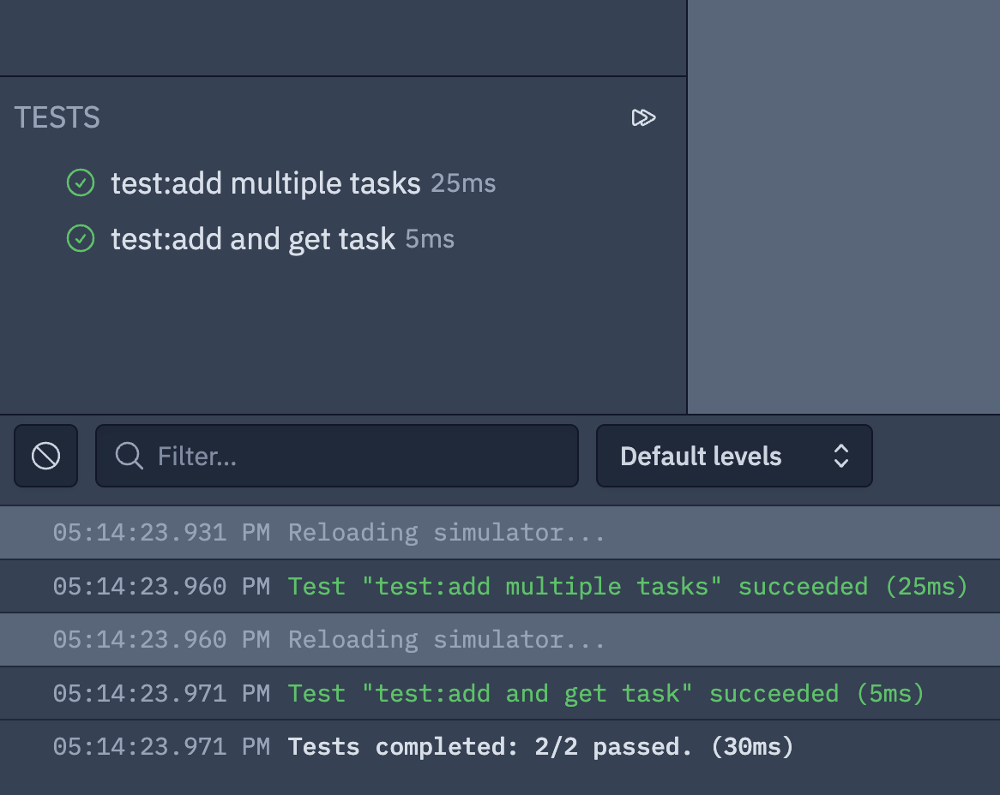

Hey everyone!

We're delighted to share with you the third ever issue of the **Wing Inflight Magazine** 
([here's a link to our last issue if you missed it](https://docs.winglang.io/blog/2023/3/5/magazine-002)).

The **Inflight Magazine** is where you can stay up to date with [Wing Programming Language](https://winglang.io) developments, community events, and all things Wing. 

Have comments or questions about Wing? Hit us up at [@winglangio](https://twitter.com/winglangio) on Twitter
or leave a message in our [Slack](https://t.winglang.io/slack)!

> *This week's cloud computing joke...*
>
> **Q:** Why do serverless developers make terrible comedians?
>
> **A:** Because their jokes always end up with a cold start!

<!--truncate-->

## TL;DR

Here is a summary of the topics in today's issue:

* 🔍 [Check out the latest Wingly Update episode](#check-out-the-latest-wingly-update-episode) 
* 🏃‍♀️ [The first Wing hackathon (wingathon) has started](#the-first-wing-hackathon-has-started)
* 🚀 [New: Community support for AWS CDK target introduced](#community-support-for-aws-cdk-target-introduced)
* 🚀 [New: Extern functions](#extern-functions---call-out-to-javascript-straight-from-wing) - call out to JavaScript straight from Wing
* 🤿 [Deep dive: Test in the cloud and in the Wing Console](#test-in-the-cloud-and-in-the-wing-console)
* 🚀 [New: SDK resources and methods](#new-sdk-resources-and-methods) - Table, Api, Redis, Bucket events
* 🗣️ [Thanks to our contributors](#thanking-our-contributors) - fixes and enhancements for for-loop sequences, queue timeouts, and more

## TS;GMM (too short; give me more)

### Check out the latest Wingly Update episode

**The Wingly Update** is our biweekly show where we stream to Twitch, share the latest developments of the project, and just make a bunch of fools of ourselves.

In our last show (ADD LINK), [Eyal](https://www.linkedin.com/in/eyal-keren-b23b7231/) hosted [Shai](https://www.linkedin.com/in/shai-ber-245b1226/), [Elad](https://www.linkedin.com/in/hackingonstuff/), [Mark the DJ](https://www.linkedin.com/in/mark-mcculloh/), and a special guest, [Eric Johnson](https://twitter.com/edjgeek), who is an AWS developer advocate and Wing enthusiast.

Here are some of the topics we covered:

- Defining API endpoints in Wing
- Introducing the Redis resource
- Running tests in the cloud
- Q&A with Eric Johnson about serverless and Wing

If you didn’t get a chance to catch it live, you can tune in here (ADD LINK) and check out our next shows on [Twitch](https://www.twitch.tv/winglangio).

### The first Wing hackathon has started

We're excited to announce that our first hackathon, known as the **wingathon**, has started!
The schedule of the hackathon is as follows:

- Thursday, April 13th - kick-off and apps presentation by the sub-teams
- Tuesday, April 18th - first check in
- Thursday, April 20th - second check in
- Thursday, April 27th - apps presentations

The goal of this hackathon is to push the boundaries of creativity and innovation by using **Wing and its existing surface area** to create a working system that is ready for actual use.
You should also be able to use any AWS resource in your Wing application through `bring "@cdktf/provider-aws"` (However, we still don’t have a great way for you to define how this behaves in the simulator). We want to challenge our team to think outside the box and come up with unique solutions to real-world problems using Wing's capabilities.

The hackathon is taking place around the world, and everyone is invited to participate at their capacity. And **don't say you didn't know** -- there will be prizes awarded for the coolest apps, so make sure you bring your A-game and show us what you got!

For more details, join us in the **#wingathon-1** channel in our [Slack](https://t.winglang.io/slack). There's still time to join the fun!

### Community support for AWS CDK target introduced

Thanks to the efforts of [Marcio](https://www.linkedin.com/in/marcio-almeida-25891669/), we now have community support for the AWS CDK target in Wing! This means you run `wing compile --target=awscdk` and get a CDK application that you can deploy to AWS using CloudFormation. Here's an example of a Wing app that uses the AWS CDK target:

```js
bring cloud;
bring "aws-cdk-lib" as aws;

let queue = new cloud.Queue();
let bucket = new cloud.Bucket();

queue.add_consumer(inflight (message: str) => {
  bucket.put("latest_message.txt", message);
});

let func = new cloud.Function(inflight () => {
  queue.push("hello world!");
});

let table = new aws.aws_dynamodb.Table();
```

As you can see, several resources from our batteries-included SDK are available in the AWS CDK target. Whenever you use these resources, your app can be deployed **both** to AWS using CloudFormation or to the Wing simulator.

Since we are compiling to AWS CDK, we are also able to use any constructs from `aws-cdk-lib` directly in Wing.
Since these imported resources don't know anything about Wing's "inflights", IAM permissions for these resources can't be inferred automatically by the compiler, and they can't do a thing in the Wing simulator.
But it's still possible to define permissions explicitly using AWS CDK APIs, and in the future we're planning to add mechanisms to specify how foreign resources behave in the simulator.

Try it out and let us know what you think! Huge thanks again to [Marcio](https://www.linkedin.com/in/marcio-almeida-25891669/) for adding support for this feature!

### Extern functions - call out to JavaScript straight from Wing

A common ask from developers we talk to (and our own team) has been -- if Wing is able to compile applications down to JavaScript (and it is!), how can we reuse existing JavaScript code and libraries in Wing apps?

The answer is **extern functions**. Extern functions let you specify a function is not implemented in Wing, but by a piece of external JavaScript. Here's an example - let's say we have a file called `helpers.js` that contains the following code that generates unique IDs for us:

```js
const uuid = require("uuid");

exports.make_id = async function() {
    return uuid.v4();
}
```

(In order for this to work, you'll also need to run `npm install uuid` in the same directory as `helpers.js`).

We can then use this function in our Wing app as if it were a regular Wing function:

```js
bring cloud;

resource Utils {
  init() {}
  // define the extern function here...
  extern "./helpers.js" inflight make_id(): str;
}

let bucket = new cloud.Bucket();
let utils = new Utils();

new cloud.Function(inflight () => {
  // ...and use it inflight here
  let id = utils.make_id();
  bucket.put(id, "hello world!");
}) as "test";
```

If you simulate the app locally using the Wing Console, your development machine will call the `make_id` function in `helpers.js` and use the copy of `uuid` you already have installed when simulating `cloud.Function`.

But if you compile the app to the `tf-aws` target, Wing will bundle all of your code -- including the `uuid` dependency -- into a single AWS Lambda function, so that the code will work the same way in the cloud as it does in the simulator.

Extern code is necessarily unsafe -- Wing can't guarantee the function will behave the same way in the simulator as it does in the cloud.
But we think it will be possible to create safe and reusable abstractions around extern functions in Wing, and we're excited to see what you build with it!

### Test in the cloud and in the Wing Console

Preventing bugs is one of the most important parts of writing production-quality code.
That's why Wing has a built-in simulator that lets you test your app locally before deploying it to the cloud.
We think this is a great way to **stay in the flow** while iterating on your code.

But beyond that, we know it's important to be able to test your app in the cloud as well.
After all, how do you know for sure that your app doesn't hit against some AWS service limit, or that it doesn't have a bug that only manifests itself in the cloud?

That's why Wing has a built-in testing mechanism, that we've expanded to support testing your app in the cloud as well.
Let's first recap how unit tests work in Wing. Here's a demo app I've written that manages a list of tasks using a bucket and counter:

```js
// task_list.w
bring cloud;

resource TaskList {
  data: cloud.Bucket;
  counter: cloud.Counter;
  init() {
    this.data = new cloud.Bucket();
    this.counter = new cloud.Counter();
  }

  inflight add_task(title: str): str {
    let id = "task-${this.counter.inc()}";
    this.data.put(id, title);
    return id;
  }

  inflight get_task(id: str): str {
    let title = this.data.get(id);
    return title;
  }
}
```

To write tests for this app, we can simply create new `cloud.Function`'s whose **resource id's start with `test` or `test:`**

```js
// task_list.w (extended)
let task_list = new TaskList();

new cloud.Function(inflight () => {
  let id1 = task_list.add_task("get avocados");
  let id2 = task_list.add_task("walk my cat");
  assert(id1 != id2);
}) as "test:add multiple tasks";

new cloud.Function(inflight () => {
  let id = task_list.add_task("buy a new hat");
  let result = task_list.get_task(id);
  assert(result == "buy a new hat");
}) as "test:add and get task";
```

Thanks to recent work by our amazing console team, if we open the [Wing Console](https://docs.winglang.io/getting-started/installation#wing-console) with `wing it task_list.w`, we're now able to run the tests against the Wing simulator using the new testing panel:

Before running             |  After running
:-------------------------:|:-------------------------:
  |  

> *By the way, did we mention the Wing Console now has a dark mode? 🌙*

But we can also run the tests in the cloud by using the `--target` flag on the `wing test` CLI command. For example, to run the tests in AWS, we can run `wing test --target tf-aws task_list.w`:

```bash
$ wing test -t tf-aws hello.w
✔ Compiling to tf-aws...
✔ terraform init
✔ terraform apply
✔ Setting up test runner...
✔ Running tests...
pass ─ hello.tfaws » root/Default/env0/test:add multiple tasks
pass ─ hello.tfaws » root/Default/env1/test:add and get task  
✔ terraform destroy
```

How cool is that? Now you can test your app in the cloud as well as in the simulator, all from the comfort of your terminal.

There is still a lot of work ahead of us - so far we only support cloud tests on AWS, so we would like to support more cloud providers. But we would like to make it easier to view logs from your tests, and to debug your app when tests fail. We're excited to see what you build with this new feature!

### New SDK resources and methods

Wing's standard library of resources is rapidly growing!
Here are the latest additions:

#### `cloud.Api`

This is your bread-and-butter API gateway resource that lets you create HTTP endpoints for your Wing app.
Endpoints are one of the easiest ways to expose your Wing app to the outside world, and they are also a great way to test your app locally using the Wing Console.
You can define routes and methods, and each route can have a handler function that will be called when a request is received. Here's an example:

```js
bring cloud;

let api = new cloud.Api();
api.get("/hello", inflight (req: cloud.ApiRequest): cloud.ApiResponse => {
  return cloud.ApiResponse {
    body: Json { message: "Hello, world!" },
    status: 200,
  };
});
```

The API resource highlights our design philosophy of making it easy to write code that works both in the cloud and in the simulator, through the use of cloud-agnostic APIs.

So far we've added support for this resource on both the `tf-aws` and `sim` targets.
When you compile to AWS, this will produce an AWS API Gateway that exposes the endpoints on the public internet -- and when you compile to the simulator, you'll get a local HTTP server that you can interact with using the Wing Console, or any other HTTP client like `curl` or Postman.

Check out our [API Reference](https://docs.winglang.io/reference/sdk#api-) for more details (docs with examples coming soon), and give us a +1 on any of these issues if you would like support for `cloud.Api` on [GCP](https://github.com/winglang/wing/issues/624), [Azure](https://github.com/winglang/wing/issues/625), or if you'd like to see a dedicated [`cloud.GraphQL` resource](https://github.com/winglang/wing/issues/2155)!

#### `cloud.Bucket` events

Acting on events is a great way to build reactive applications that leverage the cloud's scalability.

Wing's `cloud.Bucket` resource now supports the following events that allow you to run an inflight function when a certain event occurs:

* `on_create` - triggered when a new object is added to the bucket
* `on_delete` - triggered when an object is deleted from the bucket
* `on_update` - triggered when an object is updated in the bucket
* `on_event` - triggered when any of the above events occur

Here's an example of how you can use these events to count the number of objects added to a bucket, and expose that count through an API endpoint:

```js
bring cloud;

let bucket = new cloud.Bucket();
let counter = new cloud.Counter();

bucket.on_create(inflight (key: str) => {
  log(key);
  counter.inc();
});

let api = new cloud.Api();
api.get("/count", inflight (req: cloud.ApiRequest): cloud.ApiResponse => {
  return cloud.ApiResponse {
    body: Json { objects_added: counter.peek() },
    status: 200,
  };
});
```

#### Potpourri of new resources and methods

We've got too many new resources and additions to list them all here, but here are some of the highlights:

- `cloud.Table` - a NoSQL table that can be used to statefully manage structured information supports basic CRUD operations. Only supported on the `tf-aws` target right now. (Note: as databases are hard to abstract, this resource is highly experimental right now and is likely to change in the future.)
- `cloud.Secret` - a key-value store that can be used to store sensitive information like passwords and API keys. Currently supported on the `sim` and `tf-aws` targets.
- `redis.Redis` - a Redis instance that can be used to store unstructured data. Currently supports on the `sim` and `tf-aws` targets. When you compile to AWS, this will create a Redis instance in Elasticache hosted in its own VPC, with a security group that only allows access from the VPC that your Wing app is running in. When you compile to the simulator, this resource will use Docker to run a local Redis instance.

Lastly, we also want to bring to everyone's attention that the built-in `print()` function is now named `log()`. This is a breaking change, but we think it's a meaningful one.

`print()` is a very common function name in programming languages, and we wanted to make it clearer that when you're writing an application where the cloud is your computer, `log()` has a specific intent that's distinct from emitting text to a [standard output](https://en.wikipedia.org/wiki/Standard_streams) stream.
For example, logs are often aggregated in a centralized logging service like [Datadog](https://www.datadoghq.com/) or [Papertrail](https://papertrailapp.com/), and there isn't a distinction between logging with or without a newline in the cloud.

But we also acknowledge that naming things is ***hard***! So if you have any thoughts on this, please let us know!

### Thanking our contributors

We appreciate everyone who has contributed fixes, features, and documentation to Wing since the last issue:
[@Raphael Manke](https://github.com/winglang/wing/pull/1285),
[@Marcio Cruz](https://github.com/winglang/wing/pull/1763),
[@Jake Page](https://github.com/winglang/wing/pull/1773),
[@Yariv Levy](https://github.com/winglang/wing/pull/1775),
[@EJ Wang](https://github.com/winglang/wing/pull/1840),
[@davidnx](https://github.com/winglang/wing/pull/1990),
and
[@Fynn Flügge](https://github.com/winglang/wing/pull/2009).

## Summary

As usual, we can't wait for you to hop on board our adventure to transform the cloud into the ultimate software-building playground.
You'll find us regularly mingling on [Slack](https://t.winglang.io/slack), so feel free to introduce yourself, and if you haven't yet, give [winglang.io](https://winglang.io) a visit and take Wing out for a spin.

See you in our next flight!
