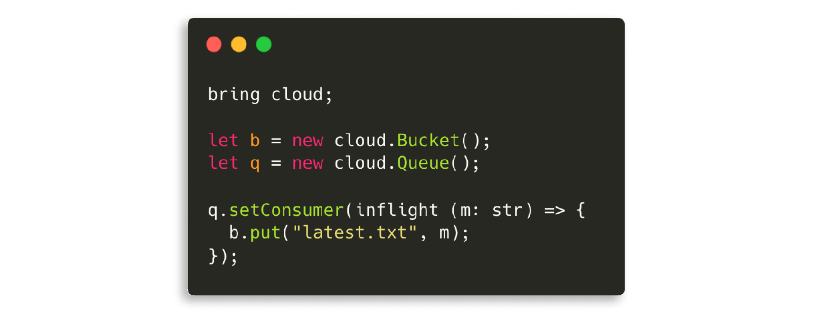
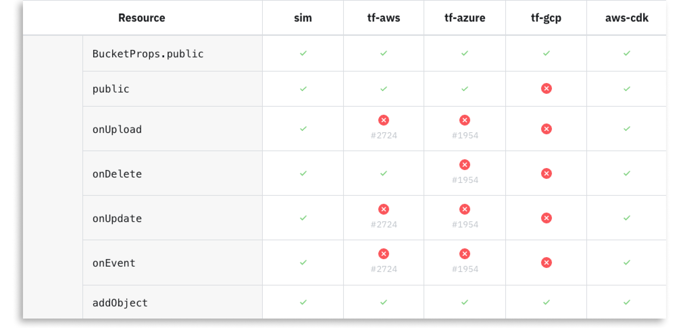

> We share our vision for [Wing Cloud](https://wing.cloud), a unified programming and operational
> experience that works across all cloud providers and services.

<!--truncate-->

All comedowns are painful, and it seems like our come down from the cloud's [hype
curve](https://en.wikipedia.org/wiki/Gartner_hype_cycle) is no different. When
[@dhh](https://twitter.com/dhh) writes about ["Why we're leaving the
cloud"](https://world.hey.com/dhh/why-we-re-leaving-the-cloud-654b47e0) and Prime Video are
[mourning the unexpected costs of
serverless](https://www.primevideotech.com/video-streaming/scaling-up-the-prime-video-audio-video-monitoring-service-and-reducing-costs-by-90),
it's not easy to read, especially for a cloud believer like myself.

And even if companies are not stocking up on server racks, there's a strong sentiment of compromise.
The complexity is overwhelming and teams are struggling to set up reasonable development
environments, test their systems or deploy them across multiple public providers or private clouds. 

I don't think I've ever talked to a platform team that feels like they got it right, or to a DevOps
engineer that didn't feel they are a bottleneck. I hear frustration and apologies "I know this is
not ideal, but we've got to give developers a way to develop". When I talk to enterprises, many of
them are in "analysis paralysis." Which cloud provider do we sell our souls to? Are we a serverless
shop or a Kubernetes shop? Do we now need to teach all developers how to configure a VPC?

When I talk to Kubernetes shops, I hear denial. It usually starts with "everything is in our
Kubernetes", and then, "Oh, yes, we have these couple of queues, and a CDN, and a DynamoDB table,
and a few Lambda functions, and just last week, the dev team needed a bucket for something, which
reminds me, we only provisioned the staging one, but not the one in production".

On the outset, the idea of the cloud makes total economic sense. It's the classic
total-cost/buy-versus-build enabler. You step into a huge candy store and pick-and-choose the
building blocks for your application. All these managed services at the palm of your hand, so you
can focus on creating value to your users.

But in reality, transferring aspects of your application to cloud services also means that now these
aspects move from the category of "application" and become "infrastructure". In practice, it means
that your code now treats these services as external entities, and managing them happens in separate
tools, workflows, and oftentimes, in separate teams.

So now, in order to add a route to my API gateway, I need to submit a ticket, or I have to update
some YAML in some repo that I don't fully understand. And now, I can only test this change when my
code reaches the shared staging environment? That's not good.

So how can we realize the potential of the cloud, but also not be buried by its complexity? As a
software developer, I'm sorry but I would have to say *abstractions*.

One of my favorite historians, [Yuval Noah-Harari](https://en.wikipedia.org/wiki/Yuval_Noah_Harari)
talks about how language’s ability to abstract and assign meaning enabled humans to establish common
understandings and cooperative behaviors. Abstractions in software are no different.

We believe that with the right abstractions, the cloud can fulfill its true potential. We believe it
is possible to establish a better model for building and operating software on top of this powerful
computing platform by establishing new common understandings and better collaboration within
engineering organizations.

### Introducing Wing Cloud

We call this new abstraction [Wing Cloud](https://wing.cloud), and we are excited to share that
we've partnered with an amazing group of investors such as [Battery
Ventures](https://www.battery.com), [Grove Ventures](https://www.grovevc.com) and [StageOne
Ventures](https://stageonevc.com/), as well as an incredible crew of [funds and
angels](https://wing.cloud/about#backed-by) from across the industry on the journey to turn this
idea into a reality.

**So what is Wing Cloud?** It is a new kind of *abstract cloud*. It doesn’t involve data centers,
machines, or provisioning engines. Instead, it’s a layer that enables builders to harness this
general-purpose computing platform through a programming and operational model that unifies both
infrastructure and application, and works across all cloud providers and services. It celebrates the
choice and flexibility the cloud has to offer without compromising the developer experience and
engineering practices.

So, what does that look like in practice? Our vision for Wing Cloud consists of three main
components:

 * **Winglang** - A programming language for the cloud which unifies infrastructure and runtime code
   under a single model.
 * **Wing Cloud Library** - A high-level SDK for writing cloud applications that can be deployed to
   all providers and run locally in a simulator
 * **Wing Console** - A visual application-centric operations and management console.
 * **Wing Developer Tools** - A set of tools for testing, debugging, visualizing and interacting
   with cloud applications locally.

### Why are we building a programming language?

The [Wing Programming Language](https://winglang.io) (*winglang*) enables developers to write code
that includes both infrastructure and runtime code. This means that when a cloud resource is needed,
I can just add it to my code and interact with it in the same way I would interact with in-memory
objects in traditional languages. The compiler takes care of the mechanics required to provision the
resource, configure the minimal IAM permissions and wire up the infrastructure configuration so your
code can interact with this resource at runtime.

 
A little piece of cloud

You might be wondering why this couldn't be implemented as a library within an existing language.
This is because existing languages don't have primitives that can naturally express the distributed
nature of cloud applications. To support this, Winglang has two execution phases: *preflight* and
*inflight*. The preflight phase defines your application's infrastructure while the inflight phase
defines its runtime behavior.

Winglang's two-phase execution model follows the long and honorable list of programming language
innovation which deals with concurrency and parallelism. From
[`fork()`](https://en.wikipedia.org/wiki/Fork_(system_call)) to multi-threading, to
[Goroutines](https://go.dev/tour/concurrency/1) to
[async/await](https://en.wikipedia.org/wiki/Async/await), we have been exploring better ways to
express non-linear programming. 

For more details and examples about Wing's execution model, check out our doc topic about [preflight
and inflight](https://www.winglang.io/docs/concepts/inflights).

But preflights and inflights are just the tip of the iceberg in terms of what a language for the
cloud can offer. Think about API endpoints and clients, telemetry, metrics, alarms, data schemas. We
have plans to bake many of these capabilities into the language and the standard library so that
developers can truly focus on building their applications.

 

<iframe  src="https://www.youtube.com/embed/5_RhWwgGue0" title="YouTube video player" frameborder="0" allow="accelerometer; autoplay; clipboard-write; encrypted-media; gyroscope; picture-in-picture; web-share; fullscreen" allowfullscreen></iframe>

A quick introduction to Winglang

### A standard library for the cloud

The second piece of the puzzle is what we call the **Wing Cloud Library** (or WCL). This is a
library of classes that represent common resources for building cloud applications. You can think of
the WCL as a [standard library](https://en.wikipedia.org/wiki/Standard_library) for the cloud.
Similarly to how standard libraries in traditional languages abstract the operating system, WCL
abstracts cloud providers and services.

We believe the cloud has finally matured to the point where it is possible to establish these
standard abstractions and that they will carry over successfully across public and private cloud
providers. Even with traditional standard libraries we didn't always have that level of abstraction.
When I started programming, I needed to know exactly which operating system, and even which file
system, I was using in order to write a file. Now, I can just call `writeFile()` and it will work
across all platforms. Other projects in the industry such as
[wasi-cloud-core](https://github.com/WebAssembly/wasi-cloud-core) have also reached a similar
conclusion.

The WCL is designed from the ground up to support multiple targets for each resource. Classes in the
library only define an abstract API, and it is possible to inject concrete implementations at
compile time. This powerful mechanism means that code written against these APIs is **portable
across cloud providers and provisioning engines**.

And of course, we think of WCL as the foundation for an ecosystem of cloud libraries. The
programming model is open and extensible and anyone will be able to publish libraries and implement
backends for existing resources based on the needs of their environment.

The WCL is a major project and in its early days. You can see the coverage of resources and targets
through this [compatibility
matrix](https://www.winglang.io/docs/standard-library/compatibility-matrix) and make sure to "+1"
the relevant GitHub issue if coverage is missing.

 

  
Resource compatibility matrix across providers

Currently, WCL only supports Winglang, but we are interested in offering it in other languages as
well. The library is built using CDK technologies such as [JSII](https://github.com/aws/jsii) and
[constructs](https://github.com/aws/constructs), so technically it is possible to publish it to
other languages.

### Reducing iteration time from minutes to milliseconds

The #1 factor in developer productivity is the time it takes to perform a single iteration
(sometimes called the *inner dev loop* cycle). This is the time it takes to run my code and check
that it does what I expected it to do. 

The more an application leans on the cloud, the more this cycle is broken. If for every iteration, I
need to deploy my code to a personal cloud account, it means that a cycle takes multiple minutes
(depending on the resources I deploy). Then, having to switch to some other system to run my code
and trace the logs also increases this iteration time and breaks my development flow.

Some tools are trying to address this problem by "hot swapping" runtime code in the cloud, or by
proxying requests into my local machine so I can debug locally. But those solutions are only partial
as they only take care of the runtime code and not on the entire application. If something changes
in my infrastructure, I go back to waiting.

I personally believe that using real cloud resources for development iterations is never going to
get us to developer experience nirvana. This is because when we provision resources in the cloud, we
leverage their [control plane](https://en.wikipedia.org/wiki/Control_plane), which, by definition,
is not optimized for latency.

In Wing, thanks to the cloud abstraction layer, we are able to take a different approach. The same
mechanism we have for portability across clouds is used to implement a local cloud simulation target
for each resource in the WCL. This means that my entire Wing application can run in a local machine
and be functionally tested.

### Tests as first-class citizens

I love tests. I believe that tests are the most important asset a software team builds. My code can
be changed and refactored as much as I like as long as my tests capture the expectations from my
system and protect me from breaking them.

The reality of the cloud today is that it is almost impossible to write effective tests that cover
more than just the application code. And even then, I find myself having to mock out and stub all the
services my code depends on, which is a very painful experience.

With Wing, this can now change.

The fact we have a simulator means that it is now possible to **write unit tests** which not only
validate my runtime code, but also how this code is interacting with the infrastructure around it
and with other pieces of my system.

To that end, the Wing language, the SDK and the Wing Console all work together to offer first-class
support for [cloud testing](https://www.winglang.io/docs/concepts/tests).

Tests in Wing are multi-cloud by default and can all run in parallel because they use cloud
functions as their compute resource. Every test you write can be executed locally in the cloud
simulator and can also be deployed and executed across all supported cloud providers.

### Stack traces for the cloud

The last piece of our story is the **Wing Console**. It's a UI tool for interacting with cloud
applications. It displays a visual diagram of your application which shows the hierarchical
structure of your system as well as the relationships between resources. In the future, it will show
Open Telemetry events as the system is activated.

 
Manage complete applications, not just a bunch of resources

In the console, each resource also has a dedicated UI which can be used to interact with the
resource. You can invoke functions, push messages to the queue, download and upload files to a
bucket and even open a website. In the future, custom UIs can be created for any resource.

Today, Wing Console only supports local development. It is baked into the Wing CLI and VSCode
experience. To open it, just run `wing it` and it will just work with no additional setup needed. It
will also watch for any file changes, recompile and reload as needed. Batteries included.

**We are planning to offer Wing Console for production**. This means that users will be able to
connect to a deployed system and operate their production systems through Wing Console. 

We believe this addresses a major pain when operating cloud applications. Today, we manage
applications "from the bottom", i.e. from the resources up. I go to my cloud provider's
administration console and what I see is a bunch of low-level resources - queues or buckets or
functions. I don't see my application. I oftentimes also have to juggle to separate administrative
tools for services that are outside of my provider's platform.

Going back to my favorite Lego analogy: Think about a cloud application as this beautiful Lego
castle. I've finished building my castle, and now I want to open the main gate. I log into the
provider's console and I see a menu of Lego block types: all the reds, all the 4 piece blues, all
the flat surfaces, etc. My gate is built out of reds and blues and greens and a bunch of cables. But
I can't see a gate. I just see the building blocks from which it's constructed. How would I know
which blue piece to move and where in order to open the gate?

This is the experience we have today when we operate applications in the cloud. We get an alarm that
there are some errors from some Lambda function. How do we know which part of the system is
affected? Which team owns this part?

The solution, today, is dashboards. I have to manually craft these views to represent the mental
model of my system. I take the red and green and blue pieces and arrange them together under the
title "Gate", and now if there's an error, I can tell where it belongs.

The operational experience of Wing Console is based on Wing's preflight structure of the system.
Every resource or event can be *traced back* to the logical unit it belongs to, based on your source
code. This is basically the purpose of stack traces in traditional languages - an exception is
thrown and the stack trace helps me trace back from low-level to high-level so I can diagnose the
problem.

### Fully customizable below the abstraction

We are not naive to think that we can create an abstraction that will cover all use cases and
possible setups. In fact, Wing is designed from the ground up to *celebrate cloud choice and
diversity* and includes multiple levels of extensibility and customizability.

One dimension of extensibility is support for any resource from the IAC ecosystem of the target as
first-class citizens. For example, if you compile your code to a Terraform target, you can use any
resource in the [Terraform Registry](https://registry.terraform.io). If you compile to AWS
CDK/CloudFormation, you can use any [AWS CDK construct](https://docs.aws.amazon.com/cdk/api/v2/) or
construct library from the [Construct Hub](https://constructs.dev/). Naturally, if you use any of
these resources, they will only work when deploying to the cloud, but there is built-in support in
Wing for providing a local implementation for them.

Another dimension is what we call [Wing Compiler
Plugins](https://www.winglang.io/docs/tools/compiler-plugins). Those are hooks implemented through
JavaScript functions that can customize the output of the Wing compiler. These plugins are extremely
powerful and work **below the abstraction line**. This means that they can utilize capabilities that
are provider-specific, **enforce policies**, **apply compliance rules**, etc. We believe these
plugins can be used by platform and centralized cloud teams to enforce and apply common standards
within a company in a streamlined way for developers.

### We are just getting started

We believe in the cloud. We believe in its economic sense and in its diversity, flexibility and
choice. We believe we will be building stuff on the cloud for the foreseeable future, even with AI
around. We think our industry is ready for a model that transcends specific providers or technology
and gives builders the right tools to build.

We know it's a big journey, and we couldn't be more excited to partner with these incredible
investors, amazing team and the awesome community forming around this vision.

We are here to make the cloud a better place to build software.

**Welcome to Wing Cloud! :wave:**