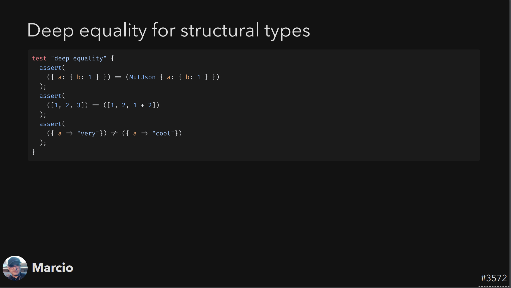
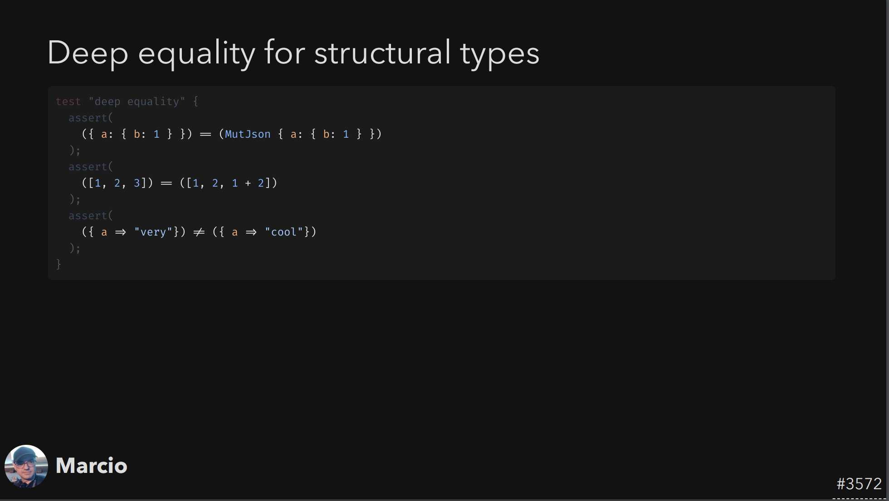
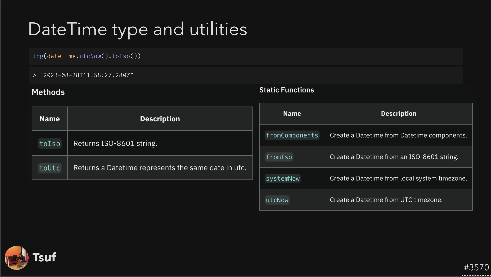
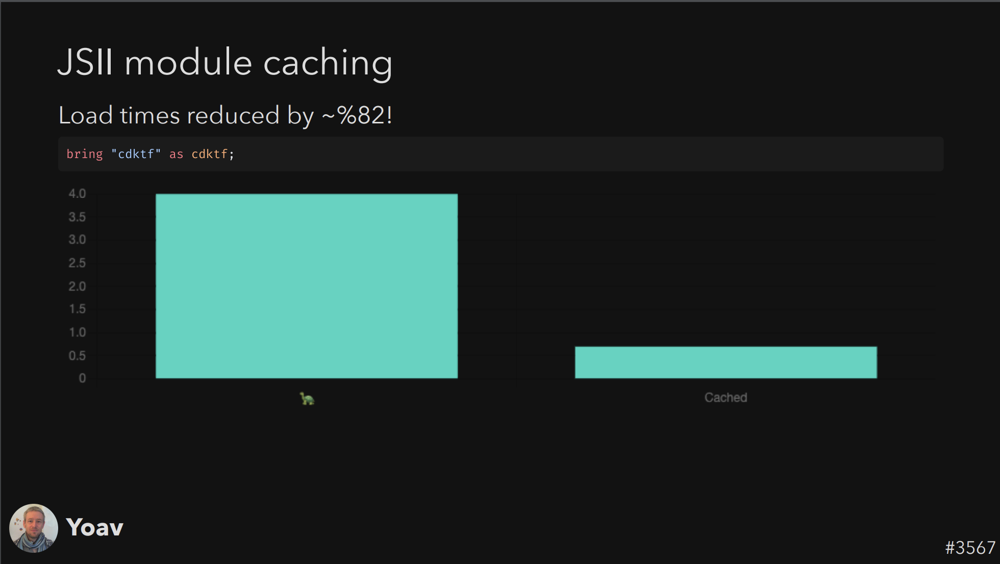
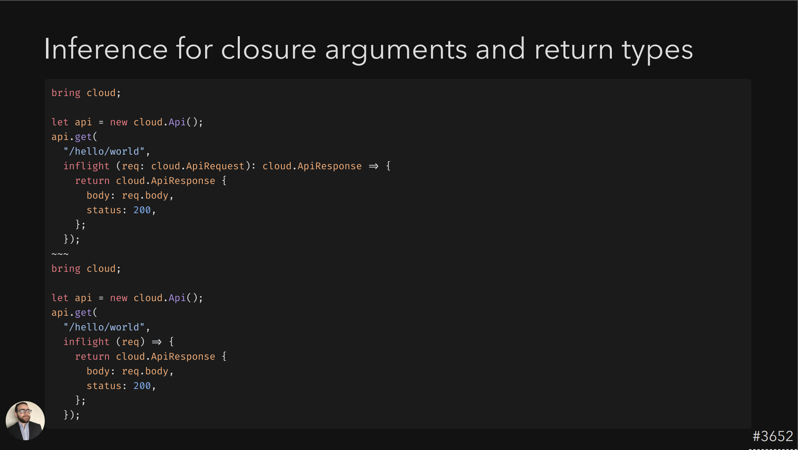

> The 4th issue of the Wing Inflight Magazine.
> <!--truncate-->

Hey everyone!

It’s been a while since we shared Wing updates. We’ve been hard at work, and to be honest, struggled to get into the groove of creating these emails.

Lately, we added a new segment to our weird little Twitch show called [The Wingly Update](https://www.youtube.com/playlist?list=PL-P8v-FRassZBWsNoSafL_ReO0JO0xJVm) where we share news about new features to Wing, so we decided to share the same updates here as well. Let us know what you think!

In this edition, we will be reviewing the following changes:

- 🚀 [New: Deep Equality for Structural Types](#deep-equality-for-structural-types)
- 🚀 [New: DateTime Type and Utilities](#datetime-type-and-utilities)
- 🔥 [Performance Optimization for JSII Loading](#performance-optimization-for-jsii-loading)
- 🚀 [New: Inferencing for Type Annotations](#inferencing-for-type-annotations)
- 🔍 [Switched Build Tooling to Turbo:](#switched-build-tooling-to-turbo)
- 🚀 [New: Multi-File Support:](#multi-file-support)
- 🚀 [New: Integrated Console in VSCode:](#integrated-console-in-vscode)

### Deep Equality for Structural Types:
❤️ Added by [Marcio Cruz](https://github.com/marciocadev) ❤️
From today, our suite of structural and collection types—arrays, maps, JSON, and structs—are now fully equipped to handle deep equality checks. This means that when you use the == operator, it’s no longer a shallow, reference-based comparison. It digs deeper, checking the actual content and structure of the objects in question.

This is an under-the-hood change that should make your code cleaner and your comparisons more precise. No more workarounds or lengthy utility functions to compare complex data structures deeply—they’re baked right in. When you use ==, you can now trust that it’s performing a complete, deep equality check.

### DateTime Type and Utilities:
❤️ Added by [Tsuf Cohen](https://github.com/tsuf239) ❤️
In our latest update, the DateTime Type along with its associated utilities and methods. Before this enhancement, our system primarily focused on durations. Now, we can offer comprehensive DateTime support, bridging a gap and providing users with a more complete toolset for their time-based operations. This new integration is set to make tasks involving date and time more intuitive and efficient.

### Performance Optimization for JSII Loading: 
❤️Added by [Yoav Steinberg](https://github.com/yoav-steinberg)❤️ 
We have also made a significant enhancement in the way we handle JSII libraries. Previously, we relied on a JSON format, which was somewhat sluggish, especially for larger JSII libraries. This shift to a binary format has actually slashed loading times. To put it in perspective, certain libraries that used to take about 4 seconds to load, now dazzle with a swift 700-millisecond loading time.

### Inferencing for Type Annotations

Taking a stride toward more intuitive coding, our latest update empowers the compiler with the ability to discern certain types, even without the developer spelling it out explicitly. This reduction in verbosity makes for cleaner code. Plans are already underway to further amplify this feature, aiming for even deeper implicit type understanding.

### Switched Build Tooling to Turbo: 

In an effort to accelerate our development processes, we transitioned from Nx to Turbo when for our monorepo build tooling and have noticed a surge in performance. Builds that previously had us waiting for 12 minutes, even with caching, have now been supercharged — they wrap up in a mere 2-3 minutes.

### Multi-File Support: 
❤️Added by [Chris Rybicki](https://github.com/Chriscbr)❤️
We’ve been working to enhance and improve Wing’s multi-file support and have just introduced the latest update. Despite an initial challenge that led to a rollback, the updated feature now integrates better with the language server, simplifying the management of multi-file projects.

<video autoplay muted loop>
  <source src="./assets/2023-08-30-magazine-004/multi-file-errors.mp4" type="video/mp4">
</video>

### Integrated Console in VSCode: 

We've improved the integration of the console within VSCode, moving beyond the basic iFramed version. This update offers developers better screen utilization. We're also working on further refinements for smoother integration in the future.

<video autoplay muted loop>
  <source src="https://github.com/winglang/wing/assets/5547636/0a787216-8c10-48d8-b42b-7d1020c85c9d" type="video/mp4">
</video>

### Summary
That’s a wrap for this update!

Thanks again to all our amazing contributors.

If you’re not already, make sure to keep following the latest additions in our repo.

You'll find us regularly mingling on Slack, so feel free to introduce yourself, and if you haven't yet, give winglang.io a visit and take Wing out for a spin.

See you next time!

