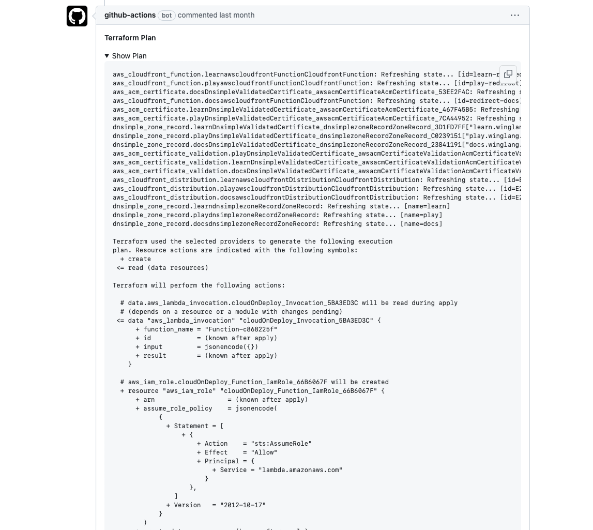

> Unlocking CI/CD with the Wing Github Action! 
> <!--truncate-->

Winglang is a specialized programming language designed for cloud applications. It smoothly integrates infrastructure and application code, enabling developers to optimize their workflow. This language translates into Infrastructure as Code (IaC) configurations, such as Terraform or CloudFormation, for cloud resources, and utilizes JavaScript for executing business logic. Importantly, neither Winglang nor its Command Line Interface (CLI) assume how users deploy applications using Terraform. For those utilizing GitHub, we've developed a dedicated Winglang GitHub Action.

GitHub Actions is a renowned automation platform within GitHub, facilitating developers in tailoring, executing, and automating their software development workflows directly within their repositories. From building and deploying applications to automating routine tasks like responding to issues, GitHub Actions enhances continuous integration and continuous deployment (CI/CD) by initiating workflows in reaction to specific events, including push and pull requests or defined schedules.

While developers have the autonomy to create a custom workflow integrating Winglang with GitHub Actions, the Wing GitHub Action is designed to be comprehensive and simplify the Wing and Terraform setup process. Our objective is to enable rapid deployment and introduce standardized deployment workflows.

### Wing Action

The [Wing Github Action](https://github.com/winglang/wing-github-action) enables two use-cases at the moment:

#### 1. Deployments

To begin, here is the basic configuration for deployments:

```yml
steps:
  - name: Deploy Winglang App
    uses: winglang/wing-github-action/actions/deploy@0.1.0
    with:
      entry: 'main.wing' # Required, replace this with your entry file if different
      target: 'tf-aws' # Required, the target to deploy to. e.g. tf-aws, tf-gcp, tf-azure
    env:
      TF_BACKEND_BUCKET: '<your-bucket-name>' # required
      TF_BACKEND_BUCKET_REGION: '<your-bucket-region>' #  required
```

This does exactly what you think it might do. It compiles the Wing application to Terraform and Javascript to eventually run a Terraform apply. Right now, a S3 bucket is the only [Terraform backend](https://www.winglang.io/docs/guides/terraform-backends) which is supported - however, there's an open issue to allow defining your own via Wing compiler plugins. Other than that, the action is fully self contained and includes all neccessary dependencies.

#### 2. Pull Request Diffs

The configuration for pull request diffs closely resembles the deployment setup, with the primary distinction being the `github-token``, necessary for posting comments on pull requests:

```yml
steps:
  - name: Pull Request Diff
    uses: winglang/wing-github-action/actions/pull-request-diff@main
    with:
      entry: 'main.wing' # Required, replace this with your entry file if different
      target: 'tf-aws' # Required, the target to deploy to. e.g. tf-aws, tf-gcp, tf-azure
      github-token: '' # Required, e.g. ${{ secrets.GITHUB_TOKEN }}
    env:
      TF_BACKEND_BUCKET: '<your-bucket-name>' # required
      TF_BACKEND_BUCKET_REGION: '<your-bucket-region>' #  required
```

Optimally, this functionality is used in conjunction with the deploy action. It presumes a state storage pattern based on the branch names of the git project. This configuration then generates a Terraform plan which the action captures, posting it as a comment on the triggering pull request.



#### Example

For a practical demonstration, explore the [Voting App](https://github.com/winglang/voting-app), which employs both the deployment and pull request diff actions.

### Conclusion

Make sure to check the [Winglang Docs](https://www.winglang.io/docs/guides/ci-cd#wing-github-action) for the Wing Github Action and custom Github workflows. Also, if you want to learn more about the implementation of those actions head over to the [wing-github-action](https://github.com/winglang/wing-github-action) repository. Contributions are highly encouraged!

As always, we welcome any feedback and would love to hear from you! Come join our
[community slack](https://t.winglang.io/slack) and share your thoughts on the Wing Github Action. As well check out and :star: our [Github repo](https://github.com/winglang/wing)
