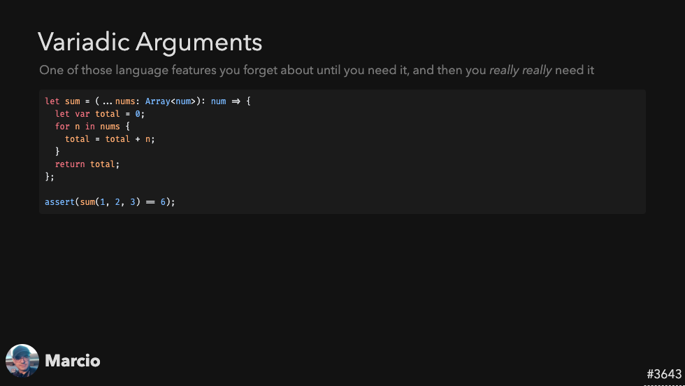
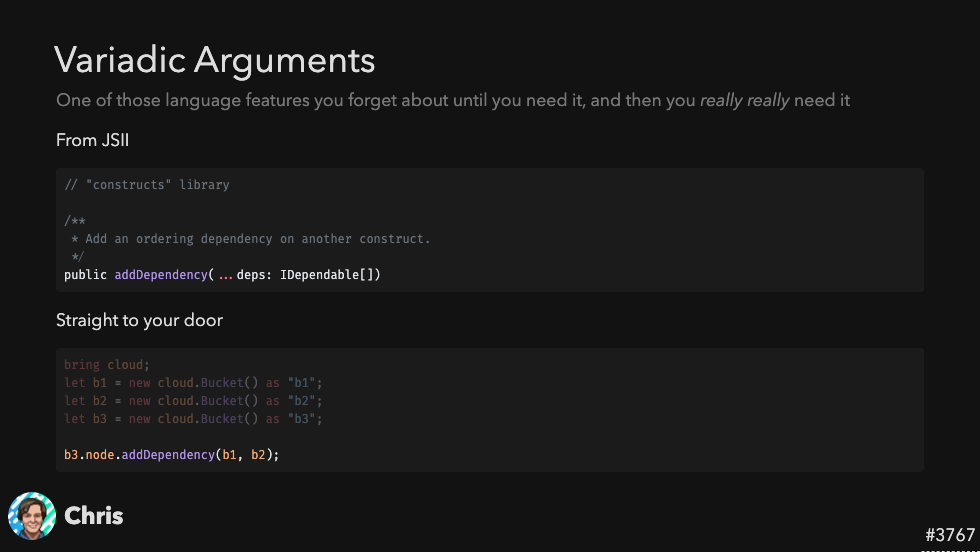
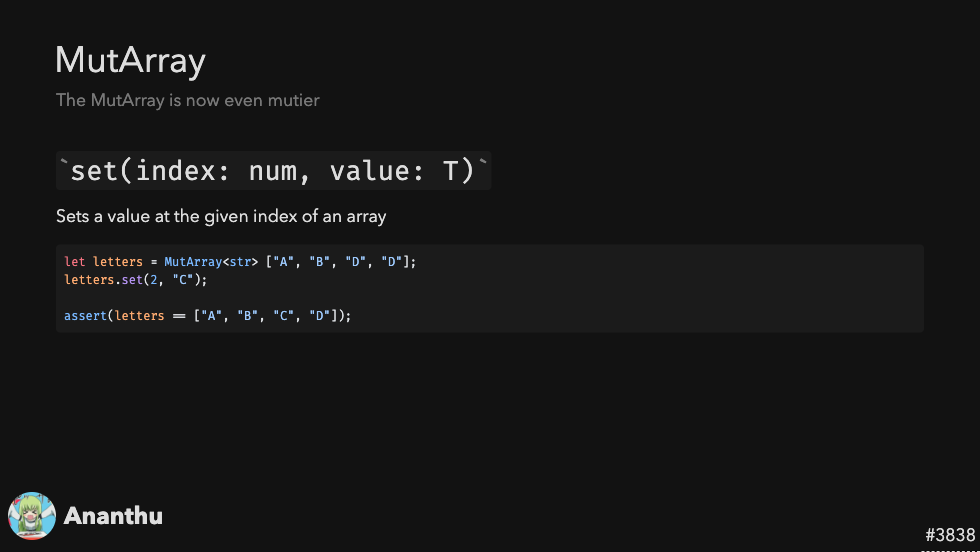
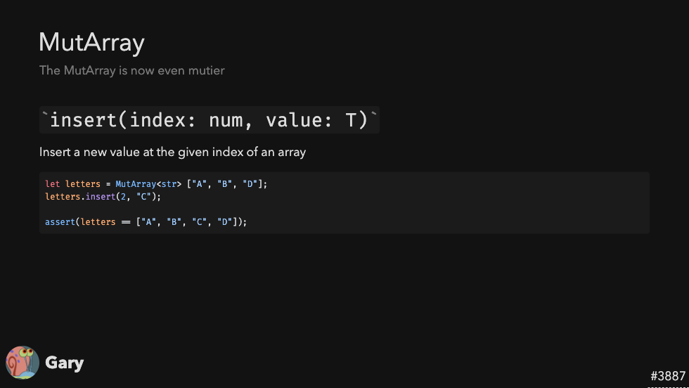
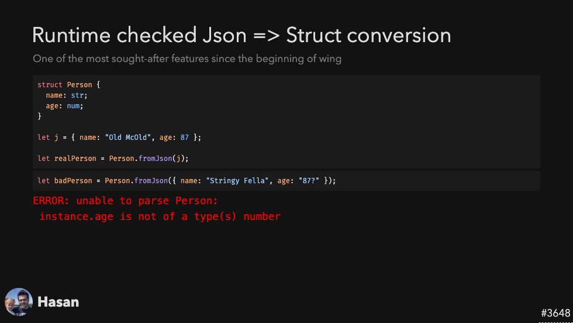
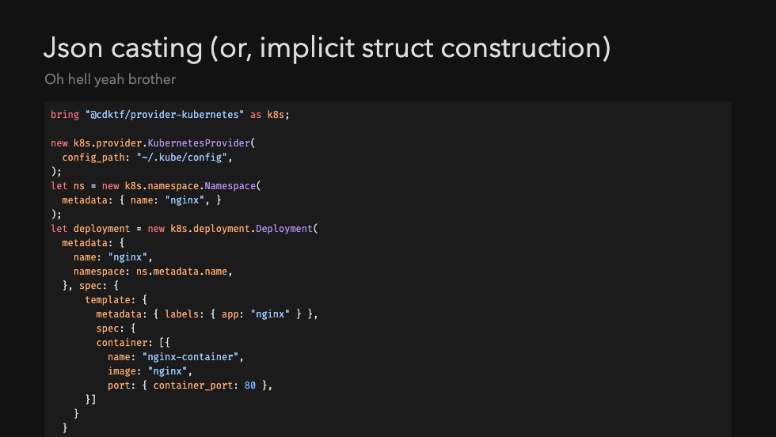
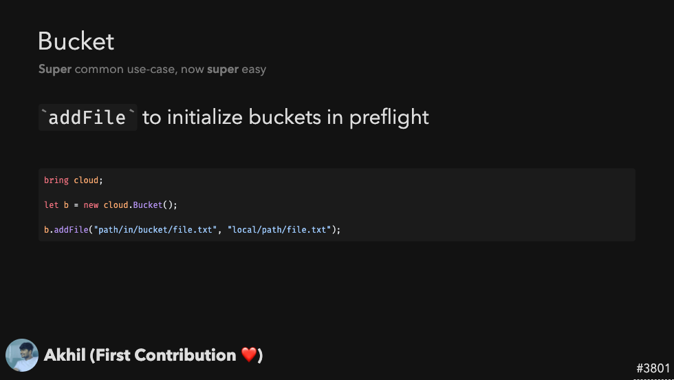

> The 5th issue of the Wing Inflight Magazine.
> <!--truncate-->

Hey folks!

We’re back with another issue of the Wing Inflight Magazine and excited to share some updates from our project.

- 🚀 [New: Variadic Arguments](#variadic-arguments)
- 🚀 [New: Added set API to `MutArray`](#added-set-api-to-mutarray)
- 🔥 [Runtime checked conversion of `Json` to struct](#runtime-checked-json)
- 🔥 [Implicit casting from `Json` to structs](#json-implicit-struct-casting)
- 🚀 [New: Added `addFile` API to `cloud.Bucket`](#added-addfile-api-to-bucket)
- 🚀 [New: Wing Libraries](#wing-libraries)
- 🔥 [Directory Modules](#directory-modules)
- 🚀 [New: `fs` module](#fs-namespace)
- 📅 [Upcoming Events](#upcoming-events)
- 🎥 [The Wingly Update](#the-wingly-update)

### Variadic Arguments
❤️ Added by [Marcio Cruz](https://github.com/marciocadev), [Chris Rybicki](https://github.com/Chriscbr), and [Lance Janssen](https://github.com/Lancear) ❤️

Wing now supports [variadic arguments](https://en.wikipedia.org/wiki/Variadic_function) for function type declarations. This feature is also extended to support JSII libraries, filling a gap that might have been a blocker for some users. Essentially, the addition provides full support for JSII libraries, expanding its usability.

### Added set API to `MutArray`
❤️ Added by [Gary Sassano](https://github.com/garysassano), [Ananthu C V](https://github.com/WeepingClown13) ❤️
New APIs have been added to MutArray, Winglang's mutable array object. The set API allows you to change an array value at a particular index, and insert allows inserting an element at a specific "tooth" (0-based index) position.

### Runtime checked `Json` 
❤️ Added by [Hasan Abu-Rayyan](https://github.com/hasanaburayyan) ❤️

Winglang now supports runtime checking for JSON objects. A fromJSON static method has been added to structs. This method allows you to take JSON data and convert it into a struct while doing runtime validation. If the JSON doesn't match the expected schema, a proper error message is generated.

### `Json` implicit struct casting
❤️ Added by [Mark McCulloh](https://github.com/MarkMcCulloh) ❤️

A new compiler feature allows for automatic "inference" or casting of JSON objects to structs, if the types match. This makes it easier to use JSON objects as structs and reduces the amount of type specification code you have to write. This feature also supports "structural typing type comparison."

### Added `addFile` API to `Bucket`
❤️ Added by [Akhil Narayandas](https://github.com/0018akhil) ❤️

A new API called addFile has been added to the bucket object. This is particularly useful in "preflight" scenarios (an internal term, apparently) and seems to be a commonly used feature. There's ongoing discussion about the behavior of file paths, specifically whether they're relative to the Wing file.

### Wing Libraries
❤️ Added by [Chris Rybicki](https://github.com/Chriscbr) ❤️

With the new subcommand 'wing pack' you can now package up your wing project as a library. This feature enables users to create an npm-compatible tarball that can be published and installed via npm. Even though the tarballs contain Wing files and are not strictly JSII libraries, they can be consumed in Wing in a similar fashion to other JSII libraries.

### Directory Modules

Another addition from Chris is the ability to bring in and access entire directories instead of just individual files. Now, within these directories, users can access types, subdirectories, and their contents. This enhancement not only aids in organizing projects within Winglang but also serves as a foundational step towards supporting Wing libraries.

### `fs` Namespace
❤️ Added by [Jade Zheng](https://github.com/jianzs) ❤️

Wing now has a comprehensive file system namespace. This namespace not only covers standard file operations but also integrates unique functions for reading and writing JSON and YAML. An awesome feature is the normalization of file paths: by default, all returned paths from these operations will use forward slashes, standardizing file paths across platforms. We believe this approach will provide consistency and ease for developers working in mixed platform environments.

### `wing test -t tf-aws` Now Runs During CI
❤️ Added by [Tsuf Cohen](https://github.com/tsuf239) ❤️

Wing's testing system has evolved. Initially, tests ran in a simulator, but to ensure local functionalities work seamlessly in the cloud, tests now also run in the cloud. Recently, tests were integrated to execute during the build phase, preventing any version disruptions in AWS. Additionally, maintainers can now trigger tests in Pull Requests, streamlining the validation of contributions against AWS. This advancement significantly enhances Wing's testing efficiency and reliability. 

### Upcoming Events

**🔥 Live Workshop - December 6th @4:30 - 6pm IST**
Get hands-on with Eyal as he walks us through the process of constructing a full-fledged React.js application with Winglang.
For more information and to register, [click here](https://www.eventbrite.com/e/winglang-react-workshop-tickets-754616256537?aff=oddtdtcreator).

### The Wingly Update
Have you heard about **[The Wingly Update](https://www.twitch.tv/winglangio)**? It's our biweekly show where we stream to Twitch, share the latest developments of the project, and just make a bunch of fools of ourselves. Mark your calendars and make sure to catch us live!

If you haven't been able to catch our show, don't fret! You can find the complete stack of [all our episodes here](https://youtube.com/playlist?list=PL-P8v-FRassZBWsNoSafL_ReO0JO0xJVm&si=trffVrtGGMUZ-SKb). 

You can check out some cool highlights from our show below!

- [How to Build Simulator Resources in Wing](https://youtu.be/wJVT1DaH8lA): In this clip from The Wingly Update #21, Elad walks through building resources in Winglang. Listen in to get some details on more advanced topics such as sim.State and tokens.
- [Winglang CHANGELOG Segment](https://youtu.be/AXQ-eIhpYto): In this clip from The Wingly Update #21, Mark walks us through the latest updates in Winglang, such as access modifiers for types, filtering tests, running multiple tests simultaneously with ‘awscdk’, testing and ‘inflight’ in Azure, and more!
- [How to Build and Test Container-based Apps in Wing](https://youtu.be/3kFcyzKt3MU): Containers are finally taking flight! In this video from The Wingly Update #20, Elad and Eyal are playing around with containers in Wing. They show how local simulation works with Docker and how apps can be seamlessly deployed to Kubernetes through Helm.
- [Winglang Meets Darko Mesaroš - AWS](https://youtu.be/KivcGZPIRB0): In this clip from The Wingly Update #19, Darko Mesaroš - an AWS Developer Advocate, joins the show. Tune in to hear about Darko’s background as a developer advocate, his hobby of collecting old computers and his ideas and suggestions for Wing. 

### Summary

And that’s a wrap for this edition!

If you’re not already, make sure to keep following the latest updates and changes in our [repo](https://github.com/winglang/wing).

You'll find us regularly mingling on [Slack](https://t.winglang.io/slack), so feel free to introduce yourself, and if you haven't yet, give winglang.io a visit and take Wing out for a spin.

See you next time!
