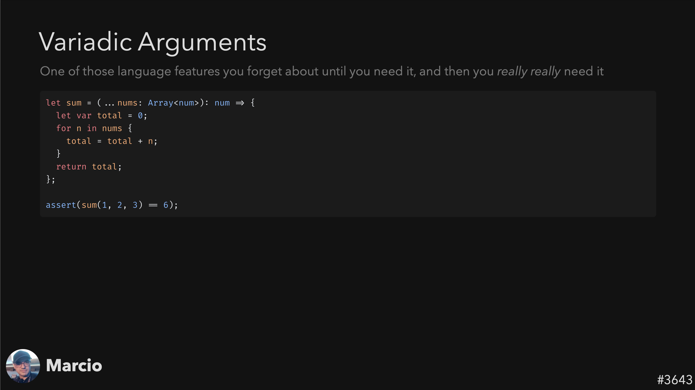
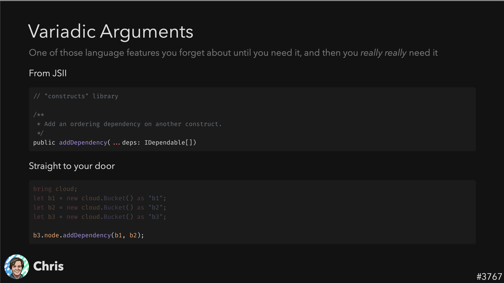
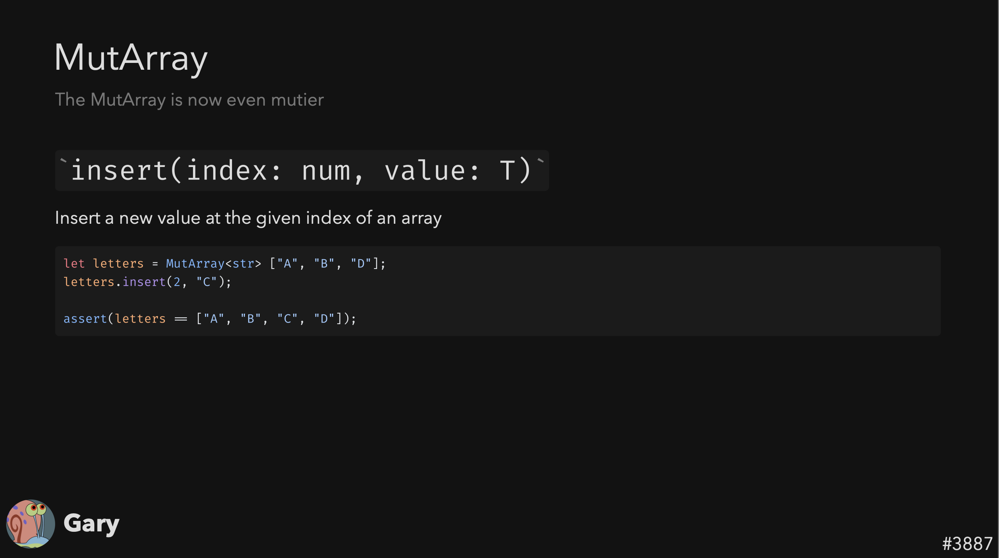
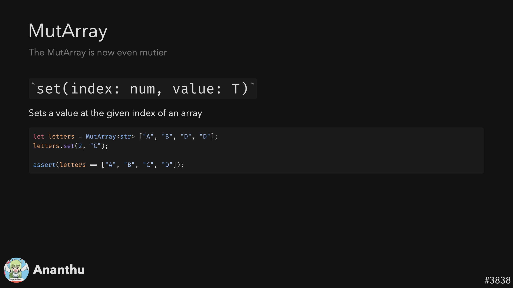
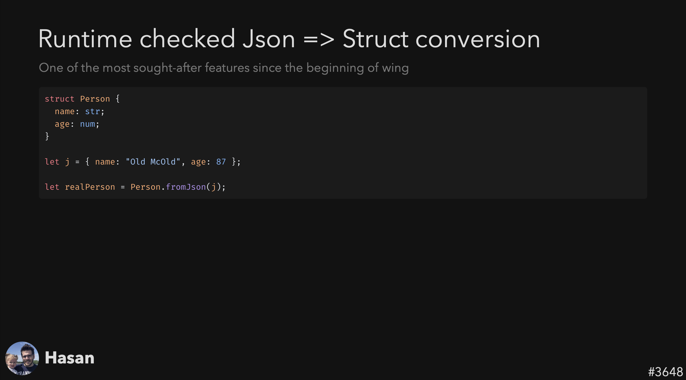
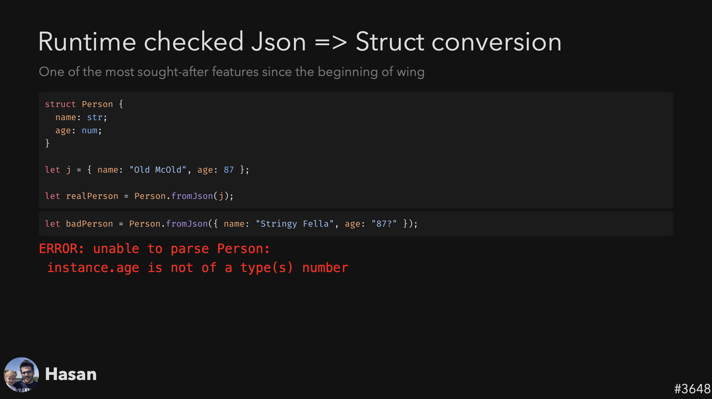
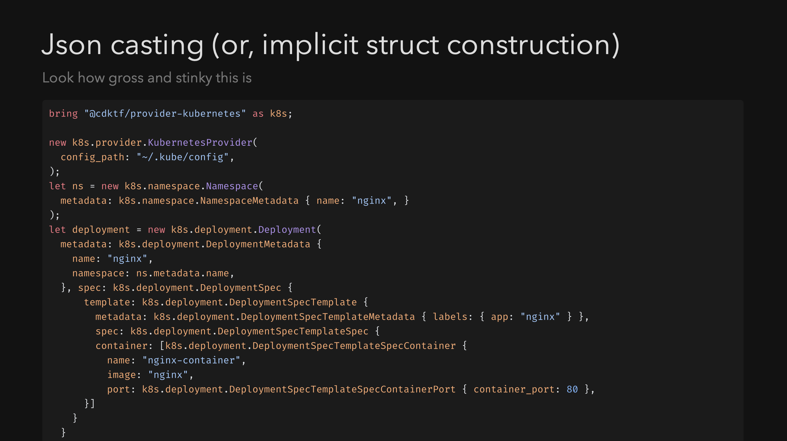
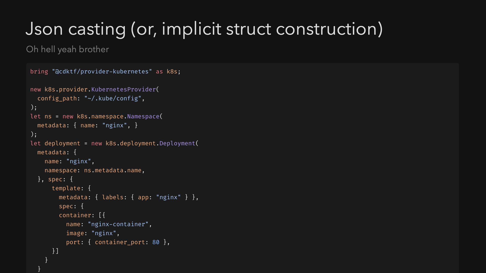
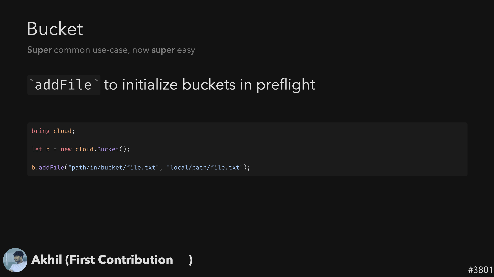

> The 5th issue of the Wing Inflight Magazine.
> <!--truncate-->

Hey folks!

We’re back with another overview of our CHANGELOG - a new segment in our quirky Twitch show called [The Wingly Update](https://www.youtube.com/playlist?list=PL-P8v-FRassZBWsNoSafL_ReO0JO0xJVm) where we share news about new features to Wing, so we decided to share the same updates here as well. Let us know what you think!

- 🚀 [New: Variadic Arguments](#variadic-arguments)
- 🚀 [New: Added set API to MutArray](#added-set-api-to-mutarray)
- 🔥 [Runtime checked Json => Struct conversion](#runtime-checked-json)
- 🔥 [Json implicit struct casting](#json-implicit-struct-casting)
- 🚀 [New: Added addFile API to Bucket](#added-addfile-api-to-bucket)
- 🔥 [Breaking Changes](#breaking-changes)
- 🔥 [New Features](#new-features)
- 📅 [Upcoming Events](#upcoming-events)

### Variadic Arguments
❤️ Added by [Marcio Cruz](https://github.com/marciocadev) & [Chris Rybicki](https://github.com/Chriscbr)  ❤️

Winglang now supports Variadic Arguments, both for declaring and consuming within the language itself. This feature is also extended to support JSII libraries, filling a gap that might have been a blocker for some users. Essentially, the addition provides full support for JSII libraries, expanding its usability.

### Added set API to MutArray
❤️ Added by [Gary Sassano](https://github.com/garysassano)  ❤️ & [Ananthu C V](https://github.com/WeepingClown13) 
New APIs have been added to MutArray, Winglang's mutable array object. The set API allows you to change an array value at a particular index, and insert allows inserting an element at a specific "tooth" (0-based index) position.

### Runtime checked Json 
❤️ Added by [Hasan Abu-Rayyan](https://github.com/hasanaburayyan) ❤️

Winglang now supports runtime checking for JSON objects. A fromJSON static method has been added to structs. This method allows you to take JSON data and convert it into a struct while doing runtime validation. If the JSON doesn't match the expected schema, a proper error message is generated.

### Json implicit struct casting
❤️ Added by [Mark McCulloh](https://github.com/MarkMcCulloh)  ❤️

A new compiler feature allows for automatic "inference" or casting of JSON objects to structs, if the types match. This makes it easier to use JSON objects as structs and reduces the amount of type specification code you have to write. This feature also supports "structural typing type comparison."

### Added addFile API to Bucket
❤️ Added by [Akhil Narayandas](https://github.com/0018akhil)  ❤️

A new API called addFile has been added to the bucket object. This is particularly useful in "preflight" scenarios (an internal term, apparently) and seems to be a commonly used feature. There's ongoing discussion about the behavior of file paths, specifically whether they're relative to the Wing file.

### Breaking Changes
We've had some excitng new breaking changes thanks to our wonderful contributers: [Uri Bar](https://github.com/staycool911) [Gary Sassano](https://github.com/garysassano),[Chris Rybicki](https://github.com/Chriscbr)

- Extern can only be used on static methods
- Removed panic built-in
- Json .get() and .getAt() can now throw
- Json.stringify() now uses keyword arguments for options

### New Features
- Added support for Regex
- Console preview environment for pull requests - A full wing console deployed for every PR!
- Console preserves form state inside resource interaction views
- Matching Themes in VSCode and Console: A UI enhancement ensures that the console within VSCode now matches the color scheme of the selected VSCode theme, going beyond just light and dark modes.

### Upcoming Events

- **🔥 October 26th, 2023 at 6:00 PM IDT: Cloud DevXChange — LocalStack x Winglang**  
Join us for an exciting virtual community event organised by [LocalStack](https://localstack.cloud/) and Winglang, to learn more about modern trends in cloud-native development & testing, unified programming model to combine infrastructure and application code, and modern developer toolings for a better dev&test experience. You can register [here](https://www.meetup.com/localstack-community/events/296353803/). 

- **🔥 October 4th, 2023 at 6:00 Pm IDT: Winglang Virtual Meet Up**  
In this meet-up, Winglang's senior software developers, Tsuf Cohen and Hasan Abu-Rayyan, will guide you through Winglang's core concepts, background, how it's constructed, and even showcase a couple live coding sessions. Make sure to save your seat [here](https://www.eventbrite.com/e/winglang-virtual-meet-up-tickets-721240368357?aff=oddtdtcreator)!

### Summary

And that’s a wrap for this edition!

If you’re not already, make sure to keep following the latest updates and changes in our [repo](https://github.com/winglang/wing).

You'll find us regularly mingling on [Slack](https://t.winglang.io/slack), so feel free to introduce yourself, and if you haven't yet, give winglang.io a visit and take Wing out for a spin.

See you next time!
