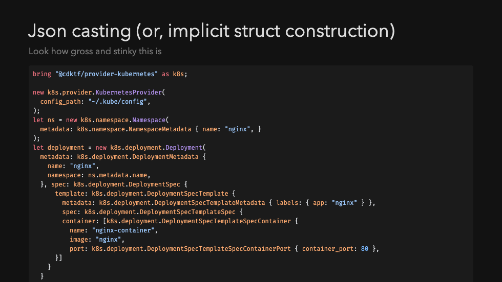

> The 5th issue of the Wing Inflight Magazine.
> <!--truncate-->

Hey folks!

We’re back with another overview of our CHANGELOG - a new segment in our quirky Twitch show called [The Wingly Update](https://www.youtube.com/playlist?list=PL-P8v-FRassZBWsNoSafL_ReO0JO0xJVm) where we share news about new features to Wing, so we decided to share the same updates here as well. Let us know what you think!

- 🚀 [New: Variadic Arguments](#variadic-arguments)
- 🚀 [New: Added set API to MutArray](#added-set-api-to-mutarray)
- 🔥 [Runtime checked Json => Struct conversion](#runtime-checked-json)
- 🔥 [Json implicit struct casting](#json-implicit-struct-casting)
- 🚀 [New: Added addFile API to Bucket](#added-addfile-api-to-bucket)
- 🚀 [New: Wing Libraries](#wing-libraries)
- 🔥 [Updated Directory Modules](#directory-modules)
- 🚀 [New: fs Namespace](#fs-namespace)
- 🔥 [Breaking Changes](#additional-breaking-changes)
- 🔥 [New Features](#additional-new-features)
- 📅 [Upcoming Events](#upcoming-events)

### Variadic Arguments
❤️ Added by [Marcio Cruz](https://github.com/marciocadev), [Chris Rybicki](https://github.com/Chriscbr), [Lance Janssen](https://github.com/Lancear) ❤️

Wing now supports variadic arguments for function type declarations. This feature is also extended to support JSII libraries, filling a gap that might have been a blocker for some users. Essentially, the addition provides full support for JSII libraries, expanding its usability.

### Added set API to MutArray
❤️ Added by [Gary Sassano](https://github.com/garysassano), [Ananthu C V](https://github.com/WeepingClown13) ❤️
New APIs have been added to MutArray, Winglang's mutable array object. The set API allows you to change an array value at a particular index, and insert allows inserting an element at a specific "tooth" (0-based index) position.

### Runtime checked Json 
❤️ Added by [Hasan Abu-Rayyan](https://github.com/hasanaburayyan) ❤️

Winglang now supports runtime checking for JSON objects. A fromJSON static method has been added to structs. This method allows you to take JSON data and convert it into a struct while doing runtime validation. If the JSON doesn't match the expected schema, a proper error message is generated.

### Json implicit struct casting
❤️ Added by [Mark McCulloh](https://github.com/MarkMcCulloh) ❤️

A new compiler feature allows for automatic "inference" or casting of JSON objects to structs, if the types match. This makes it easier to use JSON objects as structs and reduces the amount of type specification code you have to write. This feature also supports "structural typing type comparison."

### Added addFile API to Bucket
❤️ Added by [Akhil Narayandas](https://github.com/0018akhil) ❤️

A new API called addFile has been added to the bucket object. This is particularly useful in "preflight" scenarios (an internal term, apparently) and seems to be a commonly used feature. There's ongoing discussion about the behavior of file paths, specifically whether they're relative to the Wing file.

### Wing Libraries
❤️ Added by [Chris Rybicki](https://github.com/Chriscbr) ❤️

With the new subcommand 'wing pack' you can now package up your wing project as a library. This feature enables users to create an npm-compatible tarball that can be published and installed via npm. Even though the tarballs contain Wing files and are not strictly JSII libraries, they can be consumed in Wing in a similar fashion to other JSII libraries.

### Directory Modules

Another addition from Chris is the ability to bring in and access entire directories instead of just individual files. Now, within these directories, users can access types, subdirectories, and their contents. This enhancement not only aids in organizing projects within Winglang but also serves as a foundational step towards supporting Wing libraries.

### fs Namespace
❤️ Added by [Jade Zheng](https://github.com/jianzs) ❤️

Wing now has a comprehensive file system namespace. This namespace not only covers standard file operations but also integrates unique functions for reading and writing JSON and YAML. An awesome feature is the normalization of file paths: by default, all returned paths from these operations will use forward slashes, standardizing file paths across platforms. We believe this approach will provide consistency and ease for developers working in mixed platform environments.

### ` wing test -t tf-aws ` Now Runs During CI
❤️ Added by [Tsuf Cohen](https://github.com/tsuf239) ❤️

Wing's testing system has evolved. Initially, tests ran in a simulator, but to ensure local functionalities work seamlessly in the cloud, tests now also run in the cloud. Recently, tests were integrated to execute during the build phase, preventing any version disruptions in AWS. Additionally, maintainers can now trigger tests in Pull Requests, streamlining the validation of contributions against AWS. This advancement significantly enhances Wing's testing efficiency and reliability. 

### Additional Breaking Changes
We've had some excitng new breaking changes thanks to our wonderful contributers: [Uri Bar](https://github.com/staycool911) [Gary Sassano](https://github.com/garysassano),[Chris Rybicki](https://github.com/Chriscbr)

- Extern can only be used on static methods
- Removed panic built-in
- Json `.get()` and `.getAt()` can now throw
- Json `.stringify()` now uses keyword arguments for options

### Additional New Features
- Added support for Regex
- Console preview environment for pull requests - A full wing console deployed for every PR!
- Console preserves form state inside resource interaction views
- Matching Themes in VSCode and Console: A UI enhancement ensures that the console within VSCode now matches the color scheme of the selected VSCode theme, going beyond just light and dark modes.

### Upcoming Events

- **🔥 November, 6-9: KubeCon North America**
Join us at #KubeCon + #CloudNativeCon North America, Nov 6-9 in Chicago!
Our team is super excited to meet and talk with fellow adopters and technologists from leading open source and cloud native communities - Come say hi! We'll be at Booth P-39.

### Summary

And that’s a wrap for this edition!

If you’re not already, make sure to keep following the latest updates and changes in our [repo](https://github.com/winglang/wing).

You'll find us regularly mingling on [Slack](https://t.winglang.io/slack), so feel free to introduce yourself, and if you haven't yet, give winglang.io a visit and take Wing out for a spin.

See you next time!
