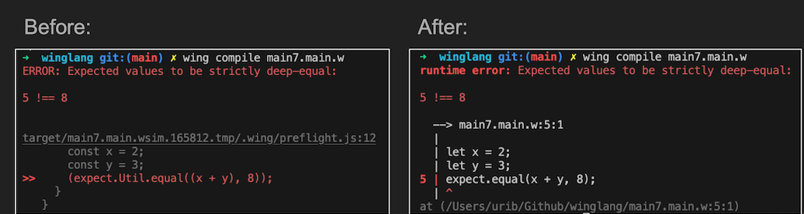

> The 6th issue of the Wing Inflight Magazine.
> <!--truncate-->

Hey folks!

We’re back with another issue of the **Wing Inflight Magazine** and we are excited to share some updates about [winglang](https://winglang.io).

- 🚀 [New: Platforms](#platforms)
- 🚀 [New: The Wingian Singleton Pattern](#the-wingian-singleton-pattern)
- 🔥 [Remove $ from String Interpolations Syntax](#remove--from-string-interpolations-syntax)
- 🔥 [Syntax update - `new` instead of `init`](#syntax-update---new-instead-of-init)
- 🔥 [http.fetch response body](#httpfetch-response-body)
- 🚀 [New: Down casting from `cloud` to `aws`](#down-casting-from-cloud-to-aws)
- 🚀 [New: Sourcemaps and Stacktraces](#sourcemaps-and-stacktraces)
- 📅 [Upcoming Events](#upcoming-events)
- 🎥 [The Wingly Update](#the-wingly-update)

### Platforms

When working with the Wing programming language, an integral part of the compilation process is the use of platform. In essence, platform specify how and where your application is deployed. They determine both the cloud environment and the provisioning engine that the code will be deployed with.
Wing is shipped with several built-in platforms: 
 - sim
 - tf-aws
 - tf-azure
 - tf-gcp
 - awscdk
Wing also has the concept of plugins, that can be explined as hooks into the compliation process to do various things to the tree structure that is created during preflight.
If you are using any Wing compiler plugins, you will now need to migrate them to become platforms.

Built-in platforms look the same as our previously supported targets:

```js
wing compile -t tf-aws
wing compile --platform tf-aws
```

A composition of platforms can be specified as well:

```js
wing compile --platform tf-aws --platform extra-stuff
```
In other words, no more targets or plugins, we will use the term platforms to describe both. Check out the [Plarforms doc](https://www.winglang.io/docs/concepts/platforms) for more details.

❤️ [Hasan Abu-Rayan](https://github.com/hasanaburayyan) ❤️

### The Wingian Singleton Pattern

If you want to create one instance of a resource thats the way to go!
We are now making it easy to access the root app from *every* node through `Node.of(this).app` or `Node.of(this).root`. Both return the same root app, even if it's not the absolute root of the tree. `tryFindChild(id)` is also added to the app to make it easier to implement app-level singletons!

A common use cases for singletons in Wing is to add a Terraform provider only once to the stack. Other examples could be a shared resource such as a VPC that all other resources can use.

Check this out:

```js

 class SingletonBucket {
   pub static of(scope: std.IResource): cloud.Bucket {
     let uid = "SingletonBucket";
     let root = std.Node.of(scope).root;
     return unsafeCast(root.tryFindChild(uid)) ?? new cloud.Bucket() as uid in root;
   }
 }

 let q1 = new cloud.Queue() as "q1";
 let store1 = SingletonBucket.of(q1);

 test "singleton" {
   store1.put("hello", "world");
 }
```

❤️ [Elad Ben-Israel](https://github.com/eladb) ❤️


### Remove `$` from string interpolation syntax

#### This one is a life changer :)
Before this change, we used the `$` for String interpolations, but not anymore! 
The motivation behind this one is *one less char to type*, more ergonomic and the `$` char had no practical use.  
In our context, we're using an expression inside the `string` interpolation so we need a start and end token (the curly braces) but anything else seems redundant.

This is a heck big of a deal! and it probably breaks a lot of Wing apps... but we believe its really worth it!

```js

let s1 = "hello";

// Before
let s2 = "${s1}, world";

// After
let s3 = "{s1}, world";

```

❤️ [Yoav Steinberg](https://github.com/yoav-steinberg) ❤️


### Syntax update - new instead of init

Constructor functions are now called `new()` instead of `init()`:

```js
pub class Nice {
  pub isNice: bool;
  new() {
    this.isNice = true
  }
}
```

This is another step toward simplicity: less syntax and keywords for the language! 


❤️ [Elad Ben-Israel](https://github.com/eladb) ❤️


### Http.Fetch response body 

We improved ergonomics when working with `http.fetch` responses so that `str?` is replaced with simply `str`:

```js
bring http;

test "wingly" {
  let response = http.fetch("someapi.org");
  Json.parse(response.body);
}
```

This is another step toward simplicity: less syntax and keywords for the language! 


❤️ [Chris Rybicki](https://github.com/Chriscbr) ❤️


### Down casting from `cloud` to `aws`

Winglang now supports a way to cast a Wing `cloud.Bucket` or any Wing resource into its AWS counterpart. This means that you can actualy grant access to the main AWS resources within Wing Resources.

```js

bring cloud;
bring aws;

let bucket = new cloud.Bucket();
if let b = aws.Bucket.from(bucket) {
  let bucketArn = b.bucketArn;
}

```

❤️ [Marcio Cruz](https://github.com/marciocadev) ❤️


### Sourcemaps and Stacktraces

This change adds sourcemap generation to the compiler. These sourcemaps are used for stacktrace rewriting in both preflight and inflight. 
Before this change, when testing code using the `expect` keyword, for instance the error message originated from JavaScript, as Wing compiles to JavaScript, and was not very clear and informative.
So, for the following error:

```js
bring expect;

let x = 2;
let y = 3;
expect.equal(x + y, 8);
```

You can see below the previous error message. With this change, you can now get a more informative and clear error message:


❤️ [Mark McCulloh](https://github.com/MarkMcCulloh) ❤️

And there's even more excitement waiting for you! Feel free to explore the [The 23rd Wingly Update](https://youtube.com/live/WlfOJM845rM) for an extra dose of information. Join in and enjoy!

### Upcoming Events

**🔥 Live Workshop - January 3rd @4:30 - 6pm IST**
Get hands-on with [Eyal Keren](https://github.com/ekeren) as he walks us through the process of constructing a full-fledged serverless workflow that ingests PDF files into one of Bedrock's supported foundation models, allowing you to query an AI agent and ask questions about the content of the file.
For more information and to register, [click here](https://www.eventbrite.com/e/amazon-bedrock-winglang-tickets-769562721817?aff=oddtdtcreator).

### The Wingly Update

**[The Wingly Update](https://www.twitch.tv/winglangio)** is our biweekly stream where we share the latest developments of the project, chat with folks from the cloud industry, geek out and celebrate the beauty of the cloud.

If you haven't been able to catch our show, you can find the complete stack of [all our episodes here](https://youtube.com/playlist?list=PL-P8v-FRassZBWsNoSafL_ReO0JO0xJVm&si=trffVrtGGMUZ-SKb). 

Here are a few segments from the show we thought might be interesting to check out:

- [The guest cornet with Ron Record](https://www.youtube.com/watch?v=i2ge8MNulqI): In this clip from The Wingly Update #23, [Elad](https://github.com/eladb) and [Eyal](https://github.com/ekeren) host [Ron](https://twitter.com/ronrecord) who is an open source developer for 30 years! In this video, Ron presents how he added two Wing workspaces registry with and without Neovim. These are Docker images designed for use with Kasm Workspaces, a container streaming platform that runs in your browser. 
- [Winglang CHANGELOG Segment](https://www.youtube.com/watch?v=XA1jtNaJBrc): In this clip from The Wingly Update #23, [Uri](https://github.com/staycoolcall911) walks us through the latest updates in Winglang, such as expression as a map key, a React application within Wing concole, and more!
- [Good first issue corner](https://www.youtube.com/watch?v=pS5BK18_7ys&t=1s): with [Revital](https://github.com/revitalbarletz)! In this clip from The Wingly Update #23, Revital and Eyal go through some of the Wing's `good first issues`, which provide an excellent starting point for contributors to become familiae with the Winglang framework.

### Winglang Community Meeting

**[The Winglang Community Meeting](https://meet.google.com/kcz-djtv-gvb?authuser=0&hs=122)** is our bi-weekly gathering where members of our community showcase cool apps, demos, and other projects! The upcoming session is scheduled for Tuesday, December 19th, at 2:30 PM UTC. We look forward to seeing you there!

**[Monday Office Hour with Revital](https://meet.google.com/spv-poiz-hpv)** is our bi-weekly opportunity for you to share your feedback, thoughts, concerns, or simply drop by to say hi.

You can find details for all our events in the [Wingnuts calendar](https://calendar.google.com/calendar/u/0?cid=Y18wZTljMGRkZjRiM2IyNzdmMmFlZTMzZjI2NDljYzNlMDAzMGE2OTI1NmRiNjQyNTk0YTc3YmFkZDhjNjc4YzQ4QGdyb3VwLmNhbGVuZGFyLmdvb2dsZS5jb20)!
We'd love to see you at one or all of them :)

### Summary

That's it for this edition!

If you're not already, stay updated on the latest changes in our [repo](https://github.com/winglang/wing).

You'll find us regularly on [Slack](join.slack.com/t/winglang/shared_invite/zt-23emj8uue-ZF4ijRNtdDOLO5F7iIz~NA), so feel free to say hello! Give [winglang.io](https://winglang.io) a visit and take Wing out for a spin.

Catch you in the next update! 
