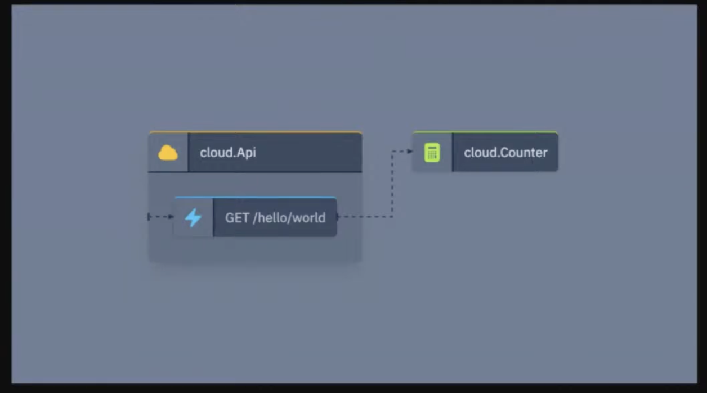
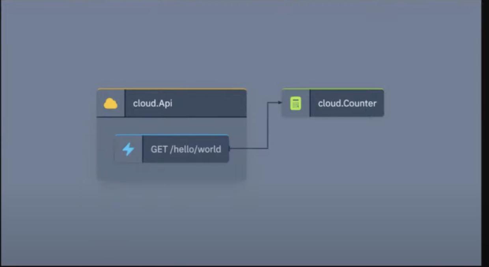

> The 7th issue of the Wing Inflight Magazine.
> <!--truncate-->

Hey folks!

We are back with another issue of the **Wing Inflight Magazine** and excited to share some updates
about the [Winglang](https://winglang.io) project.

***An open source programming language for the :cloud:***

Winglang combines infrastructure and runtime into a single programming model, making it easy for any
developer to build serverless applications without having to become a DevOps expert.

Winglang compiles to Terraform + JavaScript and can be deployed on AWS, GCP and Azure (see [support
matrix](https://www.winglang.io/docs/standard-library/compatibility-matrix)).

Winglang is designed to be a familiar and friendly language to learn for developers who come from modern object-oriented background, so it will take you [5 minutes](https://github.com/winglang/workshop-react/blob/main/cheatsheet.md) to learn.

Check out our [getting started tutorial](https://www.winglang.io/docs/) or hit the [Wing Playground](https://www.winglang.io/play/) for an online experience.

### In today's issue

- 🚀 [New: Built-in support for `.env` files](#Built-in-support-for-env-files)
- 🚀 [New: GCP support in `wing test`](#gcp-support-in-wing-test)
- 🔥 [UX improvements to Wing Console](#ux-improvements-to-Wing-Console)
- 🔥 [`bring websockets`](#bring-websockets)
- 🎥 [The Wingly Update](#the-wingly-update)
- 🎤 [The Wingly Workshops](#the-wingly-workshops)
- 🎭 [Winglang Community](#winglang-community)

### Built-in support for `.env` files

[`.env` files](https://www.npmjs.com/package/dotenv) are now automatically loaded across all CLI
workflows (`run`, `test`, `compile`). 

> Environment variables can be consumed only *during preflight* via `util.env("VAR")`, or `tryEnv()`
> for the risk-averse of us.

We also support interpolation:

```sh
BASE_URL=https://www.winglang.io
API_BASE_URL=${BASE_URL}/api
```

You can also override environment variables based on the the CLI subcommand:

- `.env` - Always loaded
- `.env.[mode]` - Only loaded in the specified mode (eg. `run`, `compile`, `test`, etc.)

❤️ [Gary Sassano](https://github.com/garysassano)

### GCP support in `wing test`

The Wing Test Framework is one of the coolest things about Wing. It allows developers to write tests
that cover **both infrastructure and runtime code** and can run across multiple cloud platforms.

Now that Google Cloud Platform (GCP) is supported, `wing test` supports all built-in Terraform
platforms (AWS, Azure and GCP).

For example, the following Wing program includes a test for the `store()` function:

```js
bring cloud;
bring util;
bring expect;

let bucket = new cloud.Bucket();

let store = inflight (data: str) => {
  bucket.put("data.txt", data);
};

test "store puts data into the bucket" {
  let data = "my data " + util.uuidv4();
  store(data);

  expect.equal(bucket.get("data.txt"), data);
}
```

Now, we can run this test within the Wing Simulator (the `sim` target):

```console
$ wing test main.w
pass ─ main.wsim » root/env0/test:store puts data into the bucket


Tests 1 passed (1)
Test Files 1 passed (1)
Duration 0m1.23s
```

The `-t` flag can be used to compile and deploy this test to the target platform:

```console
$ wing test -t tf-gcp main.w
✔ Compiling main.w to tf-gcp...
⠋ terraform init
...
```

❤️ [Tsuf Cohen](https://github.com/tsuf239)

### UX improvements to Wing Console

We've made some improvements to how Wing Console visualizes connections between nodes.

Before:




After:



❤️ [Cristian Pallarés](https://github.com/skyrpex)


### `bring websockets`

A very cool [winglib](https://github.com/winglang/winglibs) was born and already [making the
rounds](https://www.linkedin.com/posts/marcio-almeida-25891669_winglang-cloud-activity-7146152178737463296-s5gW)
on the internets.

You can now use the `websockets` library to deploy a WebSocket server. This works in the Wing
Simulator and supported on the AWS platforms (`tf-aws` and `awscdk`) backed by API Gateway V2.

Check out the library's
[README](https://github.com/winglang/winglibs/blob/main/websockets/README.md) for more details and
examples.

```sh
npm i @winglibs/websockets
```

Here's a stupid little example:

```js
bring websockets as ws;

let server = new ws.WebSocket(name: "my-server");

server.onConnect(inflight (id) => {
  log("client {id} connected");
});

server.onDisconnect(inflight (id) => {
  log("client {id} disconnected");
});

server.onMessage(inflight (id, message) => {
  log("client {id} sent {message}");
});
```

Common use case is tracking and maintaining connection pool.

```js
bring ex;

let conections = new ex.DynamodbTable(
  name: "Connections",
  hashkey: "id",
  attributeDefinitions: {
    "id": "S",
  },
};
```

And here are few usages:

```js
ws.onConnect(inflight(id) => {
  connections.putItem({
    item: {"id": id }
  });
});

ws.onDisconnect(inflight(id) => {
  connections.deleteItem({
    key: {"id": id }
  });
});

ws.onMessage(inflight(id, body) => {
  for conn in tb.scan().Items {
    ws.sendMessage(str.fromJson(conn.get("id")), body);
  }
});
```

❤️ [Marcio Cruz](https://github.com/marciocadev)

### The Wingly Update

**[The Wingly Update](https://www.twitch.tv/winglangio)** is our weird biweekly stream where we
share the latest developments of the project, chat with folks from the cloud industry, geek out and
celebrate the beauty of the cloud.

If you haven't been able to catch our show, you can find the complete stack of [all our episodes
here](https://youtube.com/playlist?list=PL-P8v-FRassZBWsNoSafL_ReO0JO0xJVm&si=trffVrtGGMUZ-SKb). 

Here are a few segments from the previous shows we thought might be interesting to check out:

- [Containers are finally taking flight](https://youtu.be/3kFcyzKt3MU): In this video from our Wingly Update, Elad and Eyal are playing around with containers in Wing. They show how local simulation works with Docker and how apps can be seamlessly deployed to Kubernetes through Helm. Exciting times!
- [Creating a FIFO Queue](TBD): [Eyal](https://github.com/ekeren) and [Elad](https://github.com/eladcohen) are walking us through on how to create a *FIfo* Queue!
- [Winglang - How to Build Resources](https://youtu.be/wJVT1DaH8lA): In this clip from The Wingly Update #21, Elad walks us through building resources in Winglang. Listen in to get some details on more advanced topics such as sim.State and tokens. 

### Winglang Workshops

- [Deploy React + Winglang to the Cloud Workshop](https://youtu.be/LMDnTCRXzJU): In this workshop, Eyal constructs a full-fledged React.js application supported by Winglang, early from developing and bundling a React website
up to deploying the site on Amazon S3 with AWS’s Content Delivery Network.

- [Amazon Bedrock + Winglang Workshop](https://youtu.be/0o1BYccryNQ): In the workshop, Eyal shows how to implement a GitHub bot from zero to hero using Amazon Bedrock & Winglang.
In only 90 minutes, you can build an application that allows you to load any PDF file and ask questions about it using one of [Amazon
Bedrock](https://aws.amazon.com/bedrock/)'s generative AI models.

If you are looking to interact more directly with the Wing team, we are hosting a bunch of recurring
meetings. Feel free to pop in any time and hang out with us:

### Winglang Community 

**[Winglang Community Meeting](https://calendar.google.com/calendar/event?action=TEMPLATE&tmeid=a3U2dm1lNnNnYzZtMWNwZjZnb3NoZHVvamlfMjAyMzEyMTlUMTQzMDAwWiBjXzBlOWMwZGRmNGIzYjI3N2YyYWVlMzNmMjY0OWNjM2UwMDMwYTY5MjU2ZGI2NDI1OTRhNzdiYWRkOGM2NzhjNDhAZw&tmsrc=c_0e9c0ddf4b3b277f2aee33f2649cc3e0030a69256db642594a77badd8c678c48%40group.calendar.google.com&scp=ALL)** is our bi-weekly gathering where members of our community showcase cool apps, demos, and other projects! The upcoming session is scheduled for Tuesday, December 19th, at 2:30 PM UTC. We look forward to seeing you there!

**[Monday Office Hours](https://calendar.google.com/calendar/event?action=TEMPLATE&tmeid=ZnFtM3NrbHM0NGZqdTNjZGdyMDg2bHVidXBfMjAyMzEyMThUMTIwMDAwWiBjXzBlOWMwZGRmNGIzYjI3N2YyYWVlMzNmMjY0OWNjM2UwMDMwYTY5MjU2ZGI2NDI1OTRhNzdiYWRkOGM2NzhjNDhAZw&tmsrc=c_0e9c0ddf4b3b277f2aee33f2649cc3e0030a69256db642594a77badd8c678c48%40group.calendar.google.com&scp=ALL)** is our bi-weekly opportunity for you to share your feedback, thoughts, concerns, or simply drop by to say hi.

You can find details for all our events in the [Wingnuts calendar](https://calendar.google.com/calendar/u/0?cid=Y18wZTljMGRkZjRiM2IyNzdmMmFlZTMzZjI2NDljYzNlMDAzMGE2OTI1NmRiNjQyNTk0YTc3YmFkZDhjNjc4YzQ4QGdyb3VwLmNhbGVuZGFyLmdvb2dsZS5jb20)!
We'd love to see you at one or all of them :)

### Summary

That's it for this edition!

If you're not already, stay updated on the latest changes in our
[repo](https://github.com/winglang/wing).

You'll find us regularly on [Discord](https://t.winglang.io/discord), so feel free to say hello! Give
[winglang.io](https://winglang.io) a visit and take Wing out for a spin.

Catch you in the next update!
