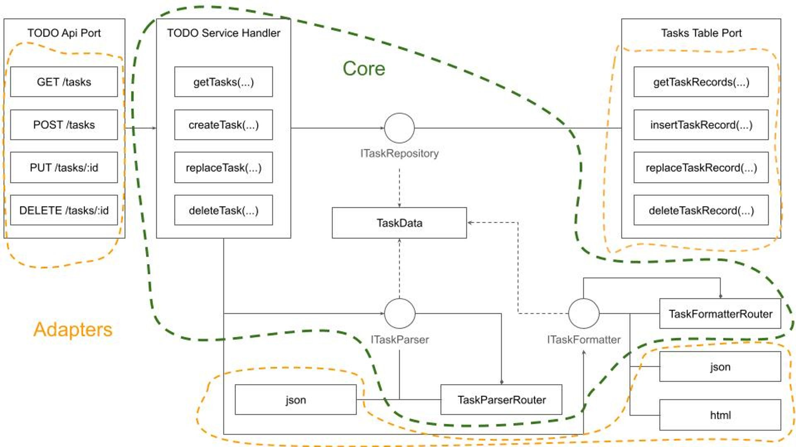
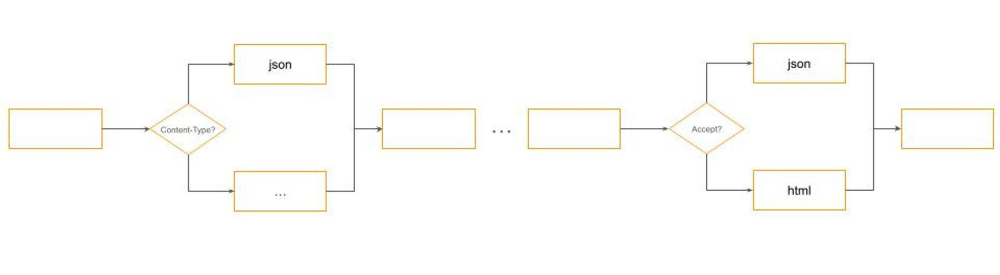

## Abstract

This is an experience report on the initial steps of implementing a CRUD (Create, Read, Update, Delete) REST API in [Winglang](https://github.com/winglang/wing), with a focus on addressing typical production environment concerns such as secure authentication, [observability](<https://en.wikipedia.org/wiki/Observability_(software)>), and error handling. It highlights how [Winglang](https://github.com/winglang/wing)'s distinctive features, particularly the separation of [Preflight](https://www.winglang.io/docs/concepts/inflights) cloud resource configuration from [Inflight](https://www.winglang.io/docs/concepts/inflights#inflight-code) API request handling, can facilitate more efficient integration of essential [middleware](https://en.wikipedia.org/wiki/Middleware) components like logging and error reporting. This balance aims to reduce overall complexity and minimize the resulting code size. The applicability of various design patterns, including [Pipe-and-Filters](https://patterns.eecs.berkeley.edu/?page_id=19), [Decorator](https://en.wikipedia.org/wiki/Decorator_pattern), and [Factory](https://en.wikipedia.org/wiki/Factory_method_pattern), is evaluated. Finally, future directions for developing a fully-fledged [middleware](https://en.wikipedia.org/wiki/Middleware) library for [Winglang](https://github.com/winglang/wing) are identified.

## Introduction

In my [previous publication](https://medium.com/itnext/hello-winglang-hexagon-6f2bdb550f37), I reported on my findings about the possible implementation of the [Hexagonal Ports and Adapters](https://alistair.cockburn.us/hexagonal-architecture/) pattern in the [Winglang](https://github.com/winglang/wing) programming language using the simplest possible `GreetingService` sample application. The main conclusions from this evaluation were:

1. Cloud resources, such as API Gateway, play the role of drivers (in-) and driven (out-) Ports
2. Event handling functions play the role of Adapters leading to a pure Core, that might be implemented in [Winglang](https://github.com/winglang/wing), [TypeScript](https://www.typescriptlang.org/), and in fact in any programming language, that compiles into [JavaScript](https://developer.mozilla.org/en-US/docs/Web/JavaScript) and runs on the [NodeJS](https://nodejs.org/en) runtime engine

Initially, I planned to proceed with exploring possible ways of implementing a more general [Staged Event-Driven Architecture (SEDA)](https://en.wikipedia.org/wiki/Staged_event-driven_architecture) architecture in [Winglang](https://github.com/winglang/wing). However, using the simplest possible `GreetingService` as an example left some very important architectural questions unanswered. Therefore I decided to explore in more depth what is involved in implementing a typical [Create/Retrieve/Update/Delete (CRUD)](https://en.wikipedia.org/wiki/Create,_read,_update_and_delete) service exposing standardized [REST API](https://en.wikipedia.org/wiki/REST) and addressing typical production environment concerns such as secure authentication, [observability](<https://en.wikipedia.org/wiki/Observability_(software)>), error handling, and reporting.

To prevent domain-specific complexity from distorting the focus on important architectural considerations, I chose the simplest possible TODO service with four operations:

1. Retrieve all Tasks (per user)
2. Create a new Task
3. Completely Replace an existing Task definition
4. Delete an existing Task

Using this simple example allowed me to evaluate many important architectural options and to to come up with an initial prototype of a [middleware](https://en.wikipedia.org/wiki/Middleware) library for the [Winglang](https://github.com/winglang/wing) programming language compatible with and potentially surpassing popular libraries for mainstream programming languages, such as [Middy](https://middy.js.org/) for [Node.js](https://nodejs.org/en) middleware engine for AWS Lambda and [AWS Power Tools for Lambda](https://github.com/aws-powertools).

Unlike my [previous publication](https://medium.com/itnext/hello-winglang-hexagon-6f2bdb550f37), I will not describe the step-by-step process of how I arrived at the current arrangement. Software architecture and design processes are rarely linear, especially beyond beginner-level tutorials. Instead, I will describe a starting point solution, which, while far from final, is representative enough to sense the direction in which the final framework might eventually evolve. I will outline the requirements, I wanted to address, the current architectural decisions, and highlight directions for future research.

## Simple TODO in Winglang

Developing a simple, prototype-level TODO REST API service in [Winglang](https://github.com/winglang/wing) is indeed very easy, and could be done within half an hour, using the [Winglang Playground](https://winglang.io/):


To keep things simple, I put everything in one source, even though, it of course could be split into Core, Ports, and Adapters. Let’s look at the major parts of this sample.

## Resource (Ports) Definition

First, we need to define cloud resources, aka Ports, that we are going to use. This this is done as follows:

```tsx
bring ex;
bring cloud;

let tasks = new ex.Table(
  name: "Tasks",
  columns: {
    "id" => ex.ColumnType.STRING,
    "title" => ex.ColumnType.STRING
  },
  primaryKey: "id"
);
let counter = new cloud.Counter();
let api = new cloud.Api();
let path = "/tasks";
```

Here we define a [Winglang Table](https://www.winglang.io/docs/standard-library/ex/table) to keep TODO Tasks with only two columns: task ID and title. To keep things simple, we implement task ID as an auto-incrementing number using the [Winglang `Counter`](https://www.winglang.io/docs/standard-library/cloud/counter) resource. And finally, we expose the TODO Service API using the [Winglang `Api`](https://www.winglang.io/docs/standard-library/cloud/api) resource.

## API Request Handlers (Adapters)

Now, we are going to define a separate handler function for each of the four REST API requests. Getting a list of all tasks is implemented as:

```tsx
api.get(
  path,
  inflight (request: cloud.ApiRequest): cloud.ApiResponse => {
    let rows = tasks.list();
    let var result = MutArray<Json>[];
    for row in rows {
      result.push(row);
    }
    return cloud.ApiResponse{
      status: 200,
      headers: {
        "Content-Type" => "application/json"
      },
      body: Json.stringify(result)
    };
  });
```

Creating a new task record is implemented as:

```tsx
api.post(
  path,
  inflight (request: cloud.ApiRequest): cloud.ApiResponse => {
    let id = "{counter.inc()}";
    if let task = Json.tryParse(request.body) {
      let record = Json{
        id: id,
        title: task.get("title").asStr()
      };
      tasks.insert(id, record);
      return cloud.ApiResponse {
        status: 200,
        headers: {
          "Content-Type" => "application/json"
        },
        body: Json.stringify(record)
      };
    } else {
      return cloud.ApiResponse {
        status: 400,
        headers: {
          "Content-Type" => "text/plain"
        },
        body: "Bad Request"
      };
    }
  });
```

Updating an existing task is implemented as:

```tsx
api.put(
  "{path}/:id",
  inflight (request: cloud.ApiRequest): cloud.ApiResponse => {
    let id = request.vars.get("id");
    if let task = Json.tryParse(request.body) {
      let record = Json{
        id: id,
        title: task.get("title").asStr()
      };
      tasks.update(id, record);
      return cloud.ApiResponse {
        status: 200,
        headers: {
          "Content-Type" => "application/json"
        },
        body: Json.stringify(record)
      };
    } else {
      return cloud.ApiResponse {
        status: 400,
        headers: {
          "Content-Type" => "text/plain"
        },
        body: "Bad Request"
      };
    }
  });
```

Finally, deleting an existing task is implemented as:

```tsx
api.delete(
  "{path}/:id",
  inflight (request: cloud.ApiRequest): cloud.ApiResponse => {
    let id = request.vars.get("id");
    tasks.delete(id);
    return cloud.ApiResponse {
      status: 200,
      headers: {
        "Content-Type" => "text/plain"
      },
      body: ""
    };
  });

```

We could play with this API using the [Winglang Simulator](https://www.winglang.io/docs/tools/wing-console):


We could write one or more tests to validate the API automatically:

```tsx
bring http;
bring expect;
let url = "{api.url}{path}";
test "run simple crud scenario" {
  let r1 = http.get(url);
  expect.equal(r1.status, 200);
  let r1_tasks = Json.parse(r1.body);
  expect.nil(r1_tasks.tryGetAt(0));
  let r2 = http.post(url, body: Json.stringify(Json{title: "First Task"}));
  expect.equal(r2.status, 200);
  let r2_task = Json.parse(r2.body);
  expect.equal(r2_task.get("title").asStr(), "First Task");
  let id = r2_task.get("id").asStr();
  let r3 = http.put("{url}/{id}", body: Json.stringify(Json{title: "First Task Updated"}));
  expect.equal(r3.status, 200);
  let r3_task = Json.parse(r3.body);
  expect.equal(r3_task.get("title").asStr(), "First Task Updated");
  let r4 = http.delete("{url}/{id}");
  expect.equal(r4.status, 200);
}
```

Last but not least, this service can be deployed on any supported cloud platform using the [Winglang CLI](https://www.winglang.io/docs/tools/cli). The code for the TODO Service is completely cloud-neutral, ensuring compatibility across different platforms without modification.

Should there be a need to expand the task details or link them to other system entities, the approach remains largely unaffected, provided the operations adhere to straightforward CRUD logic and can be executed within a 29-second timeout limit.

This example unequivocally demonstrates that the [Winglang](https://github.com/winglang/wing) programming environment is a top-notch tool for the rapid development of such services. If this is all you need, you need not read further. What follows is a kind of White Rabbit hole of multiple non-functional concerns that need to be addressed before we can even start talking about serious production deployment.

> You are warned. The forthcoming text is not for everybody, but rather for seasoned cloud software architects.


## Usability

TODO sample service implementation presented above belongs to the so-called Headless REST API. This approach focuses on core functionality, leaving user experience design to separate layers. This is often implemented as [Client-Side Rendering](https://www.patterns.dev/react/client-side-rendering) or [Server Side Rendering](https://www.patterns.dev/react/server-side-rendering) with an intermediate [Backend for Frontend](https://bff-patterns.com/) tier, or by using multiple narrow-focused REST API services functioning as [GraphQL Resolvers](https://www.apollographql.com/docs/apollo-server/data/resolvers/). Each approach has its merits for specific contexts.

I advocate for supporting [HTTP Content Negotiation](https://developer.mozilla.org/en-US/docs/Web/HTTP/Content_negotiation) and providing a minimal UI for direct API interaction via a browser. While tools like [Postman](https://www.postman.com/) or [Swagger](https://swagger.io/) can facilitate API interaction, experiencing the API as an end user offers invaluable insights. This basic UI, or what I refer to as an "engineering UI," often suffices.

In this context, anything beyond simple [Server Side Rendering](https://www.patterns.dev/react/server-side-rendering) deployed alongside headless protocol serialization, such as JSON, might be unnecessarily complex. While [Winglang](https://github.com/winglang/wing) provides support for [`Website`](https://www.winglang.io/docs/standard-library/cloud/website) cloud resource for web client assets (HTML pages, JavaScript, CSS), utilizing it for such purposes introduces additional complexity and cost.

A simpler solution would involve basic HTML templates, enhanced with [HTMX](https://htmx.org/)'s features and a CSS framework like [Bootstrap](https://getbootstrap.com/). Currently, [Winglang](https://github.com/winglang/wing) does not natively support HTML templates, but for basic use cases, this can be easily managed with [TypeScript](https://www.typescriptlang.org/). For instance, rendering a single task line could be implemented as follows:

```tsx
import { TaskData } from "core/task";

export function formatTask(path: string, task: TaskData): string {
  return `
    <li class="list-group-item d-flex justify-content-between align-items-center">
        <form hx-put="${path}/${task.taskID}" hx-headers='{"Accept": "text/plain"}' id="${task.taskID}-form">
            <span class="task-text">${task.title}</span>
            <input 
                type="text"
                name="title"
                class="form-control edit-input" 
                style="display: none;" 
                value="${task.title}">
        </form>
        <div class="btn-group">
            <button class="btn btn-danger btn-sm delete-btn" 
                hx-delete="${path}/${task.taskID}" 
                hx-target="closest li" 
                hx-swap="outerHTML" 
                hx-headers='{"Accept": "text/plain"}'>✕</button>
            <button class="btn btn-primary btn-sm edit-btn">✎</button>
        </div>
    </li>
    `;
}
```

That would result in the following UI screen:


Not super-fancy, but good enough for demo purposes.

Even purely Headless REST APIs require strong usability considerations. API calls should follow [REST conventions](https://en.wikipedia.org/wiki/REST) for HTTP methods, URL formats, and payloads. Proper documentation of [HTTP methods](https://developer.mozilla.org/en-US/docs/Web/HTTP/Methods) and potential error handling are crucial. Client and server errors need to be logged, converted into appropriate [HTTP status codes](https://developer.mozilla.org/en-US/docs/Web/HTTP/Status), and accompanied by clear explanation messages in the response body.

The need to handle multiple request parsers and response formatters based on content negotiation using Content-Type and Accept headers in HTTP requests led me to the following design approach:



Adhering to the [Dependency Inversion Principle](https://en.wikipedia.org/wiki/Dependency_inversion_principle) ensures that the system Core is completely isolated from Ports and Adapters. While there might be an inclination to encapsulate the Core within a generic CRUD framework, defined by a `ResourceData` type, I advise caution. This recommendation stems from several considerations:

1. In practice, even CRUD request processing often entails complexities that extend beyond basic operations.
2. The Core should not rely on any specific framework, preserving its independence and adaptability.
3. The creation of such a framework would necessitate support for [Generic Programming](https://en.wikipedia.org/wiki/Generic_programming), a feature not currently supported by [Winglang](https://github.com/winglang/wing).

Another option would be to abandon the Core data types definition and rely entirely on untyped JSON interfaces, akin to a Lisp-like programming style. However, given [Winglang](https://github.com/winglang/wing)'s strong typing, I decided against this approach.

Overall, the `TodoServiceHandler` is quite simple and easy to understand:

```tsx
bring "./data.w" as data;
bring "./parser.w" as parser;
bring "./formatter.w" as formatter;

pub class TodoHandler {
    _path: str;
    _parser: parser.TodoParser;
    _tasks: data.ITaskDataRepository;
    _formatter: formatter.ITodoFormatter;

    new(
        path: str,
        tasks_: data.ITaskDataRepository,
        parser: parser.TodoParser,
        formatter: formatter.ITodoFormatter,
    ) {
        this._path = path;
        this._tasks = tasks_;
        this._parser = parser;
        this._formatter = formatter;
    }

    pub inflight getHomePage(user: Json, outFormat: str): str {
        let userData = this._parser.parseUserData(user);

        return this._formatter.formatHomePage(outFormat, this._path, userData);
    }

    pub inflight getAllTasks(user: Json, query: Map<str>, outFormat: str): str {
        let userData = this._parser.parseUserData(user);
        let tasks = this._tasks.getTasks(userData.userID);

        return this._formatter.formatTasks(outFormat, this._path, tasks);
    }

    pub inflight createTask(
				user: Json,
				body: str,
				inFormat: str,
				outFormat: str
		): str {
        let taskData = this._parser.parsePartialTaskData(user, body);
        this._tasks.addTask(taskData);

        return this._formatter.formatTasks(outFormat, this._path, [taskData]);
    }

    pub inflight replaceTask(
				user: Json,
				id: str,
				body: str,
				inFormat: str,
				outFormat: str
		): str {
        let taskData = this._parser.parseFullTaskData(user, id, body);
        this._tasks.replaceTask(taskData);

        return taskData.title;
    }

    pub inflight deleteTask(user: Json, id: str): str {
        let userData = this._parser.parseUserData(user);
        this._tasks.deleteTask(userData.userID, num.fromStr(id));
        return "";
    }
}
```

As you might notice, the code structure deviates slightly from the design diagram presented earlier. These minor adaptations are normal in software design; new insights emerge throughout the process, necessitating adjustments. The most notable difference is the `user: Json` argument defined for every function. We'll discuss the purpose of this argument in the next section.

## Security

Exposing the TODO service to the internet without security measures is a recipe for disaster. Hackers, bored teens, and professional attackers will quickly target its public IP address. The rule is very simple:

> any public interface **must** be protected unless exposed for a very short testing period. Security is non-negotiable.

Conversely, overloading a service with every conceivable security measure can lead to prohibitively high operational costs. As I've argued in [previous writings](https://medium.com/@asher-sterkin/aws-mapu-65e888009916), making architects accountable for the costs of their designs might significantly reshape their approach:

> If cloud solution architects were responsible for the costs incurred by their systems, it could fundamentally change their design philosophy.

What we need, is a reasonable protection of the service API, not less but not more either. Since I wanted to experiment with full-stack [Service Side Rendering](https://www.patterns.dev/react/server-side-rendering) UI my natural choice was to enforce user login at the beginning, to produce a [JWT Token](https://en.wikipedia.org/wiki/JSON_Web_Token) with reasonable expiration, say one hour, and then to use it for authentication of all forthcoming HTTP requests.

Due to the [Service Side Rendering](https://www.patterns.dev/react/server-side-rendering) rendering specifics using [HTTP Cookie](https://developer.mozilla.org/en-US/docs/Web/HTTP/Cookies) to carry over the session token was a natural (to be honest suggested by [ChatGPT](https://openai.com/blog/chatgpt/)) choice. For the [Client-Side Rendering](https://www.patterns.dev/react/client-side-rendering) option, I might need to use the [Bearer Token](https://developer.mozilla.org/en-US/docs/Web/HTTP/Authentication) delivered via the HTTP Request headers Authorization field.

With session tokens now incorporating user information, I could aggregate TODO tasks by the user. Although there are numerous methods to integrate session data, including user details into the domain, I chose to focus on `userID` and `fullName` attributes for this study.

For user authentication, several options are available, especially within the AWS ecosystem:

1. [AWS Cognito](https://aws.amazon.com/cognito/), utilizing its User Pools or integration with external Identity Providers like Google or Facebook.
2. Third-party authentication services such as [Auth0](https://auth0.com/).
3. A custom authentication service fully developed in [Winglang](https://github.com/winglang/wing).
4. [AWS Identity Center](https://docs.aws.amazon.com/singlesignon/latest/userguide/what-is.html)
5. …

As an independent software technology researcher, I gravitate towards the simplest solutions with the fewest components, which also address daily operational needs. Leveraging the [AWS Identity Center](https://docs.aws.amazon.com/singlesignon/latest/userguide/what-is.html), as detailed in a [separate publication](https://medium.com/@asher-sterkin/aws-mapu-65e888009916), was a logical step due to my existing multi-account/multi-user setup.

After integration, my [AWS Identity Center](https://docs.aws.amazon.com/singlesignon/latest/userguide/what-is.html) main screen looks like this:


That means that in my system, users, myself, or guests, could use the same AWS credentials for development, administration, and sample or housekeeping applications.

To integrate with [AWS Identity Center](https://docs.aws.amazon.com/singlesignon/latest/userguide/what-is.html) I needed to [register my application](https://docs.aws.amazon.com/singlesignon/latest/userguide/customermanagedapps-saml2-setup.html#customermanagedapps-set-up-your-own-app-saml2) and provide a new endpoint implementing the so-called “[Assertion Consumer Service URL (ACS URL)](https://docs.aws.amazon.com/IAM/latest/UserGuide/id_roles_providers_enable-console-saml.html)”. This publication is not about the [SAML](https://en.wikipedia.org/wiki/Security_Assertion_Markup_Language) standard. It would suffice to say that with [ChatGPT](https://openai.com/blog/chatgpt/) and Google search assistance, it could be done. Some useful information can be found [here](https://blog.purple-technology.com/how-to-build-serverless-app-with-saml-auth-via-aws-iam-identity-center/). What came very handy was a [TypeScript](https://www.typescriptlang.org/) [samlify](https://samlify.js.org/#/) library which encapsulates the whole heavy lifting of the [SAML](https://en.wikipedia.org/wiki/Security_Assertion_Markup_Language) Login Response validation process.

What I’m mostly interested in is how this variability point affects the overall system design. Let’s try to visualize it using a semi-formal data flow notation:


While it might seem unusual this representation reflects with high fidelity how data flows through the system. What we see here is a special instance of the famous [Pipe-and-Filters](https://patterns.eecs.berkeley.edu/?page_id=19) architectural pattern.

Here, data flows through a pipeline and each filter performs one well-defined task in fact following the [Single Responsibility Principle](https://en.wikipedia.org/wiki/Single_responsibility_principle). Such an arrangement allows me to replace filters should I want to switch to a simple [Basic HTTP Authentication](https://developer.mozilla.org/en-US/docs/Web/HTTP/Authentication), to use the [HTTP Authorization header](https://developer.mozilla.org/en-US/docs/Web/HTTP/Headers/Authorization), or use a different secret management policy for [JWT token](https://en.wikipedia.org/wiki/JSON_Web_Token) building and validation.

If we zoom into Parse and Format filters, we will see a typical dispatch logic using [Content-Type](https://developer.mozilla.org/en-US/docs/Web/HTTP/Headers/Content-Type) and [Accept](https://developer.mozilla.org/en-US/docs/Web/HTTP/Headers/Accept) HTTP headers respectively:



Many engineers confuse design and architectural patterns with specific implementations. This misses the essence of what patterns are meant to achieve.

Patterns are about identifying a suitable approach to balance conflicting forces with minimal intervention. In the context of building cloud-based software systems, where security is paramount but should not be overpriced in terms of cost or complexity, this understanding is crucial. The [Pipe-and-Filters](https://patterns.eecs.berkeley.edu/?page_id=19) design pattern helps with addressing such design challenges effectively. It allows for modularization and flexible configuration of processing steps, which in this case, relate to authentication mechanisms.

For instance, while robust security measures like [SAML](https://en.wikipedia.org/wiki/Security_Assertion_Markup_Language) authentication are necessary for production environments, they may introduce unnecessary complexity and overhead in scenarios such as automated end-to-end testing. Here, simpler methods like [Basic HTTP Authentication](https://developer.mozilla.org/en-US/docs/Web/HTTP/Authentication) may suffice, providing a quick and cost-effective solution without compromising the system's overall integrity. The goal is to maintain the system's core functionality and code base uniformity while varying the
authentication strategy based on the environment or specific requirements.

[Winglang](https://github.com/winglang/wing)'s unique [Preflight](https://www.winglang.io/docs/concepts/inflights) compilation feature facilitates this by allowing for configuration
adjustments at the build stage, eliminating runtime overhead. This capability presents a significant advantage of [Winglang](https://github.com/winglang/wing)-based solutions over other middleware libraries, such as [Middy](https://middy.js.org/) and [AWS Power Tools for Lambda](https://github.com/aws-powertools), by offering a more efficient and flexible approach to managing the authentication pipeline.

Implementing [Basic HTTP Authentication](https://developer.mozilla.org/en-US/docs/Web/HTTP/Authentication), therefore, only requires modifying a single filter within the authentication pipeline, leaving the remainder of the system unchanged:


Due to some technical limitations, it’s currently not possible to implement [Pipe-and-Filters](https://patterns.eecs.berkeley.edu/?page_id=19) in [Winglang](https://github.com/winglang/wing) directly, but it could be quite easily simulated by a combination of [Decorator](https://en.wikipedia.org/wiki/Decorator_pattern) and [Factory](https://en.wikipedia.org/wiki/Factory_method_pattern) design patterns. How exactly, we will see shortly. Now, let’s proceed to the next topic.

## Operation

In this publication, I’m not going to cover all aspects of production operation. The topic is large and deserves a separate publication of its own. Below, is presented what I consider as a bare minimum:


To operate a service we need to know what happens with it, especially when something goes wrong. This is achieved via a [Structured Logging](https://opentelemetry.io/docs/specs/otel/logs/data-model/) mechanism. At the moment, [Winglang](https://github.com/winglang/wing) provides only a basic `log(str)` function. For my investigation, I need more and implemented a poor man-structured logging class

```tsx
// A poor man implementation of configurable Logger
// Similar to that of Python and TypeScript
bring cloud;
bring "./dateTime.w" as dateTime;

pub enum logging {
  TRACE,
  DEBUG,
  INFO,
  WARNING,
  ERROR,
  FATAL
}

//This is just enough configuration
//A serious review including compliance
//with OpenTelemetry and privacy regulations
//Is required. The main insight:
//Serverless Cloud logging is substantially
//different
pub interface ILoggingStrategy {
  inflight timestamp(): str;
  inflight print(message: Json): void;
}

pub class DefaultLoggerStrategy impl ILoggingStrategy {
  pub inflight timestamp(): str {
    return dateTime.DateTime.toUtcString(std.Datetime.utcNow());
  }
  pub inflight print(message: Json): void {
    log("{message}");
  }
}

//TBD: probably should go into a separate module
bring expect;
bring ex;

pub class MockLoggerStrategy impl ILoggingStrategy {
  _name: str;
  _counter: cloud.Counter;
  _messages: ex.Table;

  new(name: str?) {
    this._name = name ?? "MockLogger";
    this._counter = new cloud.Counter();
    this._messages = new ex.Table(
      name: "{this._name}Messages",
      columns: Map<ex.ColumnType>{
        "id" => ex.ColumnType.STRING,
        "message" => ex.ColumnType.STRING
      },
      primaryKey: "id"
    );
  }
  pub inflight timestamp(): str {
    return "{this._counter.inc(1, this._name)}";
  }
  pub inflight expect(messages: Array<Json>): void {
    for message in messages {
      this._messages.insert(
	      message.get("timestamp").asStr(),
	      Json{ message: "{message}"}
	    );
    }
  }
  pub inflight print(message: Json): void {
    let expected = this._messages.get(
	    message.get("timestamp").asStr()
	  ).get("message").asStr();
    expect.equal("{message}", expected);
  }
}

pub class Logger {
  _labels: Array<str>;
  _levels: Array<logging>;
  _level: num;
  _service: str;
  _strategy: ILoggingStrategy;

  new (level: logging, service: str, strategy: ILoggingStrategy?) {
    this._labels = [
        "TRACE",
        "DEBUG",
        "INFO",
        "WARNING",
        "ERROR",
        "FATAL"
    ];
    this._levels = Array<logging>[
      logging.TRACE,
      logging.DEBUG,
      logging.INFO,
      logging.WARNING,
      logging.ERROR,
      logging.FATAL
    ];
    this._level = this._levels.indexOf(level);
    this._service = service;
    this._strategy = strategy ?? new DefaultLoggerStrategy();
  }
  pub inflight log(level_: logging, func: str, message: Json): void {
    let level = this._levels.indexOf(level_);
    let label = this._labels.at(level);
    if  this._level <= level {
      this._strategy.print(Json {
        timestamp: this._strategy.timestamp(),
        level: label,
        service: this._service,
        function: func,
        message: message
      });
    }
  }
  pub inflight trace(func: str, message: Json): void {
    this.log(logging.TRACE, func,message);
  }
  pub inflight debug(func: str, message: Json): void {
    this.log(logging.DEBUG, func, message);
  }
  pub inflight info(func: str, message: Json): void {
    this.log(logging.INFO, func, message);
  }
  pub inflight warning(func: str, message: Json): void {
    this.log(logging.WARNING, func, message);
  }
  pub inflight error(func: str, message: Json): void {
    this.log(logging.ERROR, func, message);
  }
  pub inflight fatal(func: str, message: Json): void {
    this.log(logging.FATAL, func, message);
  }
}
```

There is nothing spectacular here and, as I wrote in the comments, a cloud-based logging system requires a serious revision. Still, it’s enough for the current investigation. I’m fully convinced that logging is an integral part of any service specification and has to be tested with the same rigor as core functionality. For that purpose, I developed a simple mechanism to mock logs and check them against expectations.

For a REST API CRUD service, we need to log at least three types of things:

1. HTTP Request
2. Original Error message if something wrong happened
3. HTTP Response

In addition, depending on needs the original error message might need to be converted into a standard one, for example in order not to educate attackers.

How much if any details to log depends on multiple factors: deployment target, type of request, specific user, type of error, statistical sampling, etc. In development and test mode, we will normally opt for logging almost everything and returning the original error message directly to the client screen to ease debugging. In production mode, we might opt for removing some sensitive data because of regulation requirements, to return a general error message, such as “Bad Request”, without any details, and apply only statistical sample logging for particular types of requests [to save the cost](https://aws.amazon.com/blogs/aws-cloud-financial-management/reinvent-2023-cost-optimization-highlights-that-you-were-not-expecting/).

Flexible logging configuration was achieved by injecting four additional filters in every request handling pipeline:

1. HTTP Request logging filter
2. Try/Catch Decorator to convert exceptions if any into HTTP status codes and to log original error messages (this could be extracted into a separate filter, but I decided to keep things simple)
3. Error message translator to convert original error messages into standard ones if required
4. HTTP Response logging filter

This structure, although not an ultimate one, provides enough flexibility to implement a wide range of logging and error-handling strategies depending on the service and its deployment target specifics.

As with logs, [Winglang](https://github.com/winglang/wing) at the moment provides only a basic `throw <str>` operator, so I decided to implement my version of a poor man structured exceptions:

```tsx
// A poor man structured exceptions
pub inflight class Exception {
    pub tag: str;
    pub message: str?;

    new(tag: str, message: str?) {
        this.tag = tag;
        this.message = message;
    }
    pub raise() {
        let err = Json.stringify(this);
        throw err;
    }
    pub static fromJson(err: str): Exception {
        let je = Json.parse(err);

        return new Exception(
	        je.get("tag").asStr(),
	        je.tryGet("message")?.tryAsStr()
	      );
    }
    pub toJson(): Json { //for logging
        return Json{tag: this.tag, message: this.message};
    }
}

// Standard exceptions, similar to those of Python
pub inflight class KeyError extends Exception {
    new(message: str?) {
        super("KeyError", message);
    }
}
pub inflight class ValueError extends Exception {
    new(message: str?) {
        super("ValueError", message);
    }
}
pub inflight class InternalError extends Exception {
    new(message: str?) {
        super("InternalError", message);
    }
}
pub inflight class NotImplementedError extends Exception {
    new(message: str?) {
        super("NotImplementedError", message);
    }
}
//Two more HTTP-specific, yet useful
pub inflight class AuthenticationError extends Exception {
		//aka HTTP 401 Unauthorized
    new(message: str?) {
        super("AuthenticationError", message);
    }
}
pub inflight class AuthorizationError extends Exception {
		//aka HTTP 403 Forbidden
    new(message: str?) {
        super("AuthorizationError", message);
    }
}
```

These experiences highlight how the developer community can bridge gaps in new languages with temporary workarounds. [Winglang](https://github.com/winglang/wing) is still evolving, but its innovative features can be harnessed for progress despite the language's age.

Now, it’s time to take a brief look at the last production topic on my list, namely

## Scale

Scaling is a crucial aspect of cloud development, but it's often misunderstood. Some neglect it entirely, leading to problems when the system grows. Others over-engineer, aiming to be a "FANG" system from day one. The proclamation "We run everything on Kubernetes" is a common refrain in technical circles, regardless of whether it's appropriate for the project at hand.

Neither—neglect nor over-engineering— extreme is ideal. Like security, scaling shouldn't be ignored, but it also shouldn't be over-emphasized.

Up to a certain point, cloud platforms provide cost-effective scaling mechanisms. Often, the choice between different options boils down to personal preference or inertia rather than significant technical advantages.

The prudent path involves starting small and cost-effectively, scaling out based on real-world usage and performance data, rather than assumptions. This approach necessitates a system designed for easy configuration changes to accommodate scaling, something not inherently supported by [Winglang](https://github.com/winglang/wing) but certainly within the realm of feasibility through further development and research. As an illustration, let's consider scaling within the AWS ecosystem:

1. Initially, a cost-effective and swift deployment might involve a single [Lambda Function URL](https://docs.aws.amazon.com/lambda/latest/dg/lambda-urls.html) for a full-stack CRUD API with [Server-Side Rendering](https://www.patterns.dev/react/server-side-rendering), using an [S3 Bucket](https://aws.amazon.com/s3/) for storage. This setup enables rapid feedback essential for early development stages. Personally, I favor a "UX First" approach over "API First." You might be surprised how far you can get with this basic technology stack. While [Winglang](https://github.com/winglang/wing) doesn't currently support [Lambda Function URLs](https://docs.aws.amazon.com/lambda/latest/dg/lambda-urls.html), I believe it could be achieved with filter combinations and system adjustments. At this level, following [Marc Van Neerven](https://medium.com/cto-as-a-service/purepwa-a-radical-u-turn-in-web-development-a386c0dc092e)'s recommendation to use standard [Web Components](https://developer.mozilla.org/en-US/docs/Web/API/Web_components) instead of heavy frameworks could be beneficial. This is a subject for future exploration.
2. Transitioning to an [API Gateway](https://aws.amazon.com/api-gateway/) or [GraphQL Gateway](https://aws.amazon.com/pm/appsync/?gclid=CjwKCAiAi6uvBhADEiwAWiyRdhl4AiIZkllfejb0Za3YevzuB4xXj1U8QcVcuMecAt89Jf8XIdtVAhoCX70QAvD_BwE&trk=e37f908f-322e-4ebc-9def-9eafa78141b8&sc_channel=ps&ef_id=CjwKCAiAi6uvBhADEiwAWiyRdhl4AiIZkllfejb0Za3YevzuB4xXj1U8QcVcuMecAt89Jf8XIdtVAhoCX70QAvD_BwE:G:s&s_kwcid=AL!4422!3!647301987556!e!!g!!aws%20appsync!19613610159!148358960849) becomes relevant when external API exposure or advanced features like [WebSockets](https://developer.mozilla.org/en-US/docs/Web/API/WebSockets_API) are required. If the initial data storage solution becomes a bottleneck, it might be time to consider switching to a more robust and scalable solution like [DynamoDB](https://aws.amazon.com/pm/dynamodb/?gclid=CjwKCAiAi6uvBhADEiwAWiyRdsq7X-awzsUATFWptQ2uk-qwYf8je9mBM1kIIigbB2l1PWTdR4fhAxoCw7gQAvD_BwE&trk=5c0a5fc5-4392-49ca-8bcf-f023c39b7463&sc_channel=ps&ef_id=CjwKCAiAi6uvBhADEiwAWiyRdsq7X-awzsUATFWptQ2uk-qwYf8je9mBM1kIIigbB2l1PWTdR4fhAxoCw7gQAvD_BwE:G:s&s_kwcid=AL!4422!3!645125273714!e!!g!!dynamodb!19574556905!145779852912). At this point, deploying separate Lambda Functions for each API request might offer simplicity in implementation, though it's not always the most cost-effective strategy.
3. The move to containerized solutions should be data-driven, considered only when there's clear evidence that the function-based architecture is either too costly or suffers from latency issues due to cold starts. An initial foray into containers might involve using [ECS Fargate](https://docs.aws.amazon.com/AmazonECS/latest/developerguide/AWS_Fargate.html) for its simplicity and cost-effectiveness, reserving [EKS](https://aws.amazon.com/pm/eks/?gclid=CjwKCAiAi6uvBhADEiwAWiyRdhfIT2JlfvVJ21ERRZcgJNNtWy-T871InA7-ZHNwduW8QWDQo9qSZBoC2E4QAvD_BwE&trk=c69c708c-c423-4c07-9fc8-513781540cc7&sc_channel=ps&ef_id=CjwKCAiAi6uvBhADEiwAWiyRdhfIT2JlfvVJ21ERRZcgJNNtWy-T871InA7-ZHNwduW8QWDQo9qSZBoC2E4QAvD_BwE:G:s&s_kwcid=AL!4422!3!669047416746!e!!g!!eks!20433874212!155230227787) for scenarios with specific operational needs that require its capabilities. This evolution should ideally be managed through configuration adjustments and automated filter generation, leveraging [Winglang](https://github.com/winglang/wing)'s unique capabilities to support dynamic scaling strategies.

In essence, [Winglang](https://github.com/winglang/wing)'s approach, emphasizing the [Preflight and Inflight](https://www.winglang.io/docs/concepts/inflights) stages, holds promise for facilitating these scaling strategies, although it may still be in the early stages of fully realizing this potential. This exploration of scalability within cloud software development emphasizes starting small, basing decisions on actual data, and remaining flexible in adapting to changing requirements.

# Concluding Remarks

In the mid-1990s, I learned about [Commonality Variability Analysis](https://www.dre.vanderbilt.edu/~schmidt/PDF/Commonality_Variability.pdf) from [Jim Coplien](https://www.linkedin.com/in/coplien/). Since then, this approach, alongside [Edsger W. Dijkstra](https://en.wikipedia.org/wiki/Edsger_W._Dijkstra)'s [Layered Architecture](https://www.eecs.ucf.edu/~eurip/papers/dijkstra-the68.pdf), has been a cornerstone of my software engineering practices. [Commonality Variability Analysis](https://www.dre.vanderbilt.edu/~schmidt/PDF/Commonality_Variability.pdf) asks: "In our system, which parts will always be the same and which might need to change?" The [Open-Closed Principle](https://en.wikipedia.org/wiki/Open%E2%80%93closed_principle) dictates that variable parts should be replaceable without modifying the core system.

Deciding when to finalize the stable aspects of a system involves navigating the trade-off between flexibility and efficiency, with several stages from code generation to runtime offering opportunities for fixation. Dynamic language proponents might delay these decisions to runtime for maximum flexibility, whereas advocates for static, compiled languages typically secure crucial system components as early as possible.

[Winglang](https://github.com/winglang/wing), with its unique [Preflight compilation phase](https://www.winglang.io/docs/concepts/inflights), stands out by allowing cloud resources to be fixed early in the development process. In this publication, I explored how [Winglang](https://github.com/winglang/wing) enables addressing non-functional aspects of cloud services through a flexible pipeline of filters, though this granularity introduces its own complexity. The challenge now becomes managing this complexity without compromising the system's efficiency or flexibility.

While the final solution is a work in progress, I can outline a high-level design that balances these forces:


This design combines several software [Design Patterns](https://en.wikipedia.org/wiki/Software_design_pattern) to achieve the desired balance. The process involves:

1. The Pipeline [Builder](https://en.wikipedia.org/wiki/Builder_pattern) component is responsible for preparing a final set of [Preflight](https://www.winglang.io/docs/concepts/inflights) components.
2. The Pipeline [Builder](https://en.wikipedia.org/wiki/Builder_pattern) reads a Configuration which might be organized as a [Composite](https://en.wikipedia.org/wiki/Composite_pattern) (think team-wide or organization-wide configuration).
3. Configurations specify capability requirements for resources (e.g., loggers).
4. Each Resource has several [Specifications](https://en.wikipedia.org/wiki/Specification_pattern) each one defining conditions under which a [Factory](https://en.wikipedia.org/wiki/Factory_method_pattern) needs to be invoked to produce the required [Filter](https://patterns.eecs.berkeley.edu/?page_id=19). Three filter types are envisioned:
   1. Row HTTP Request/Response Filter
   2. Extended HTTP Request/Response Filter with session information extracted after token validation
   3. Generic CRUD requests filter to be forwarded to Core

This approach shifts complexity towards implementing the Pipeline [Builder](https://en.wikipedia.org/wiki/Builder_pattern) machinery and Configuration specification. Experience teaches such machinery could be implemented (described for example in [this publication](https://medium.com/python-in-plain-english/generic-composite-in-python-4b88d6727ad0)). That normally requires some generic programming and dynamic import capabilities. Coming up with a good configuration data model is more challenging.

Recent advances in [generative AI-based copilots](https://martinfowler.com/articles/exploring-gen-ai.html) raise new questions about achieving the most cost-efficient outcome. To understand the problem, let's revisit the traditional compilation and configuration stack:


This general case may not apply to every ecosystem. Here's a breakdown of the typical layers:

1. The Core Language is designed to be small (”C” and Lisp tradition). It may or may not provide support for [Reflection](https://en.wikipedia.org/wiki/Reflective_programming).
2. As many as possible extended capabilities are provided by Standard Library and 3rd Party Libraries and Frameworks.
3. Generic Meta-Programming: Support for features like C++ templates or Lisp macros is introduced early (C++, Rust) or later (Java, C#). Generics are a source of ongoing debate:
   1. Framework developers find them insufficiently expressive.
   2. Application developers struggle with their complexity.
   3. Scala exemplifies the potential downsides of overly complex generics.
4. Despite criticism, macros (e.g., C preprocessor) persist as a tool for automated code generation, often compensating for generic limitations.
5. Third-party vendors (often open-source) provide solutions that enhance or compensate for the standard library, typically using external configuration files (YAML, JSON, etc.).
6. Specialized generators very often use external blueprints or templates.

This complex structure has limitations. Generics can obscure the core language, macros are unsafe, configuration files are poorly disguised scripts, and code generators rely on inflexible static templates. These limitations are why I believe the current trend of [Internal Development Platforms](https://platformengineering.org/blog/five-reasons-why-an-internal-developer-platform-is-worth-it) has limited growth potential.

As we look forward to the role of generative AI in streamlining these processes, the question becomes: Can generative [AI-based copilots](https://martinfowler.com/articles/exploring-gen-ai.html) not only simplify but also enhance our ability to balance commonality and variability in software engineering?

This is going to be the main topic of my future research to be reported in the next publications. Stay tuned.
