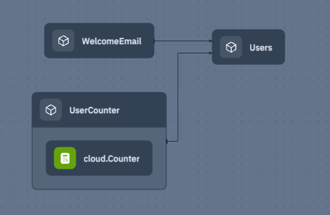

import ReactPlayer from "react-player";
import console_new_look from "./assets/2024-03-13-magazine-008/console-new-look.mp4";

> The 8th issue of the Wing Inflight Magazine.
> <!--truncate-->

Hello Wingnuts!

We are back with another issue of the **Wing Inflight Magazine** and excited to share some updates about [Winglang](https://winglang.io), **an open source-programming language for the cloud**.

Wing is shipped with a **powerful cloud simulator** which allows developers to write and test complete cloud application without having to deploy anything to the cloud.

The language combines cloud infrastructure ***and*** runtime into a single programming model and **compiles to Terraform/CloudFormation and JavaScript** that are ready to deploy to AWS, GCP and Azure (see [support matrix](https://www.winglang.io/docs/api/standard-library/compatibility-matrix)).

We are designing Wing to be **familiar and friendly** for developers who come from modern object-oriented background, so it will take you [5 minutes](https://github.com/winglang/workshop-react/blob/main/cheatsheet.md) to learn.

Check out our [getting started tutorial](https://www.winglang.io/docs/) or hit the [Wing Playground](https://www.winglang.io/play/) for an online experience.

### In today's issue

- 🚀 [Deploying AWS resources and APIs inside a private VPCs](#deploying-aws-resources-and-apis-inside-a-private-vpcs)
- 🎨 [A fresh look for the Wing Console map view](#a-fresh-look-for-the-wing-console-map-view)
- 🤩 [New syntax for creating sets](#new-syntax-for-creating-sets)
- 🔥 [Mutually referential type declarations](#mutually-referential-type-declarations)
- 🛟 [The bang `!` operator](#the-bang--operator)
- 🏋️ [Ability to lift collection of inflight closures](#ability-to-lift-collection-of-inflight-closures)
- 🗄️ [`fs.appendFile()`](#fsappendfile)
- ⚙ [Platform Parameters and AWS VPC configuration](#platform-parameters-and-aws-vpc-configuration)
- 🛌 [Ergonomic improvements for `cloud.Function` and `cloud.Api`](#ergonomic-improvements-for-cloudfunction-and-cloudapi)
- 🎥 [Goodies from the Wingly Update](#goodies-from-the-wingly-update)
- 👯‍♀️ [Community Events](#community-events)

> NOTE: I spent like two hours trying to figure out the right emojis here so please take a minute to appreciate them :-)

### Deploying AWS resources and APIs inside a private VPCs


Users tell us they are looking for ways to deploy API-based services inside their VPCs. We've spent some time learning about [the challenges people have](https://www.winglang.io/blog/2024/02/15/private-api-gateways) and figured we can offer a awesome experience in Wing for this use case.

We published a [guide](https://www.winglang.io/blog/2024/02/09/private-api-gateway-aws) which describes how to configure the `tf-aws` platform to deploy your application's AWS resources and APIs inside a VPC, with support for creating a whole new VPC or deploying into a VPC that's already setup in your environment.

Check out a recording of this [online workshop](https://youtu.be/1o5dk4S82_o?si=mvHGaYBJtGTj2Fi8) by [Hasan Abu-Rayyan](https://github.com/hasanaburayyan) from the Wing core team, where he talks about this use case and walks through an example.

[Ruslan Kazakov](https://github.com/rkazakov) from Sydney, Australia wrote about his experience in [a blog post](https://medium.com/bear-plus/secure-your-vpc-endpoint-for-api-gateway-with-winglang-235a5f8af072) :

> ”Wing made all the difference! After struggling for days with the CDK, I turned to Wing and had a fully functional Private API Gateway up and running within hours. Its simplicity and power are unparalleled. Thank you, Wing, for saving me time and headaches!”

### A fresh look for the Wing Console map view

We gave the map view in Wing Console some love, improved colors, cleaned up the UI and polished the interactions:

<ReactPlayer width="50%" height="50%" playing loop muted url={console_new_look}/>

### New syntax for creating sets

Wing has a built-in `Set` type to represent a collection of unique values. This type used to have its own literal syntax which used curly braces `{}`:

```js
let mySet = {1, 2, 3}; // before
```

While this syntax was cute, it caused some confusion with the object literal syntax that also uses curly braces (`{ foo: 123 }`). Given how infrequently sets are created (and how frequently object literals are used), the syntactic complexity seemed unwarranted. Sets can now be created with the existing square brackets `[]` alongside a type annotation:

```js
let mySet = Set<num> [1, 2, 3];
```

> [PR #5729](https://github.com/winglang/wing/pull/5729) by [@Warkanlock](https://github.com/Warkanlock)

### Mutually referential type declarations

It is now possible for two type declarations such as `struct`s, `interface`s, or `class`es to refer to each other:

```js
interface IThing1 {
  m2(): IThing2;
}

interface IThing2 {
  m1(): IThing1;
}

struct M1 { m2: M2?; }
struct M2 { m1: M1?; }
```

This implies that declarations can be used anywhere within the scope, regardless of where they are located in the file. Declarations are basically type system information and they are not executed, so there is no meaning to their order.

```js
// this works even though M1 is declared later!
let x: M1 = {};

struct M1 { m2: M2?; }
struct M2 { m1: M1?; }
```

> [PR #5683](https://github.com/winglang/wing/pull/5683) by [@Chriscbr](https://github.com/Chriscbr)

### The bang `!` operator

We are continuing to add language tools for safely dealing with nullity.

The bang operator (`!`) performs a *runtime assertion* that a value is not `nil`, and returns the value.

An error will be thrown if the value is `nil`. Unlike TypeScript, where `!` is only a type-checking hint, in Wing the bang operator will actually throw an error if there is no value. This means that nullity will not propagate further and avoids the common horrors of `"Cannot read properties of undefined"` errors, cascading through your program.

```js
struct User {
  name: str;
  email: str;
}

let response = http.get("https://api.mysystem.com/users/127364");
let user = User.parseJson(response.body!); // since "body" is `str?` we need to unwrap it
log("name: {user.name}, email: {user.email}");
```

This is roughly equivalent to:

```js
if let body = response.body {
  let user = User.parseJson(body);
  // ...
} else {
  throw "Unexpected nil";
}
```

> [PR #5556](https://github.com/winglang/wing/pull/5556) by [@meirdev](https://github.com/meirdev)

### Ability to lift collection of inflight closures

This is a very powerful addition to the Wing lifting system that opens up many interesting use cases.

It is now possible to lift collections of inflight closures (arrays, maps, etc) from preflight to inflight. This allows you to collect them during preflight and execute later. For example, a common use case is event handlers.

The example below implements a simple pub/sub mechanism using a collection of inflight closure. The `Users` class which allows consumers to subscribe to a "sign up" event by providing an inflight closure as the handler. When a new user signs up, all the handlers are called:

```js
bring cloud;

class Users {
  signupHandlers: MutArray<inflight (str): void>;

  new() {
    this.signupHandlers = MutArray<inflight (str): void>[];
  }

  pub onSignup(handler: inflight (str): void) {
    this.signupHandlers.push(handler);
    nodeof(this).addConnection(name: "onSignup", source: unsafeCast(handler), target: this);
  }

  pub inflight signup(user: str) {
    for h in this.signupHandlers {
      h(user);
    }
  }
}

class UserCounter {
  counter: cloud.Counter;

  new(users: Users) {
    this.counter = new cloud.Counter();
    users.onSignup(inflight () => {
      this.counter.inc();
    });
  }

  pub inflight count(): num {
    return this.counter.peek();
  }
}

class WelcomeEmail {
  new(users: Users) {
    users.onSignup(inflight (email) => {
      // send an email to user
    });
  }
}

let users = new Users();

new UserCounter(users);
new WelcomeEmail(users);
```

Notice the cool usage of `nodeof(x).addConnection()` which results in this beautiful view:



> [PR #5757](https://github.com/winglang/wing/pull/5757) by [@yoav-steinberg](https://github.com/yoav-steinberg)

### `fs.appendFile()`

A new function on the filesystem (`fs`) builtin module. `fs.appendFile()` writes data to the *end* of a file.

```js
bring fs;

let file = "/dummy.txt";

fs.writeFile(file, "Hello ");
fs.appendFile(file, "World!");

// file now contains "Hello World!"
```

> [PR #5800](https://github.com/winglang/wing/pull/5800) by [@CJLA](https://github.com/CJLA)

### Platform Parameters and AWS VPC configuration

[Platforms](https://www.winglang.io/docs/concepts/platforms) are the "backend" of the Wing compiler. They hook into the compilation and synthesis process and determine everything about how an app will eventually be deployed to the cloud. Wing is shipped with a set of built-in platforms such as `tf-aws`, `tf-azure`, but users can create their own platform extensions, and we are starting to see some very creative and powerful capabilities enabled by this feature.

It is now possible for platforms to read parameters from a configuration file (`wing.toml`) or from the `-v` CLI switch.

As one example of this, the `tf-aws` platform now supports a few parameters related to handling VPCs. The parameters provide an easy mechanism to control this cross-cutting concern across all your resources:

`wing.toml`:

```toml
[tf-aws]
vpc = "existing"
vpc_id = "vpc-088c31249bb80726a"
vpc_lambda = true
```

With the above configuration, when compiling the following program to `tf-aws`, the AWS Lambda function below will be placed inside an existing VPC:

```js
bring cloud;

new cloud.Function(inflight () => {
  log("hi");
});
```

> [PR #5557](https://github.com/winglang/wing/pull/5557) by [@hasanaburayyan](https://github.com/hasanaburayyan)

### Ergonomic improvements for `cloud.Function` and `cloud.Api`

`cloud.Function` and `cloud.Api` are fundamental building blocks of Wing's SDK. They both make use of inflight handlers for their runtime.
These handlers had a required return type, which was often not actually needed. Now this return type is optional and defaults to a sensible value:

```js
new cloud.Function(inflight (event) => {
  log(event);

  // no need to return anything!
})

new cloud.Api().post("/", inflight () => {
  log("Hi");
  
  // can also return a partial response with no body, like:
  // return { status: 200 };
})
```

Invoking `cloud.Function` also now has an optional argument instead of a required one:

```js
let func = new cloud.Function(inflight () => {
  log("Hi");
});

test "invoke function" {
  func.invoke();
}
```

> [PR #5644](https://github.com/winglang/wing/pull/5644) by [@eladb](https://github.com/eladb)

### Goodies from the Wingly Update


[The Wingly Update](https://www.twitch.tv/winglangio) is our corky bi-weekly stream where we share the latest developments of the project, chat with folks from the cloud industry, geek out and celebrate the beauty of the cloud.

If you haven't been able to catch our show, you can find the complete stack of [all our episodes here](https://youtube.com/playlist?list=PL-P8v-FRassZBWsNoSafL_ReO0JO0xJVm&si=trffVrtGGMUZ-SKb). 

Here are a few goodies we curated from recent shows:

- [Huzaifa Asif](https://youtu.be/MmO2SdKmw40?si=9jrLON4QLdwqI9CR) came to chat with us about his career journey and his new book **Designing Scalable Systems**.
- [Live Hacking Session Building a Slack Bot](https://www.youtube.com/watch?v=OH_OrzhkqEA&t=132s) - the first in a series of sessions where we build a Slack bot with Wing.

### Community Events

You can find details for all our events in the [Wingnuts Calendar](https://calendar.google.com/calendar/u/0?cid=Y18wZTljMGRkZjRiM2IyNzdmMmFlZTMzZjI2NDljYzNlMDAzMGE2OTI1NmRiNjQyNTk0YTc3YmFkZDhjNjc4YzQ4QGdyb3VwLmNhbGVuZGFyLmdvb2dsZS5jb20), amongst them:

* [Winglang Community Meeting](https://calendar.google.com/calendar/event?action=TEMPLATE&tmeid=NDN1dWpoNTQ4dGhhNDNvNzUwcW9yYW12dDBfMjAyNDAzMTJUMTQzMDAwWiBjXzBlOWMwZGRmNGIzYjI3N2YyYWVlMzNmMjY0OWNjM2UwMDMwYTY5MjU2ZGI2NDI1OTRhNzdiYWRkOGM2NzhjNDhAZw&tmsrc=c_0e9c0ddf4b3b277f2aee33f2649cc3e0030a69256db642594a77badd8c678c48%40group.calendar.google.com&scp=ALL) is our bi-weekly gathering where members of our community showcase cool apps, demos, and other projects! The upcoming session is scheduled for **Tuesday, December 19th, at 2:30 PM UTC**. We look forward to seeing you there!
* [Monday Office Hours](https://calendar.google.com/calendar/event?action=TEMPLATE&tmeid=ZnFtM3NrbHM0NGZqdTNjZGdyMDg2bHVidXBfMjAyMzEyMThUMTIwMDAwWiBjXzBlOWMwZGRmNGIzYjI3N2YyYWVlMzNmMjY0OWNjM2UwMDMwYTY5MjU2ZGI2NDI1OTRhNzdiYWRkOGM2NzhjNDhAZw&tmsrc=c_0e9c0ddf4b3b277f2aee33f2649cc3e0030a69256db642594a77badd8c678c48%40group.calendar.google.com&scp=ALL) is our bi-weekly opportunity for you to share your feedback, thoughts, concerns, or simply drop by to say hi.

### Summary

That's it for this edition!

You are invited to join the [Wing Discord](https://t.winglang.io/discord)! Come say hello and hang out with fellow Wingnuts!
Give [winglang.io](https://winglang.io) a visit and take Wing out for a spin. If you're not already, stay updated on the latest changes in our [repo](https://github.com/winglang/wing).

Catch you in the next update!

**The Wing Team**
