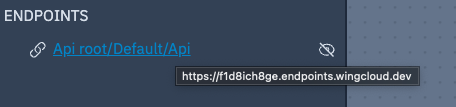

import ReactPlayer from "react-player";
import ReactPlayer from "react-player";

> The 9th issue of the Wing Inflight Magazine.
> <!--truncate-->

Howdy Wingnuts!

I am pleased to share another issue of the *Wing Inflight Magazine* with recent updates and news from the [Winglang](https://winglang.io) project.
### So what is Wing again?

Wing is a **programming environment for the cloud**. It makes it easy for developers to build and test distributed systems that leverage a variety of powerful cloud primitives such as queues, topics, API endpoints, buckets, websites, topics and a growing ecosystem of [winglibs](https://github.com/winglang/winglibs) published by the community.

Wing comes with a **visual cloud simulator** which allows interacting and testing with your cloud application on your local machine with fast hot reloading without having to deploy a single resource to the cloud.

One of the unique capabilities of Wing is that it supports what we call **pluggable platform providers**. This means that applications can be *cloud- and provisioning-engine agnostic*, and deployed to various clouds using various provisioning engines.

There is already support for Terraform/OpenTofu, CloudFormation, AWS, GCP and Azure, and discussions about [Cloudflare](https://github.com/winglang/wing/issues/4298), [Crossplane](https://github.com/winglang/wing/issues/6268), [OpenShift](https://github.com/winglang/wing/issues/6273), [Azure Bicep](https://github.com/winglang/wing/issues/6271), [Pulumi](https://github.com/winglang/wing/issues/6272). Check out the [compatibility matrix](https://www.winglang.io/docs/standard-library/compatibility-matrix), add your 👍 to the relevant issue, and share your use case to help us prioritize!

Platform teams can also create their own custom platforms using CDK constructs. This offers central control over best practices, compliance policies, security, deployment strategies and any other aspect of how Wing applications are implemented in an organization's cloud environment.

**Wing is still in active development**, but we are starting to see some really cool stuff being built with it. If you are up for a really fun (yet possibly bumpy) ride, we encourage you to [take Wing for a spin on your local machine](https://www.winglang.io/docs) or in the [Wing Playground](https://www.winglang.io/play/) and [let us know](https://t.winglang.io/slack) what you think.

We are designing Wing to be **familiar and friendly** for developers who come from modern object-oriented background such as TypeScript, Swift, C# and Java, so it will take you [5 minutes](https://github.com/winglang/workshop-react/blob/main/cheatsheet.md) to learn.
### In today's issue

- 🚀 [Deploying AWS resources and APIs inside a private VPCs](#deploying-aws-resources-and-apis-inside-a-private-vpcs)
- 🎨 [A fresh look for the Wing Console map view](#a-fresh-look-for-the-wing-console-map-view)
- 🤩 [New syntax for creating sets](#new-syntax-for-creating-sets)
- 🔥 [Mutually referential type declarations](#mutually-referential-type-declarations)
- 🛟 [The bang `!` operator](#the-bang--operator)
- 🏋️ [Ability to lift collection of inflight closures](#ability-to-lift-collection-of-inflight-closures)
- 🗄️ [`fs.appendFile()`](#fsappendfile)
- ⚙ [Platform Parameters and AWS VPC configuration](#platform-parameters-and-aws-vpc-configuration)
- 🛌 [Ergonomic improvements for `cloud.Function` and `cloud.Api`](#ergonomic-improvements-for-cloudfunction-and-cloudapi)
- 🎥 [Goodies from the Wingly Update](#goodies-from-the-wingly-update)
- 👯‍♀️ [Community Events](#community-events)

### Default IDs no longer include namespace  

`new cloud.Bucket()` previously created a resource with an ID of `cloud.Bucket`.

Now, the ID is just `Bucket`.

This avoids a bug where changing the namespace would cause the ID to change. For the non-aliased namespace this was not an issue, but for `bring "@cdktf/provider-aws" as aws;` it was if you decided to change `aws` to `awsProvider`.

[See PR by Elad](https://github.com/winglang/wing/pull/5658)

### `cloud.Function`s simulator improvements

In previous versions of the local simulator, invoked `cloud.Function`s always ran concurrently and did not share execution contexts. This was done with Node's `vm` api to execute inflight JavaScript.

Both of these facts had unfortunate implications:
- `vm` has several limitations and bugs
- No maximum concurrency
- In most real cloud function environments, sequential invocations often share execution contexts

Now, `cloud.Function` uses a worker pool of full Node processes that can also be reused between invocations.

> [See PR by Chris](https://github.com/winglang/wing/pull/5867)

### Implicitly loaded platform files

As Wing compiles your code, any `wplatform.js` files found will be loaded automatically as a platform. This occurs after explicit ones like `-t tf-aws`. This also applies to any wing libraries used!

One of the currently explored use cases is the ability for libraries to expose their own platform parameters.

For example, the `@winglibs/eventbridge` winglib exposes a platform parameter to instead import an existing event bus.  

```js
module.exports.Platform = class {
  parameters = {
    type: "object",
	  properties: {
	    eventBridgeName: {
	    type: "string",
	  },
	},
  };
};
```

> [See PR by Hasan](https://github.com/winglang/wing/pull/5886)

### Cron schedules are now more cloud agnostic  

A cron expression like `* * * * *` is valid in a unix-based crontab, but not in AWS.

On the other hand, `* * * * ?` is valid in AWS, but not elsewhere.  

Now, Wing will expect cron expression to match the more standard syntax and will automatically convert it to the AWS syntax when deploying to AWS.

```js
bring cloud;

new cloud.Schedule(cron: "* * * * *");
```

> [See PR by Marcio](https://github.com/winglang/wing/pull/5956)

### Debugging with breakpoints
  
With the VS Code extension, breakpoints can be added to .w files, both for preflight and inflight. A standard javascript debugger can be used with this to inspect and step through the code.


> [See PR by Mark](https://github.com/winglang/wing/pull/5981)
### Explicit lifting of preflight objects

New builtin `lift` function allows you to lift preflight objects for the current inflight closure.

The current syntax is experimental and already has some planned changes.

```js

class Foo {
  pub inflight method() {
    // Explicitly add some permissions to `bucket`
    lift(bucket, ["put", "delete"]); 

    // We can now use an inflight variable `b` to reference 
    // a preflight object `bucket`
    let b = bucket;
    b.put("k2", "value2"); // This will no longer fail due to the explicit lift
  }
}
```

[See PR by Yoav](https://github.com/winglang/wing/pull/5935)
### Expose cloud endpoints through the console

Any resources that use `cloud.Endpoint` will show up in the "Endpoints" section of the Wing Console as a clickable link.



> [See PR by Elad](https://github.com/winglang/wing/pull/5792)

### `bring ui` is now supported in Wing Console  

`ui` is a builtin module that allows you to add UI elements to interact with in the Console!  

```js
bring ui;

class MyResource {
  counter: cloud.Counter;
  new() {
    this.counter = new cloud.Counter();
    
    new ui.Button("Cool Button", inflight () => {
      this.counter.inc();
    });

    new ui.Field("Counter", inflight () => {
      return "{this.counter.peek()}";
    });
  }
}
```


> [See PR by Cristian](https://github.com/winglang/wing/pull/5841)

### React vite

[https://www.winglang.io/docs/guides/react-vite-websockets](https://www.winglang.io/docs/guides/react-vite-websockets)

To expedite the project creation process, consider leveraging the react-vite quickstart template:

```sh
wing new react-vite
```
### Goodies from the Wingly Update

changelog - [https://www.youtube.com/watch?v=jfUiAdcjlO4](https://www.youtube.com/watch?v=jfUiAdcjlO4)

[The Wingly Update](https://www.twitch.tv/winglangio) is our corky bi-weekly stream where we share the latest developments of the project, chat with folks from the cloud industry, geek out and celebrate the beauty of the cloud.

If you haven't been able to catch our show, you can find the complete stack of [all our episodes here](https://youtube.com/playlist?list=PL-P8v-FRassZBWsNoSafL_ReO0JO0xJVm&si=trffVrtGGMUZ-SKb). 

Here are a few goodies we curated from recent shows:

- [Huzaifa Asif](https://youtu.be/MmO2SdKmw40?si=9jrLON4QLdwqI9CR) came to chat with us about his career journey and his new book **Designing Scalable Systems**.
- [Live Hacking Session Building a Slack Bot](https://www.youtube.com/watch?v=OH_OrzhkqEA&t=132s) - the first in a series of sessions where we build a Slack bot with Wing.

In this clip from The Wingly Update #29, Mark takes us on a Typescript adventure.

[https://www.youtube.com/watch?v=eorc-Z25jGM](https://www.youtube.com/watch?v=eorc-Z25jGM)

### Community Content

Ayush post about building his first NextS app using Wing as a backend [https://www.linkedin.com/posts/ayush2390_nextjs-wing-activity-7176582275357184001-sIUe?utm_source=share&utm_medium=member_desktop](https://www.linkedin.com/posts/ayush2390_nextjs-wing-activity-7176582275357184001-sIUe?utm_source=share&utm_medium=member_desktop)

Also was a guess on our community meeting [(link to the meeting TBD)](https://drive.google.com/file/d/1dZJG7Y0RjSXnpkD_LlnyB7augYs4Gt2C/view)

Artem's video about his talk at the AWS meetup [https://drive.google.com/file/d/1dZJG7Y0RjSXnpkD_LlnyB7augYs4Gt2C/view](https://drive.google.com/file/d/1dZJG7Y0RjSXnpkD_LlnyB7augYs4Gt2C/view)

Asher's article posted by someone in Reddit [https://www.reddit.com/r/programming/comments/1bjcjbh/implementing_productiongrade_crud_rest_api_in/](https://www.reddit.com/r/programming/comments/1bjcjbh/implementing_productiongrade_crud_rest_api_in/)

Amichai's video [](https://www.youtube.com/watch?si=P6eAxuTYE5kRUv-r&v=aNGM_RF66_U&feature=youtu.be)[https://www.youtube.com/watch?v=aNGM_RF66_U](https://www.youtube.com/watch?v=aNGM_RF66_U)

Asher's articles: [https://medium.com/@asher-sterkin/implementing-production-grade-crud-rest-api-in-winglang-7b8f6917efc2](https://medium.com/@asher-sterkin/implementing-production-grade-crud-rest-api-in-winglang-7b8f6917efc2)

[https://asher-sterkin.medium.com/aws-mapu-65e888009916](https://asher-sterkin.medium.com/aws-mapu-65e888009916)
### Community Events

You can find details for all our events in the [Wingnuts Calendar](https://calendar.google.com/calendar/u/0?cid=Y18wZTljMGRkZjRiM2IyNzdmMmFlZTMzZjI2NDljYzNlMDAzMGE2OTI1NmRiNjQyNTk0YTc3YmFkZDhjNjc4YzQ4QGdyb3VwLmNhbGVuZGFyLmdvb2dsZS5jb20), amongst them:

* [Winglang Community Meeting](https://calendar.google.com/calendar/event?action=TEMPLATE&tmeid=NDN1dWpoNTQ4dGhhNDNvNzUwcW9yYW12dDBfMjAyNDAzMTJUMTQzMDAwWiBjXzBlOWMwZGRmNGIzYjI3N2YyYWVlMzNmMjY0OWNjM2UwMDMwYTY5MjU2ZGI2NDI1OTRhNzdiYWRkOGM2NzhjNDhAZw&tmsrc=c_0e9c0ddf4b3b277f2aee33f2649cc3e0030a69256db642594a77badd8c678c48%40group.calendar.google.com&scp=ALL) is our bi-weekly gathering where members of our community showcase cool apps, demos, and other projects! The upcoming session is scheduled for **Tuesday, December 19th, at 2:30 PM UTC**. We look forward to seeing you there!
* [Monday Office Hours](https://calendar.google.com/calendar/event?action=TEMPLATE&tmeid=ZnFtM3NrbHM0NGZqdTNjZGdyMDg2bHVidXBfMjAyMzEyMThUMTIwMDAwWiBjXzBlOWMwZGRmNGIzYjI3N2YyYWVlMzNmMjY0OWNjM2UwMDMwYTY5MjU2ZGI2NDI1OTRhNzdiYWRkOGM2NzhjNDhAZw&tmsrc=c_0e9c0ddf4b3b277f2aee33f2649cc3e0030a69256db642594a77badd8c678c48%40group.calendar.google.com&scp=ALL) is our bi-weekly opportunity for you to share your feedback, thoughts, concerns, or simply drop by to say hi.
* - Slack channel
    
    [https://t.winglang.io/slack](https://t.winglang.io/slack)

### Summary

That's it for this edition!

You are invited to join the [Wing Slack](https://t.winglang.io/slack)! Come say hello and hang out with fellow Wingnuts!
Give [winglang.io](https://winglang.io) a visit and take Wing out for a spin. If you're not already, stay updated on the latest changes in our [repo](https://github.com/winglang/wing).

Catch you in the next update!

**The Wing Team**
