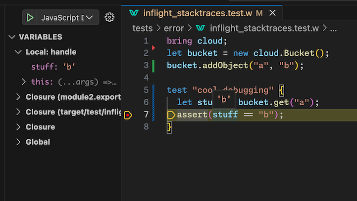

> The 9th issue of the Wing Inflight Magazine.
> <!--truncate-->

Howdy Wingnuts!

I am pleased to share another issue of the *Wing Inflight Magazine* with recent updates and news
from the [Winglang](https://winglang.io) project.

### So what is Wing again?

Wing is a new programming environment for the cloud. It makes it easy for developers to build and
test distributed systems that leverage a variety of powerful cloud primitives such as queues,
topics, API endpoints, buckets, websites, topics and a growing ecosystem of
[winglibs](https://github.com/winglang/winglibs).

Wing comes with a *visual cloud simulator* which can be used to interact and test complete cloud
applications on your local machine, with fast hot reloading and without having to deploy a single
resource to the cloud.

One of the unique capabilities of Wing is that it supports what we call **pluggable platform
providers**. This means that applications can be *cloud- and provisioning-engine agnostic*, so they
can be deployed to multiple cloud providers using multiple provisioning engines.

There is already support for Terraform/OpenTofu, CloudFormation, AWS, GCP and Azure, and discussions
about [Cloudflare](https://github.com/winglang/wing/issues/4298),
[Crossplane](https://github.com/winglang/wing/issues/6268),
[Pulumi](https://github.com/winglang/wing/issues/6272),
[OpenShift](https://github.com/winglang/wing/issues/6273), [Azure
Bicep](https://github.com/winglang/wing/issues/6271). Check out the [compatibility
matrix](https://www.winglang.io/docs/standard-library/compatibility-matrix), add your 👍 to the
relevant issue, and share your use case to help us prioritize!

Platform teams can also create their own custom platforms using CDK constructs. This offers central
control over best practices, compliance policies, security, deployment strategies and any other
aspect of how Wing applications are implemented in an organization's cloud environment.

**Wing is still in active development**, but we are starting to see some really cool stuff being
built with it. If you are up for a really fun (yet possibly bumpy) ride, we encourage you to [take
Wing for a spin on your local machine](https://www.winglang.io/docs) or in the [Wing
Playground](https://www.winglang.io/play/) and [let us know](https://t.winglang.io/slack) what you
think.

We are designing Wing to be **familiar and friendly** for developers who come from modern
object-oriented background such as TypeScript, Swift, C# and Java, so it will take you [5
minutes](https://github.com/winglang/workshop-react/blob/main/cheatsheet.md) to learn.

### In today's issue

- 🐛 [Debugging with breakpoints](#debugging-with-breakpoints)
- 📊 [Local simulation of serverless function concurrency](#local-simulation-of-serverless-function-concurrency)
- 💁 [A new project template for React with Vite](#a-new-project-template-for-react-with-vite)
- 🔘 [Adding UI to Wing classes through `bring ui`](#adding-ui-to-wing-classes-through-bring-ui)
- 🪝 [Exposing cloud endpoints for webhook development](#exposing-cloud-endpoints-for-webhook-development)
- 🏋️‍♀️ [Explicit lifting of preflight objects](#explicit-lifting-of-preflight-objects)
- 🤞 [Changes to default object identifiers](#changes-to-default-object-identifiers)
- 💼 [Implicitly loaded platform extensions](#implicitly-loaded-platform-extensions)
- 🕑 [Standardize cron expressions](#standardize-cron-expressions)
- 🎥 [Goodies from the Wingly Update](#goodies-from-the-wingly-update)
- 🦁 [Wing in the Wild](#wing-in-the-wild)
- 👯‍♂️ [Community Events](#community-events)

### Changes to default object identifiers

When creating [preflight
objects](https://www.winglang.io/docs/language-reference#33-preflight-classes) in Wing, each object
gets an identifier which is unique to its scope of definition. These identifiers are essential for
producing deterministic unique addresses for cloud resources when they are provisioned.

The default identifier for objects in Wing is the name of the class. In the following example, the
identifier of the bucket is simply `"Bucket"`:

```js
new cloud.Bucket();
```

Previously, the default identifier included the namespace of the class, so in the above example the
identifier was `"cloud.Bucket"`, but since namespaces can now be aliased (`bring cloud as
my_cloud`), this resulted in unstable defaults, which can have dire implications on infrastructure.

By the way, Wing also has dedicated syntax (`as ID`) to determine the identity of an object in case
there are multiple instances of the same type or you want to be more explicit:

```js
new cloud.Bucket() as "my_bucket";
```

> We are discussing potentially [changing this
> syntax](https://github.com/winglang/wing/issues/4604), so let us know what you think.

[See PR by Elad](https://github.com/winglang/wing/pull/5658)

### Local simulation of serverless function concurrency

We've made improvements to how `cloud.Function`s are executed in the Wing Simulator so they
functionally behave like FaaS providers. We are now running each function within an isolated child
process and manage it's concurrency limits.


The `concurrency` option that can be passed to `cloud.Function` or any resource that takes an
inflight closure can be used to control these limits.

For example:

```js
bring util;
bring cloud;

let queue = new cloud.Queue();

let handler = inflight (x) => {
  log("only one at a time: {x}");
};

queue.setConsumer(handler, concurrency: 1);
//                         ^^^^^^^^^^^^^^

test "push 10" {
  for i in 0..10 { queue.push("{i}"); }
  util.waitUntil(() => { return queue.approxSize() == 0; });
}
```

* When running this with `concurrency: 1`, the code finishes after ~1.5s
* When running with `concurrency: 10`, the code finishes after 0.5s

> [See PR by Chris](https://github.com/winglang/wing/pull/5867)

### Implicitly loaded platform extensions

[Platform extensions](https://www.winglang.io/docs/concepts/platforms) are one of the most powerful
capabilities of Wing. They can determine how cloud resources are implemented in your cloud
environment, validate that your application adheres to an organizational policy or inject best
practices and common patterns "under the hood".

So far, it was possible to configure Wing to use a platform provider using an explicit `--platform`
switch passed to the Wing CLI, but we've seen a need for modules or libraries to be able to provide
platform extensions without having to require explicit configuration.

To that end, as Wing compiles your code, any `wplatform.js` files found will be loaded automatically
as a platform. This occurs after explicit ones like `-t tf-aws` and also applies to any winglibs
used by your applications.

One of the currently explored use cases is the ability for libraries to expose their own platform
parameters.

For example, the [`eventbridge`](https://github.com/winglang/winglibs/tree/main/eventbridge) winglib
exposes a platform parameter called `eventBridgeName` to allow developers to connect to an existing
EventBridge bus:

```shell
wing compile -t @winglang/platform-awscdk -v eventBridgeName="my-bus" main.w
```

Here's a sneak peak on how this platform extension is implemented:

```js
module.exports.Platform = class {
  parameters = {
    type: "object",
	  properties: {
	    eventBridgeName: {
	    type: "string",
	  },
	},
  };
};
```

> [See PR by Hasan](https://github.com/winglang/wing/pull/5886)

### Standardize cron expressions  

A cron expression like `* * * * *` is valid in a unix-based crontab, but not in AWS. On the other
hand, `* * * * ?` is valid in AWS, but not elsewhere.

Now, Wing will expect cron expression to match the standard syntax, and will automatically convert
it to the AWS syntax when deploying to AWS:

```js
bring cloud;

new cloud.Schedule(cron: "* * * * *");
```

> [See PR by Marcio](https://github.com/winglang/wing/pull/5956)

### Debugging with breakpoints

It is now possible to set breakpoints and fully debug your Wing applications!

The Wing VS Code extension, breakpoints can be added to `.w` files, both for preflight and inflight
code and simply hit F5 to debug. The built-in debugger can now be used to inspect and step through
the code.



> [See PR by Mark](https://github.com/winglang/wing/pull/5981)

### Explicit lifting of preflight objects

When inflight code is referencing a preflight object, the object is *lifted* and the operation
performed on the object is *qualified* in order to be able to determine things like IAM permissions.

In many cases, the Wing compiler can automatically qualify the lift. For example, in the code below,
it is clear that the inflight closure performs a `push` operation on the lifted queue object:

```js
bring cloud;

let myQueue = new cloud.Queue();

inflight () => {
  myQueue.push("hello");
};
```

But since the Wing compiler currently does not perform symbolic execution, there are cases where
it's currently impossible for the compiler to qualify the lift. For example, if I assign `myQueue`
to a new variable called (`yourQueue`), we will get the following error:

```js
bring cloud;

let myQueue = new cloud.Queue();

inflight () => {
  let yourQueue = myQueue;
  yourQueue.push("hello");
//^^^^^^^^^ Expression of type "Queue" references an unknown preflight object, can't qualify its capabilities.
};
```

To overcome this limitation, a new builtin `lift()` can be used to explicitly qualify the lifts:

```js
bring cloud;

let myQueue = new cloud.Queue();

inflight () => {
  lift(myQueue, ["push"]);

  let yourQueue = myQueue;
  yourQueue.push("hello");
};
```

New builtin `lift` function allows you to lift preflight objects for the current inflight closure.

> This syntax is still under discussion, but we wanted to make sure this is not blocking users.
> Check out the [RFC](https://github.com/winglang/wing/pull/5951) and join the conversation.

[See PR by Yoav](https://github.com/winglang/wing/pull/5935)

### Exposing cloud endpoints for webhook development

When developing applications that react to requests from other services via web hooks such as bots
and extensions, it is often very valuable to be able to accept requests from these external systems
during development.

So now, every `cloud.Endpoint` in your application (either explicitly or implicitly defined via a
`cloud.Api`, `cloud.Website`, etc) can be exposed and requests will be tunneled into the local
simulator:


> This is an experimental feature and still needs some ironing out, and we would love to hear what
> you think about it.

> [See PR by Elad](https://github.com/winglang/wing/pull/5792)

### Adding UI to Wing classes through `bring ui`

It is now possible to associate simple user interface elements with Wing preflight classes through
the `ui` module. These elements can dynamically interact with your system via simple implementations
of inflight closures:

```js
bring ui;

class MyResource {
  counter: cloud.Counter;
  
  new() {
    this.counter = new cloud.Counter();
    
    new ui.Button("Cool Button", inflight () => {
      this.counter.inc();
    });

    new ui.Field("Counter", inflight () => {
      return "{this.counter.peek()}";
    });
  }
}
```

Now, when a `MyResource` node is selected in the Wing Console, you'll see this in the inspector
pane:


We are adding more UI elements and can't wait to see what people will build with this!

> [See PR by Cristian](https://github.com/winglang/wing/pull/5841)

### A new project template for React with Vite

We are continuing to add new project templates for various types of projects, and we've recently
created one for the infamous combination of [React](https://react.dev/) with
[Vite](https://vitejs.dev/) tooling.

Check out [this
guide](https://www.winglang.io/docs/guides/react-vite-websockets](https://www.winglang.io/docs/guides/react-vite-websockets)
for a detailed tutorial or just get started with:

```sh
mkdir my-project && cd my-project
wing new react-vite
```

### Goodies from the Wingly Update

[The Wingly Update](https://www.twitch.tv/winglangio) is our corky bi-weekly stream where we share
the latest developments of the project, chat with folks from the cloud industry, geek out and
celebrate the beauty of the cloud.

If you haven't been able to catch our show, you can find the complete stack of [all our episodes
here](https://youtube.com/playlist?list=PL-P8v-FRassZBWsNoSafL_ReO0JO0xJVm&si=trffVrtGGMUZ-SKb). 

Here are a few goodies we curated from recent shows:

- The recent [CHANGELOG](https://www.youtube.com/watch?v=jfUiAdcjlO4) with [@MarkMcCulloh](https://github.com/MarkMcCulloh)
- An overview of where we are in our journey towards [Wing for TypeScript](https://www.youtube.com/watch?v=eorc-Z25jGM).
- A [chat with Allen Helton](https://www.youtube.com/watch?v=bi67oqJBNU0) about Texas, life, conferences, cowboys and his love for serverless.
- A fun [chat with Michael Antonio](https://www.youtube.com/watch?v=G_8n5AIzmFA) from AWS about his journey at Microsoft and Amazon, IAC, CDK and computing nostalgia.

### Wing in the Wild

This is a new section in our magazine where we curate content about Wing from the world wide and
wonderful web:

* An awesome [overview video of Wing](https://www.youtube.com/watch?v=aNGM_RF66_U) by Amichai
  Mantinband.
* Ayush Thakur
  [wrote](https://www.linkedin.com/posts/ayush2390_nextjs-wing-activity-7176582275357184001-sIUe?utm_source=share&utm_medium=member_desktop)
  about his experience building a NextS app with a Wing backend.
* Asher Sterkin's explored an implementation of [production-grade REST
  APIs](https://itnext.io/implementing-production-grade-crud-rest-api-in-winglang-7b8f6917efc2) in
  Wing as well as used Wing to manage multiple AWS environments.

### Community Events

You can find details for all our events in the [Wingnuts
Calendar](https://calendar.google.com/calendar/u/0?cid=Y18wZTljMGRkZjRiM2IyNzdmMmFlZTMzZjI2NDljYzNlMDAzMGE2OTI1NmRiNjQyNTk0YTc3YmFkZDhjNjc4YzQ4QGdyb3VwLmNhbGVuZGFyLmdvb2dsZS5jb20),
amongst them:

* [Winglang Community
  Meeting](https://calendar.google.com/calendar/event?action=TEMPLATE&tmeid=NDN1dWpoNTQ4dGhhNDNvNzUwcW9yYW12dDBfMjAyNDAzMTJUMTQzMDAwWiBjXzBlOWMwZGRmNGIzYjI3N2YyYWVlMzNmMjY0OWNjM2UwMDMwYTY5MjU2ZGI2NDI1OTRhNzdiYWRkOGM2NzhjNDhAZw&tmsrc=c_0e9c0ddf4b3b277f2aee33f2649cc3e0030a69256db642594a77badd8c678c48%40group.calendar.google.com&scp=ALL)
  is our bi-weekly gathering where members of our community showcase cool apps, demos, and other
  projects.
* [Monday Office
  Hours](https://calendar.google.com/calendar/event?action=TEMPLATE&tmeid=ZnFtM3NrbHM0NGZqdTNjZGdyMDg2bHVidXBfMjAyMzEyMThUMTIwMDAwWiBjXzBlOWMwZGRmNGIzYjI3N2YyYWVlMzNmMjY0OWNjM2UwMDMwYTY5MjU2ZGI2NDI1OTRhNzdiYWRkOGM2NzhjNDhAZw&tmsrc=c_0e9c0ddf4b3b277f2aee33f2649cc3e0030a69256db642594a77badd8c678c48%40group.calendar.google.com&scp=ALL)
  is our bi-weekly opportunity for you to share your feedback, thoughts, concerns, or simply drop by
  to say hi.

### Summary

That's it for this edition!

You are invited to join the [Wing Slack](https://t.winglang.io/slack)! Come say hello and hang out
with fellow Wingnuts! Give [winglang.io](https://winglang.io) a visit and take Wing out for a spin.
If you're not already, stay updated on the latest changes in our
[repo](https://github.com/winglang/wing).

Looking forward to entertaining you in your next flight!

*- The Wing Team*