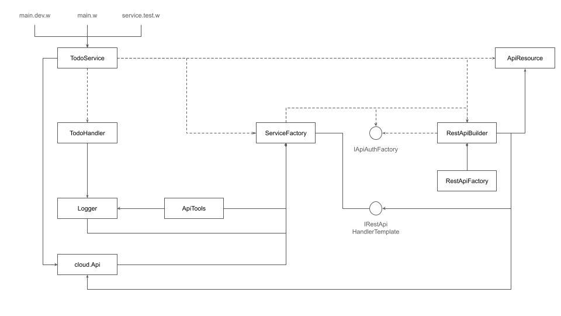
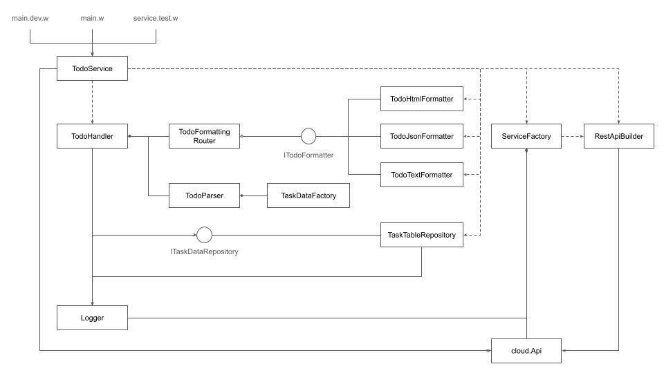

<div style={{color: "#E2EAEB", fontSize: "2rem" }}>Part Two: Pipeline Formation with Template Method </div>


[Winglang's](https://github.com/winglang/wing) unique capability to uniformly handle both [preflight](https://www.winglang.io/docs/concepts/inflights#preflight-code) (cloud resource configuration) and [inflight](https://www.winglang.io/docs/concepts/inflights#inflight-code) (cloud events processing) logic opens up meta-programming possibilities akin to [Lisp macros](https://lispcookbook.github.io/cl-cookbook/macros.html). This allows for the dynamic adjustment of service configurations to various deployment targets—such as DEV, TEST, STAGE, and PROD—at the build stage. By doing so, it optimizes cost, security, and performance without compromising the integrity of the core service logic, which remains largely insulated from middleware framework details. This level of flexibility is unmatched by more traditional cloud middleware libraries, such as [PowerTools for AWS Lambda](https://github.com/aws-powertools), which I explored in the [first part](https://medium.com/itnext/in-search-for-winglang-middleware-9d1be0782108) of this series.

In this part, I will explore how a middleware framework can leverage the [Template Method Design Pattern](https://en.wikipedia.org/wiki/Template_method_pattern). This design pattern has proven instrumental in defining the common elements of the [REST API](https://en.wikipedia.org/wiki/REST) Create/Retrieve/Update/Delete (CRUD) request handling flow, while still allowing enough flexibility to accommodate the specifics of each request.

Specifically, the application of the [Template Method Design Pattern](https://en.wikipedia.org/wiki/Template_method_pattern) to define a common request-handling workflow has demonstrated the following benefits:

- Unlike [Decorator](https://en.wikipedia.org/wiki/Decorator_pattern), it organically presents post-processing steps of request handling in their natural sequence.
- It facilitates the reuse of a common request-handling definition across all functions related to a resource, service, or even across all services developed by the same team or organization.
- It enables the specification of multiple configurations optimized for various deployment targets (DEV, TEST, STAGE, PROD), addressing variability at the build stage to eliminate unnecessary overhead and security risks.

Nevertheless, this approach has limitations. A high number of deployment targets, services, resources, and function permutations may necessitate maintaining a large number of templates—a common challenge in any [Engineering Platform](https://platformengineering.org/blog/what-is-platform-engineering) based on blueprints.

Exploring whether these limitations can be surmounted using [Winglang's](https://github.com/winglang/wing) unique capabilities will be the focus of future research.

# Common Service Middleware

As clarified in the [previous publication](https://medium.com/itnext/in-search-for-winglang-middleware-9d1be0782108),

> **Common middleware services** augment distribution middleware by defining higher-level domain-independent reusable services that allow application developers to concentrate on
> programming business logic, without the need to write the “plumbing” code required to develop distributed applications via lower-level middleware directly.

In our pursuit, we specifically aim to define common service configurations that are adaptable to various development targets. Such configurations are not only reusable across multiple services and resources within the same team or organization but are also distinct enough not to be overgeneralized in the form of a framework but rather to merit integration into a tailored [Engineering Platform](https://platformengineering.org/blog/what-is-platform-engineering). This balance ensures that while the configurations maintain a high level of generality, they remain sufficiently detailed to support the unique needs of different projects within the organization.

Here is an example of how common service configurations can be implemented using [Winglang](https://github.com/winglang/wing).
Typically, this or a similar code snippet will be a part of a larger solution integrated into an organization's or team's [engineering platform](https://platformengineering.org/blog/what-is-platform-engineering):

```tsx
bring endor;
bring cloud;
bring logging;

//Could be a part of an organization or team engineering platform
pub class ServiceFactory impl endor.IRestApiHandlerTemplate {
    _tools: endor.ApiTools;
    _mode: endor.Mode;
    pub logger: logging.Logger;
    pub api: cloud.Api;

    _getLoggingLevel(mode: endor.Mode): logging.Level {
        if mode == endor.Mode.PROD {
            return logging.Level.INFO;
        } elif mode == endor.Mode.DEV {
            return logging.Level.TRACE;
        } else {
            return logging.Level.DEBUG;
        }
    }

    _getToolsOptions(
        mode: endor.Mode,
        logger: logging.Logger
    ): endor.ApiToolsOptions {
        if mode == endor.Mode.DEV {
            return endor.ApiToolsOptions{
                logger: logger,
                statusMessage: Map<str>{} // leave original error messages intact
            };
        }
        return endor.ApiToolsOptions{
            logger: logger
        }; // use defaults
    }

    new(serviceName: str, mode: endor.Mode) {
        this._mode = mode;
        this.logger = new logging.Logger(
            this._getLoggingLevel(mode),
            serviceName);
        this._tools = new endor.ApiTools(
            this._getToolsOptions(mode,
            this.logger));
        this.api = new cloud.Api();
    }

    _getProdApiBuilder(
        resource: endor.ApiResource,
        responseFormats: Array<str>,
        getHomePage: (inflight (Json, str): str)?
    ): endor.RestApiBuilder {
        let tokenFactory = new endor.FixedSecretTokenFiltersFactory();
        let cookieFactory = new endor.CookieAuthFiltersFactory(tokenFactory);
        let apiBuilder = new endor.RestApiBuilder(
            this.api,
            resource,
            this,
            cookieFactory,
            responseFormats);
        if getHomePage != nil {
            apiBuilder.samlLogin(cookieFactory, getHomePage!);
        }
        return apiBuilder;
    }
    _getDevApiBuilder(
        resource: endor.ApiResource,
        responseFormats: Array<str>,
        getHomePage: (inflight (Json, str): str)?
    ): endor.RestApiBuilder {
        let session = Json {
            userID: "test-user",
            fullName: "Test User"
        };
        let stubAuth = new endor.ApiStubAuthFactory(session);
        let apiBuilder = new endor.RestApiBuilder(
            this.api,
            resource,
            this,
            stubAuth,
            responseFormats);
        if getHomePage != nil {
            apiBuilder.stubLogin(session, getHomePage!);
        }
        return apiBuilder;
    }
    _getDefaultApiBuilder(
        resource: endor.ApiResource,
        responseFormats: Array<str>,
        password: str
    ): endor.RestApiBuilder {
        let basicAuth = new endor.ApiBasicAuthFactory(password);
        let apiBuilder = new endor.RestApiBuilder(
            this.api,
            resource,
            this,
            basicAuth,
            responseFormats);
        return apiBuilder;
    }
    pub getApiBuilder(
        resource: endor.ApiResource,
        responseFormats: Array<str>,
        getHomePage: (inflight (Json, str): str)?,
        password: str?
    ): endor.RestApiBuilder {
        if this._mode == endor.Mode.PROD {
            return this._getProdApiBuilder(
                resource,
                responseFormats,
                getHomePage);
        } elif this._mode == endor.Mode.DEV {
            return this._getDevApiBuilder(
                resource,
                responseFormats,
                getHomePage);
        } else {
            return this._getDefaultApiBuilder(
                resource,
                responseFormats,
                password!);
        }
    }

    pub makeRequestHandler(
        functionName: str,
        proc: inflight (cloud.ApiRequest): cloud.ApiResponse
    ): inflight(cloud.ApiRequest): cloud.ApiResponse {
        let handler = inflight (request: cloud.ApiRequest): cloud.ApiResponse => {
            let var response = cloud.ApiResponse{};
            try {
                this._tools.logRequest(functionName, request);
                response = proc(request);
            } catch err {
                response = this._tools.errorResponse(err);
            }
            this._tools.logResponse(functionName, response);
            response = this._tools.responseMessage(response);
            return response;
        };
        return handler;
    }

}
```

This example is quite detailed, so we will break it down section by section to fully understand its structure and functionality.

This module, by convention named `middleware.w`, features a [Winglang preflight](https://www.winglang.io/docs/concepts/inflights#preflight-code) class called `ServiceFactory`. This class encapsulates the following public resources and methods, which are crucial for the middleware's operation:

- `api: [cloud.Api](https://www.winglang.io/docs/standard-library/cloud/api)`: resource from the [Winglang Standard Library](https://www.winglang.io/docs/category/cloud)
- `logger: logging.Logger`: resource, extending the [Winglang libraries](https://www.winglang.io/docs/libraries), which was discussed previously in terms of its utility and possible implementation implementation [here](https://medium.com/itnext/implementing-production-grade-crud-rest-api-in-winglang-7b8f6917efc2)
- `makeRequestHandler()`: [Factory Method](https://en.wikipedia.org/wiki/Factory_method_pattern) that applies the [Template Method Design Pattern](https://en.wikipedia.org/wiki/Template_method_pattern) tailored to each request handler
- `getApiBuilder()`: another [Factory Method](https://en.wikipedia.org/wiki/Factory_method_pattern) this time applying the [Builder Design Pattern](https://en.wikipedia.org/wiki/Builder_pattern) to configure specific resource API calls

## makeRequestHandler() Factory Method

```tsx
    pub makeRequestHandler(
        functionName: str,
        proc: inflight (cloud.ApiRequest): cloud.ApiResponse
    ): inflight(cloud.ApiRequest): cloud.ApiResponse {
        let handler = inflight (request: cloud.ApiRequest): cloud.ApiResponse => {
            let var response = cloud.ApiResponse{};
            try {
                this._tools.logRequest(functionName, request);
                response = proc(request);
            } catch err {
                response = this._tools.errorResponse(err);
            }
            this._tools.logResponse(functionName, response);
            response = this._tools.responseMessage(response);
            return response;
        };
        return handler;
    }

```

This [Factory Method](https://en.wikipedia.org/wiki/Factory_method_pattern) plays a central role in implementing the Common Service Middleware. It is a [Winglang preflight](https://www.winglang.io/docs/concepts/inflights#preflight-code) method that obtains two parameters:

- `functionName`: The name of the function handling the API request, used for logging purposes.
- `proc`: a [Winglang inflight](https://www.winglang.io/docs/concepts/inflights#inflight-code) function that transforms `cloud.ApiRequest` into a `cloud.ApiResponse`

Internally, it defines a [Winglang inflight](https://www.winglang.io/docs/concepts/inflights#inflight-code) function, called `handler` that encapsulates a typical API request processing workflow:

1. **Logging the Request**: Initially logs the incoming `cloud.ApiRequest`.
2. **Processing the Request**: Executes the `proc` function to obtain a `cloud.ApiResponse`.
3. **Error Handling**: In the case of an error, it transforms the error into an appropriate `cloud.ApiResponse`.
4. **Response Logging**: Logs the outgoing `cloud.ApiResponse`.
5. **Error Message Management**: Modifies the error message in the response based on the configuration to prevent leakage of sensitive information to potential attackers.

Operations for logging and error handling are managed using the auxiliary `endor.ApiTools` class, which we will explore in further detail later.

## getApiBuilder() Factory Method

The `getApiBuilder()` method, another key component implemented as a [Factory Method](https://en.wikipedia.org/wiki/Factory_method_pattern), dynamically creates a properly configured API [Builder](https://en.wikipedia.org/wiki/Builder_pattern) for a specific resource, depending on the deployment mode:

```tsx
pub getApiBuilder(
        resource: endor.ApiResource,
        responseFormats: Array<str>,
        getHomePage: (inflight (Json, str): str)?,
        password: str?
    ): endor.RestApiBuilder {
        if this._mode == endor.Mode.PROD {
            return this._getProdApiBuilder(
                resource,
                responseFormats,
                getHomePage);
        } elif this._mode == endor.Mode.DEV {
            return this._getDevApiBuilder(
                resource,
                responseFormats,
                getHomePage);
        } else {
            return this._getDefaultApiBuilder(
                resource,
                responseFormats,
                password!);
        }
    }
```

This [Winglang preflight](https://www.winglang.io/docs/concepts/inflights#preflight-code) method accepts four parameters:

- `resource`: A [Winglang Struct](https://www.winglang.io/docs/language-reference#31-structs) defining the API resource, including its names and HTTP paths for singular and plural operations.
- `responseFormats`: A [Winglang Array](https://www.winglang.io/docs/language-reference#37-arrays) specifying supported response formats, such as `application/json`, `text/html`, or `text/plain`.
- `getHomePage`: An optional [Winglang inflight](https://www.winglang.io/docs/concepts/inflights#inflight-code) function to fetch the home page content using session data and the required format.
- `password`: An optional string for temporary use in [HTTP Basic Authentication](https://en.wikipedia.org/wiki/Basic_access_authentication).

Based on the `_mode` field, the method directs the construction of the appropriate builder:

- It calls `_getProdApiBuilder` for the `PROD` mode.
- It invokes `_getDevApiBuilder` for the `DEV` mode.
- It defaults to `_getDefaultApiBuilder` in other cases.

The main variability point that distinguishes these three options is the authentication [strategy](https://en.wikipedia.org/wiki/Strategy_pattern) applied to each API request. Let's examine the specifics of each builder's implementation.

## \_getProdApiBuilder() Factory Method

```tsx
_getProdApiBuilder(
        resource: endor.ApiResource,
        responseFormats: Array<str>,
        getHomePage: (inflight (Json, str): str)?
    ): endor.RestApiBuilder {
        let tokenFactory = new endor.FixedSecretTokenFiltersFactory();
        let cookieFactory = new endor.CookieAuthFiltersFactory(tokenFactory);
        let apiBuilder = new endor.RestApiBuilder(
            this.api,
            resource,
            this,
            cookieFactory,
            responseFormats);
        if getHomePage != nil {
            apiBuilder.samlLogin(cookieFactory, getHomePage!);
        }
        return apiBuilder;
    }
```

For production environments, the security of API requests is paramount. This method implements stringent authentication protocols using [JSON Web Tokens (JWT)](https://en.wikipedia.org/wiki/JSON_Web_Token) embedded within [Cookie HTTP Headers](https://developer.mozilla.org/en-US/docs/Web/HTTP/Headers/Cookie). The JWTs are signed with a fixed random key, a cost-effective measure that maintains robust security for services at this level.

This [Winglang preflight](https://www.winglang.io/docs/concepts/inflights#preflight-code) method sets up the described security configuration. Additionally, if the `getHomePage` parameter is not `nil`, the method configures an extra HTTP request handler for SAML-based authentication, offering another layer of security and user verification (further details on this process can be found [here](https://medium.com/itnext/implementing-production-grade-crud-rest-api-in-winglang-7b8f6917efc2)).

## \_getDevApiBuilder() Factory Method

```tsx
_getDevApiBuilder(
        resource: endor.ApiResource,
        responseFormats: Array<str>,
        getHomePage: (inflight (Json, str): str)?
    ): endor.RestApiBuilder {
        let session = Json {
            userID: "test-user",
            fullName: "Test User"
        };
        let stubAuth = new endor.ApiStubAuthFactory(session);
        let apiBuilder = new endor.RestApiBuilder(
            this.api,
            resource,
            this,
            stubAuth,
            responseFormats);
        if getHomePage != nil {
            apiBuilder.stubLogin(session, getHomePage!);
        }
        return apiBuilder;
    }
```

For development purposes, especially when using the [Winglang Simulator](https://www.winglang.io/docs/category/sim) in [interactive mode](https://www.winglang.io/docs/tools/wing-console#interact-with-your-wing-application), security requirements can be relaxed. In this mode, authentic security is not required, allowing developers to focus on functionality and flow without the overhead of complex security protocols.

This [Winglang preflight](https://www.winglang.io/docs/concepts/inflights#preflight-code) method implements such a setup. It uses a stub authentication system based on predefined user session data. Furthermore, if the `getHomePage` parameter is supplied and not `nil`, the method adds an HTTP request handler that simulates the login process, maintaining the integrity of the user experience even in a simulated environment.

## \_getDefaultApiBuilder() Factory Method

```tsx
_getDefaultApiBuilder(
        resource: endor.ApiResource,
        responseFormats: Array<str>,
        password: str
    ): endor.RestApiBuilder {
        let basicAuth = new endor.ApiBasicAuthFactory(password);
        let apiBuilder = new endor.RestApiBuilder(
            this.api,
            resource,
            this,
            basicAuth,
            responseFormats);
        return apiBuilder;
    }
```

For test and stage modes, where end-to-end testing is routinely performed, a balance between security, cost-efficiency, and performance is essential. Unlike local simulations that utilize stub authentication similar to the development environment, end-to-end tests in real cloud platforms like AWS require more robust security.

This [Winglang preflight](https://www.winglang.io/docs/concepts/inflights#preflight-code) method achieves this by implementing [HTTP Basic Authentication](https://en.wikipedia.org/wiki/Basic_access_authentication). It utilizes a dynamically generated password to ensure security while maintaining cost efficiency. The use of [HTTP Basic Authentication](https://en.wikipedia.org/wiki/Basic_access_authentication), where credentials are passed directly in the header, eliminates the need for separate login request handling, streamlining the testing process.

## ServiceFactory Object Initialization

Proper initialization of the `ServiceFactory` object is crucial for the functionality of its public methods and fields. Below is a detailed look into its initialization process:

```tsx
bring endor;
bring cloud;
bring logging;

//Could be a part of organization or team engineering platform
pub class ServiceFactory impl endor.IRestApiHandlerTemplate {
    _tools: endor.ApiTools;
    _mode: endor.Mode;
    pub logger: logging.Logger;
    pub api: cloud.Api;

    _getLoggingLevel(mode: endor.Mode): logging.Level {
        if mode == endor.Mode.PROD {
            return logging.Level.INFO;
        } elif mode == endor.Mode.DEV {
            return logging.Level.TRACE;
        } else {
            return logging.Level.DEBUG;
        }
    }

    _getToolsOptions(
        mode: endor.Mode,
        logger: logging.Logger
    ): endor.ApiToolsOptions {
        if mode == endor.Mode.DEV {
            return endor.ApiToolsOptions{
                logger: logger,
                statusMessage: Map<str>{} // leave original error messages intact
            };
        }
        return endor.ApiToolsOptions{
            logger: logger
        }; // use defaults
    }

    new(serviceName: str, mode: endor.Mode) {
        this._mode = mode;
        this.logger = new logging.Logger(
            this._getLoggingLevel(mode),
            serviceName);
        this._tools = new endor.ApiTools(
            this._getToolsOptions(mode,
            this.logger));
        this.api = new cloud.Api();
    }
```

The `new()` constructor method is designed to take two parameters:

- `serviceName`: Utilized in all log messages to identify service-specific operations.
- `mode`: Determines the appropriate configuration settings for different operational environments.

The initialization sequence performs the following steps:

1. **Mode Configuration**: Stores the `mode` to dictate the behavior of the `getApiBuilder()` method.
2. **Logger Initialization**: Creates a `Logger` object with a logging level based on `mode`:
   - **INFO** for PROD for streamlined logging.
   - **TRACE** for DEV to enable detailed debugging.
   - **DEBUG** for other environments to balance detail and performance.
3. **ApiTools Configuration**: Establishes an `endor.ApiTools` object with settings influenced by `mode`:
   - Retains original error messages in DEV mode to aid in debugging.
   - Replaces error messages with standard HTTP response text in other modes to safeguard against potential security risks.

This `ServiceFactory` class, by implementing the `endor.IRestApiHandlerTemplate` interface, seamlessly integrates with the `endor.RestApiBuilder`. This allows the latter to utilize the `makeRequestHandler()` method of `ServiceFactory`, thus ensuring consistent handling of all API requests.

# TodoService

The common middleware service configuration described previously hides a substantial portion of the system infrastructure complexity, allowing specific service configurations to be defined with ease and precision. A practical implementation of this approach can be seen in the `TodoService`, first introduced in the [previous publication](https://medium.com/itnext/implementing-production-grade-crud-rest-api-in-winglang-7b8f6917efc2):

```tsx
bring endor;
bring cloud;
bring logging;
bring "./core" as core;
bring "./adapters" as adapters;
bring "./middleware.w" as middleware;

pub class TodoService {
    _api: cloud.Api;

    //TODO: true content negotiation; unit test?; move to adapters??
    _getResponseFormatters(
		    mode: endor.Mode,
		    resource: endor.ApiResource
		): Map<core.ITodoFormatter> {
        if mode == endor.Mode.TEST {
            return Map<core.ITodoFormatter> {
                "application/json" => new adapters.TodoJsonFormatter()
            };
        }
        return Map<core.ITodoFormatter> {
            "text/html" => new adapters.TodoHtmlFormatter(resource.htmlPath),
            "text/plain" => new adapters.TodoTextFormatter(),
        };
    }

    new(mode: endor.Mode, password: str?) {
        let serviceName = "Todo Service";
        let factory = new middleware.ServiceFactory(serviceName, mode);
        let resource = new endor.ApiResource("Task");
        let responseFormatters = this._getResponseFormatters(mode, resource);
        let repository = new adapters.TaskTableRepository(factory.logger);
        let handler = new core.TodoHandler(
            repository,
            responseFormatters,
            factory.logger
        );
        let apiBuilder = factory.getApiBuilder(
            mode,
            resource,
            responseFormatters.keys(),
            handler.getHomePage(),
            password
        );

        apiBuilder.retrieveResources(handler.getAllTasks());
        apiBuilder.createResource(handler.createTask());
        apiBuilder.replaceResource(handler.replaceTask());
        apiBuilder.deleteResource(handler.deleteTask());
        this._api = factory.api;
    }

    pub getUrl(): str {
        return this._api.url;
    }
}
```

The `TodoService` class serves as a [Winglang preflight](https://www.winglang.io/docs/concepts/inflights#preflight-code) entity that orchestrates the integration of the service core, its adapters, and middleware. It includes a public `getUrl()` method for testing purposes.

## Service Initialization

The `new()` constructor method takes two parameters:

- `mode`: Determines the output format selection and middleware configuration.
- `password`: An optional string for [HTTP Basic Authentication](https://en.wikipedia.org/wiki/Basic_access_authentication) in scenarios requiring secure access.

The service is initialized through the following steps:

1. **Middleware Configuration**: Initializes a `ServiceFactory` with `serviceName` and `mode`.
2. **Resource Descriptor**: Sets up a `Task` resource descriptor that translates to the `/tasks` HTTP path.
3. **Response Formatter Configuration**: Depending on the `mode`, it configures response formatters:
   - `application/json` for TEST mode.
   - `text/html` and `text/plain` for PROD and DEV modes.
4. **Repository Creation**: Establishes a Tasks repository using a DynamoDB backend.
5. **Handler Setup**: Configures a `core.TodoHandler` with necessary dependencies, including a logger from `ServiceFactory`.
6. **API Builder Setup**: Uses `ServiceFactory.getApiBuilder()` to link `TodoHandler` methods to respective REST API endpoints.
7. **REST API Wiring:** Connects `TodoHandler` methods to the corresponding [REST API](https://en.wikipedia.org/wiki/REST) calls.
8. **API Object Storage**: Retains the `cloud.Api` object to handle URL retrieval via `getUrl()`.

## Configurations

This `TodoService` can be instantiated with different target modes and optionally a random password, resulting in three primary configurations for various environments:

1. **Production**: `let _service = new service.TodoService(endor.Mode.PROD);`
2. **Development**: `let _service = new service.TodoService(endor.Mode.DEV);`
3. **Testing**: `let _service = new service.TodoService(endor.Mode.TEST, _password);`

## Design Diagram

While detailed code snippets and textual descriptions provide precise insight into design decisions, they often fall short of conveying a holistic view. For a broader perspective, visual representations are invaluable, especially when dealing with concepts as abstract as [higher-order programming](https://en.wikipedia.org/wiki/Higher-order_programming) utilized by [Winglang's preflight/inflight](https://www.winglang.io/docs/concepts/inflights) mechanisms. This section aims to bridge this understanding gap through graphical illustrations.

To visualize core system components and their relationships a [UML Class diagram](https://en.wikipedia.org/wiki/Class_diagram) is a suitable tool:



In this diagram, solid arrows indicate permanent references, dashed arrows depict temporal interactions, and diamond-ended lines show component aggregations. This static representation helps delineate how components are interconnected during the [preflight](https://www.winglang.io/docs/concepts/inflights#preflight-code) phase.

However, to visualize what happens dynamically at the [inflight](https://www.winglang.io/docs/concepts/inflights#inflight-code) stage, a more specialized notation is necessary. Traditional UML [communication](https://en.wikipedia.org/wiki/Communication_diagram) and [sequence](https://en.wikipedia.org/wiki/Sequence_diagram) diagrams were found inadequate, prompting the creation of a custom notation specifically designed for this purpose.

Illustrated below is the `createTask` with [HTTP Basic Authentication](https://en.wikipedia.org/wiki/Basic_access_authentication) scenario:


In this diagram:

- Circles with transparent backgrounds represent individual functional steps.
- Circles with grey backgrounds denote [template method](https://en.wikipedia.org/wiki/Template_method_pattern) plug-in function sockets.
- Rounded rectangles indicate top-level functions.
- Dashed arrows symbolize standard function calls, while solid arrows indicate indirect function calls via function references.

## Interpretation of the Diagram

1. An incoming HTTP POST request is received by the cloud resource (e.g., [AWS API Gateway](https://docs.aws.amazon.com/apigateway/latest/developerguide/welcome.html)), which uses the [Winglang `cloud.Api`](https://www.winglang.io/docs/standard-library/cloud/api) to convert it into a `cloud.ApiRequest` and invokes the appropriate [inflight](https://www.winglang.io/docs/concepts/inflights#inflight-code) function, typically specified within the `RestApiHandlerTemplate` (here, implemented by `ServiceFactory`).
2. The api request handling process begins within a `try` block, where the `logRequest` function from `ApiTools` logs the request, and the plugged-in function (`createResource` from `RestApiBuilder`) processes the request. Upon error, `errorResponse` from `ApiTools` converts exceptions into `cloud.ApiResponse`. Regardless of the outcome, `logResponse` and `responseMessage` from `ApiTools` are invoked to finalize the processing.
3. The `createResource` function within `RestApiBuilder` initiates authentication via a plugged-in `auth` function (provided by `BasicAuthFactory`), which extracts user data and passes control to `createResource` of `RestApiFactory`.
4. Finally, `createResource` in `RestApiFactory` parses HTTP headers and body data and calls the `createTask` function provided by `TodoHandler`, which handles the core business logic.

This dynamic interaction is indeed complex, highlighting the intricate and interconnected nature of the system. The proposed middleware design aims to shield users from this complexity in daily operations. However, when issues arise, creating a precise graphical representation of the underlying system dynamics becomes essential. Future research will likely focus on developing tools to maintain cognitive control over such complex systems, ensuring that developers can effectively manage and troubleshoot without being overwhelmed.

## Todo Service Core

The architecture adopted allows the service core to remain independent of any middleware framework, focusing on core functionality without being tangled in middleware specifics. An example of this is the `core.TodoHandler` class:

```tsx
bring logging;
bring "./task.w" as task;
bring "./parser.w" as parser;
bring "./formatter.w" as formatter;

// Experimental implementation of
// "Preflight Object Oriented, Inflight Functional"
// Design Pattern
pub class TodoHandler {
    _tasks: task.ITaskDataRepository;
    _parser: parser.TodoParser;
    _formatter: formatter.TodoFormattingRouter;
    _logger: logging.Logger;

    new(
        tasks_: task.ITaskDataRepository,
        formatters: Map<formatter.ITodoFormatter>,
        logger: logging.Logger
    ) {
        this._tasks = tasks_;
        this._parser = new parser.TodoParser();
        this._formatter = new formatter.TodoFormattingRouter(formatters);
        this._logger = logger;
    }

    pub getHomePage(): inflight (Json, str): str {
        let handler = inflight (user: Json, outFormat: str): str => {
            let userData = this._parser.parseUserData(user);

            return this._formatter.formatHomePage(outFormat, userData);
        };
        return handler;
    }

    pub getAllTasks(): inflight (Json, Map<str>, str): str {
        let handler = inflight (
            user: Json,
            query: Map<str>,
            outFormat: str
        ): str => {
            let userData = this._parser.parseUserData(user);
            //TBD: should it get userData instead?
            let tasks = this._tasks.getTasks(userData.userID);

            return this._formatter.formatTasks(outFormat, tasks);
        };
        return handler;
    }

    pub createTask(): inflight (Json, Json, str): str {
        let handler = inflight (
            user: Json,
            taskAttributes: Json,
            outFormat: str
        ): str => {
            let taskData = this._parser.parsePartialTaskData(
                user,
                taskAttributes);
            this._tasks.addTask(taskData);
            //TBD: cloud events?
            this._logger.info(
                "createTask",
                Json{userID: taskData.userID, taskID:taskData.taskID});

            return this._formatter.formatTasks(outFormat, [taskData]);
        };
        return handler;
    }

    pub replaceTask(): inflight (Json, str, Json, str): str {
        let handler = inflight (
            user: Json,
            id: str,
            taskAttributes: Json,
            outFormat: str
        ): str => {
            let taskData = this._parser.parseFullTaskData(
                user,
                id,
                taskAttributes);
            this._tasks.replaceTask(taskData);
            //TBD: cloud events?
            this._logger.info(
                "replaceTask",
                Json{userID: taskData.userID, taskID:taskData.taskID});

            return this._formatter.formatTasks(outFormat, [taskData]);
        };
        return handler;
    }

    pub deleteTask(): inflight (Json, str): str {
        let handler = inflight (user: Json, id: str): str => {
            let userData = this._parser.parseUserData(user);
            let taskID = num.fromStr(id);
            //TBD: taskKey? userData?
            this._tasks.deleteTask(userData.userID, taskID);
            //TBD: cloud events?
            this._logger.info(
                "deleteTask",
                Json{userID: userData.userID, taskID:taskID});

            return ""; //TBD: formatter?
        };
        return handler;
    }
}

```

The `core.TodoHandler` is designed as a [Winglang preflight](https://www.winglang.io/docs/concepts/inflights#preflight-code) class that encapsulates key functionalities for Todo Service operations. Each method in this class exemplifies a [Factory Method](https://en.wikipedia.org/wiki/Factory_method_pattern), returning specialized [inflight](https://www.winglang.io/docs/concepts/inflights#inflight-code) functions that handle specific aspects of Todo management.

The only implicit coupling between the core of the Todo Service and its middleware lies in the parameters passed to each function. This level of coupling, referred to as [Knowledge Sharing](https://www.amazon.com/Balancing-Coupling-Software-Design-Addison-Wesley-ebook/dp/B09RV3Z3TP), is a trade-off typically considered acceptable in such architectural designs, facilitating seamless integration while maintaining a clear separation of concerns.

Interestingly enough, introducing [Generics](https://www.typescriptlang.org/docs/handbook/2/generics.html) support in [Winglang](https://github.com/winglang/wing) could potentially increase rather than decrease system coupling. With Generics, the coordination between the core and middleware layers would extend beyond just the order and types of parameters. It would also necessitate sharing the names of functions and their parameters, thereby tightening the interdependence within the system.

The following [UML class diagram](https://en.wikipedia.org/wiki/Class_diagram) summarizes the Todo Service logic design in visual form:



A detailed description of this design is presented in [a previous publication](https://medium.com/itnext/implementing-production-grade-crud-rest-api-in-winglang-7b8f6917efc2).

# Endor Middleware Framework

The `ServiceFactory` class, detailed earlier, relies on the `Endor` middleware framework—an experimental library designed to push the boundaries of what is possible with [Winglang](https://github.com/winglang/wing), a new cloud-oriented programming language.

The name "[Endor](https://www.elfdict.com/w/endor)", derived from [Quenya](https://en.wikipedia.org/wiki/Quenya)—a functional language [created by J.R.R. Tolkien](https://en.wikipedia.org/wiki/Languages_constructed_by_J._R._R._Tolkien) for the Elves in his [Middle-earth fiction](https://en.wikipedia.org/wiki/Middle-earth)—translates to "Middle-earth." This nomenclature not only signifies 'middle' but also metaphorically represents our exploration into [Winglang's](https://github.com/winglang/wing) unleashed yet potential, positioning it as a pioneering language at the crossroads of established practices and innovative paradigms.

In its current iteration, the `Endor` middleware framework encapsulates an initial set of functionalities for HTTP request handling, including various authentication methods. While a comprehensive review of the entire framework is outside the scope of this publication, we will briefly explore the `Endor.ApiBuilder` class implementation, which plays a crucial role in integrating application-specific handlers into a common request processing infrastructure:

```tsx
bring cloud;
bring "./apiStubAuth.w" as apiStubAuth;
bring "./apiResource.w" as apiResource;
bring "./apiAuthFactory.w" as authFactory;
bring "./restApiFactory.w" as restApiFactory;
bring "./cookieAuthFilters.w" as cookieFilters;

pub interface IRestApiHandlerTemplate {
    makeRequestHandler(
        functionName: str,
        proc: inflight (cloud.ApiRequest): cloud.ApiResponse
    ): inflight (cloud.ApiRequest): cloud.ApiResponse;
}

pub class RestApiBuilder {
    _resource: apiResource.ApiResource;
    _template: IRestApiHandlerTemplate;
    _factory: restApiFactory.RestApiFactory;
    _auth: (inflight (cloud.ApiRequest): Json);
    _api: cloud.Api;

    new(
        api: cloud.Api,
        resource: apiResource.ApiResource,
        template: IRestApiHandlerTemplate,
        authFactory: authFactory.IApiAuthFactory,
        responseFormats: Array<str>
    ) {
        this._resource = resource;
        this._template = template;
        this._factory = new restApiFactory.RestApiFactory(responseFormats);
        this._auth = authFactory.getAuth();
        this._api = api;
    }

    _makeAuthRequestHandler(
        functionName: str,
        proc: inflight (Json, cloud.ApiRequest): cloud.ApiResponse
    ): inflight(cloud.ApiRequest): cloud.ApiResponse {
        let handler = inflight(request: cloud.ApiRequest): cloud.ApiResponse => {
            let userData = this._auth(request);
            return proc(userData, request);
        };
        return this._template.makeRequestHandler(functionName, handler);
    }

    pub samlLogin(
        cookieFactory: cookieFilters.CookieAuthFiltersFactory,
        getHomePage: inflight (Json, str): str
    ): void {
        this._api.post(
            "/sp/acs",
            this._template.makeRequestHandler(
                "login",
                this._factory.samlLogin(cookieFactory, getHomePage)
            )
        );
    }

    pub stubLogin(
        session: Json,
        getHomePage: inflight (Json, str): str
    ): void {
        this._api.get(
            "/",
            this._template.makeRequestHandler(
                "login",
                this._factory.stubLogin(session, getHomePage)
            )
        );
    }

    pub retrieveResources(
        handler: inflight (Json, Map<str>, str): str
    ): void {
        this._api.get(
            this._resource.path,
            this._makeAuthRequestHandler(
                "get{this._resource.plural}",
                this._factory.retrieveResources(
                    handler
                )
            )
        );
    }

    pub createResource(
        handler: inflight (Json, Json, str): str
    ): void {
        this._api.post(
            this._resource.path,
            this._makeAuthRequestHandler(
                "create{this._resource.singular}",
                this._factory.createResource(
                    handler
                )
            )
        );
    }

    pub replaceResource(
        handler: inflight (Json, str, Json, str): str
    ): void {
        this._api.put(
            this._resource.idPath,
            this._makeAuthRequestHandler(
                "replace{this._resource.singular}",
                this._factory.replaceResource(
                    handler
                )
            )
        );
    }

    pub deleteResource(
        handler: inflight (Json, str): str
    ): void {
        this._api.delete(
            this._resource.idPath,
            this._makeAuthRequestHandler(
                "delete{this._resource.singular}",
                this._factory.deleteResource(
                    handler
                )
            )
        );
    }

    //TODO: other operations: partial update (patch), has (head), delete all, update all
}
```

The `RestApiBuilder` class is designed to wrap application-specific handlers, such as `createTask()`, within a standardized cloud API request-response conversion process, seamlessly incorporating specified authentication methods. The conversion from `cloud.ApiRequest` to `cloud.ApiResponse` is further handled by the `endor.RestApiFactory`, whose details are not covered in this publication.

The `endor.ApiTools` class, another significant component of the framework, provides a suite of middleware operations:

```tsx
bring cloud;
bring logging;
bring exception;

pub struct ApiToolsOptions {
    logger: logging.Logger;
    logLevel: logging.Level?;
    statusMessage: Map<str>?;
    statusLogging: Map<logging.Level>?;
}

//TODO: unit test
pub class ApiTools {
    _logger: logging.Logger;
    _logLevel: logging.Level;
    _errorStatus: Map<num>;
    _statusMessage: Map<str>;
    _statusLogging: Map<logging.Level>;

    new(
        options: ApiToolsOptions
    ) {
        this._logger = options.logger;
        this._logLevel = options.logLevel ?? logging.Level.DEBUG;
        this._errorStatus = Map<num>{
            "ValueError" => 400,
            "AuthenticationError" => 401,
            "AuthorizationError" => 403,
            "KeyError" => 404,
            "InternalError" => 500,
            "NotImplementedError" => 501
        };
        this._statusMessage = options.statusMessage ?? Map<str> {
            "400" => "Bad Request",
            "401" => "Unauthorized",
            "403" => "Forbidden",
            "404" => "Not Found",
            "500" => "Internal Server Error",
            "501" => "Not Implemented"
        };
        this._statusLogging = options.statusLogging ?? Map<logging.Level> {
            "200" => logging.Level.DEBUG,
            "400" => logging.Level.WARNING,
            "401" => logging.Level.WARNING,
            "403" => logging.Level.WARNING,
            "404" => logging.Level.WARNING,
            "500" => logging.Level.ERROR,
            "501" => logging.Level.ERROR,
        };
    }
    pub inflight logRequest(functionName: str, request: cloud.ApiRequest): void {
        this._logger.log(
            this._logLevel,
            functionName,
            Json{
                request: Json.parse(Json.stringify(request))
            }
        );
    }
    pub inflight logResponse(functionName: str, response: cloud.ApiResponse): void {
        if let logLevel = this._statusLogging.tryGet("{response.status!}") {
            this._logger.log(
                logLevel,
                functionName,
                Json{
                    response: Json.parse(Json.stringify(response))
                }
            );
        }
    }
    pub inflight errorResponse(err: str): cloud.ApiResponse {
        if let error = exception.tryParse(err) {
            if let status = this._errorStatus.tryGet(error.tag) {
                return cloud.ApiResponse {
                    status: status,
                    headers: {
                        "Content-Type" => "text/plain"
                    },
                    body: error.message
                };
            }
        }
        return cloud.ApiResponse {
            status: 500,
            headers: {
                "Content-Type" => "text/plain"
            },
            body: err
        };
    }
    pub inflight responseMessage(response: cloud.ApiResponse): cloud.ApiResponse {
        if let message = this._statusMessage.tryGet("{response.status!}") {
            return cloud.ApiResponse{
                status: response.status,
                headers: response.headers,
                body: message
            };
        }
        return response;
    }
}

```

This class offers essential functionalities for logging requests and responses, handling errors, and modifying response messages based on the status codes, thereby standardizing the error handling and logging processes across all middleware services.

The following [UML class diagram](https://en.wikipedia.org/wiki/Class_diagram) summarizes the `endor` middleware framework design in visual form:


# Middleware Service Layers

Finally, let us synthesize the components discussed throughout this series and identify some common patterns that have emerged. Below, we visualize how these elements interact:


At the top of this structure is located the `TodoService` which pulls together three critical elements:

1. **The Service Core** - Defines the fundamental service logic independent of specific communication and storage implementations:
   - **Domain Entities** like Task and User.
   - **Domain Entity Factory** - Constructs domain-specific data, such as assigning unique IDs to tasks.
   - **Parser** - Transforms JSON into domain-specific data structures.
   - **Formatter** - An abstract interface for converting domain data into required formats (e.g., HTML).
   - **Repository** - An abstract interface for domain data storage.
   - **Handler** - Integrates core components to manage specific API requests.
2. **The Service Adapters** - Implements specific interfaces for the Formatter and Repository. Examples include:
   - **HTML Formatter**
   - **JSON Formatter**
   - **Plain Text Formatter**
   - **Task Repository** using DynamoDB.
3. **The Platform Middleware** - Contains the `ServiceFactory` class, crucial for implementing a standardized request-handling workflow.

The `endor` Middleware Framework provides foundational building blocks for composing request handling workflows, utilizing core [Winglang](https://github.com/winglang/wing) libraries like `logging` and `exception` for enhanced functionality.

# Conclusions

The application of the [Template Method Design Pattern](https://en.wikipedia.org/wiki/Template_method_pattern) to define a common request-handling workflow has demonstrated significant flexibility and utility, surpassing mainstream solutions such as [PowerTools for AWS Lambda](https://github.com/aws-powertools):

- It organically presents post-processing steps of request handling in their natural sequence.
- It facilitates the reuse of a common request-handling definition across all functions related to a resource, service, or even across all services developed by the same team or organization.
- It enables the specification of multiple configurations optimized for various deployment targets (DEV, TEST, STAGE, PROD), addressing variability at the build stage to eliminate unnecessary overhead and security risks.

Nevertheless, this approach has limitations. A high number of deployment targets, services, resources, and function permutations may necessitate maintaining a large number of templates—a common challenge in any [Engineering Platform](https://platformengineering.org/blog/what-is-platform-engineering) based on blueprints.

Exploring whether these limitations can be surmounted using [Winglang's](https://github.com/winglang/wing) unique capabilities will be the focus of future research. Stay tuned for further developments.

# Acknowledgments

Throughout the preparation of this publication, I utilized several key tools to enhance the draft and ensure its quality.

The initial draft was crafted with the organizational capabilities of [Notion](https://www.notion.so/)'s free subscription, facilitating the structuring and development of ideas.

For grammar and spelling review, the free version of [Grammarly](https://app.grammarly.com/) proved useful for identifying and correcting basic errors, ensuring the readability of the text.

The enhancement of stylistic expression and the narrative coherence checks were performed using the paid version of [ChatGPT 4.0](https://openai.com/gpt-4).

While these advanced tools and resources significantly contributed to the preparation process, the concepts, solutions, and final decisions presented in this article are entirely my own, for which I bear full responsibility.
