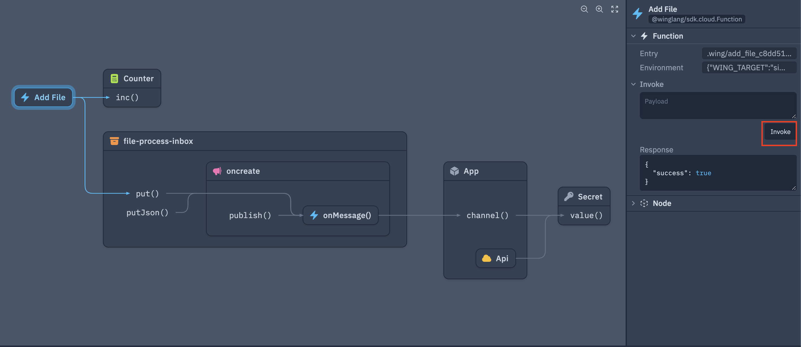
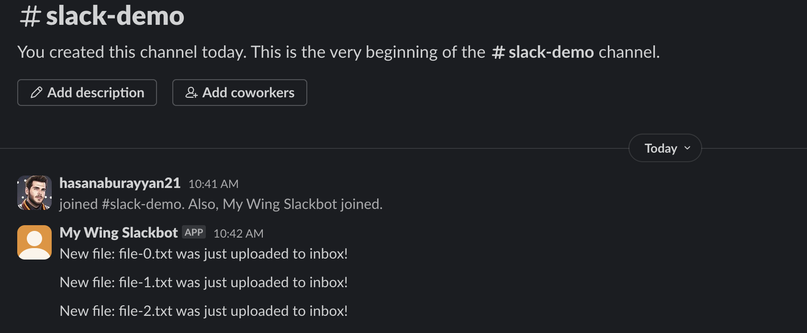

Building Slack apps can be a daunting task for beginners. Between understanding the Slack API, setting up a server to handle incoming requests, and deploying the app to a cloud provider, there are many steps involved. For instance setting up a slack app locally on your machine is simple enough, but then deploying it to a cloud provider can be challenging and might require re-architecting your app.

In this tutorial, I'm going to show you how to build a Slack app using Wing, making use of the Wing Console for local simulation and then deploying it to AWS with a single command!

## A Quick Introduction to Wing

Wing is an open source programming language for the cloud, that also provides a powerful and fun local development experience.

Wing combines infrastructure and runtime code in one language, enabling developers to stay in their creative flow, and to deliver better software, faster and more securely.

To take a closer look at Wing checkout our [Github repository](https://github.com/winglang/wing).

## Let's Get Started

First, you need to install Wing on your machine (you'll need Node.js >= 20.x installed):

```bash
npm i -g winglang
```

You can check the CLI version like this (the minimum version required by this tutorial is 0.75.0):

```bash
wing --version
0.75.0
```

Ok, now that we have the Wing CLI installed we can use the Slack quick-start template to start building our Slack app.

```bash
$ mkdir my-slack-app
$ cd my-slack-app
$ wing new slack
```

This will create the following project structure:

```bash
my-slack-app/
├── main.w
├── package-lock.json
└── package.json
```

Let's take a look at the `main.w` file, where we can see a code template for a simple Slack app that updates us on files uploaded to a bucket.

> Note: your template will have more comments and explanations than the one below. I have removed them for brevity.

```js
bring cloud;
bring slack;

let botToken = new cloud.Secret(name: "slack-bot-token");
let slackBot = new slack.App(token: botToken);
let inbox = new cloud.Bucket() as "file-process-inbox";

inbox.onCreate(inflight (key) => {
  let channel = slackBot.channel("INBOX_PROCESSING_CHANNEL");
  channel.post("New file: {key} was just uploaded to inbox!");
});

slackBot.onEvent("app_mention", inflight(ctx, event) => {
  let eventText = event["event"]["text"].asStr();
  log(eventText);
  if eventText.contains("list inbox") {
    let files = inbox.list();
    let message = new slack.Message();
    message.addSection({
      fields: [
        {
          type: slack.FieldType.mrkdwn,
          text: "*Current Inbox:*\n-{files.join("\n-")}"
        }
      ]
    });
    ctx.channel.postMessage(message);
  }
});
```

> Note: Be sure to replace the `INBOX_PROCESSING_CHANNEL` with the name of the slack channel you want to post to.

We can see above the very first resource defined is a `cloud.Secret` which is used to store the Slack bot token. This is a secure way to store sensitive information in Wing. So before we can get started we need to create a Slack app and get the bot token to use in our Wing app.

## Creating a Slack App

1. Head over to the [Slack API Dashboard](https://api.slack.com/apps) and create a new app.
2. Select `Create from Scratch` and give your app a name and select the workspace you want to deploy it to.

3. For the sake of our tutorial, we will be building a bot that requires the following permissions:
  - `app_mentions:read`
  - `chat:write`
  - `chat:write.public`
to add these head over to the `OAuth & Permissions` section and add those permissions.

4. Install the app to your workspace and copy the bot token.


Once its installed you can copy the bot token and let's head back over to our Wing app.

## Configuring Slack Bot Token Secret

Now that we have our bot token, we can add it to our application by running the `wing secrets` command and pasting the token when prompted:

```bash
❯ wing secrets
1 secret(s) found

? Enter the secret value for slack-bot-token: [hidden]
```

Now that our bot token is stored our application is ready to run!

## Running the App Locally

To run the app locally we can use the Wing Console, which simulates the cloud environment on your local machine. To start the console run:

```bash
wing it
```
This will open a browser window showing the Wing Console. You should see something similar to this:


Now in order to see the Slack bot in action, let's add some more code to our `main.w` file. We will add a function that will make a new file each time it is called.

The following code can be appended to the `main.w` file:

```js
let counter = new cloud.Counter();

new cloud.Function(inflight () => {
  let i = counter.inc();
  inbox.put("file-{i}.txt", "Hello, Slack!");
}) as "Add File";
```

Once you save the file, the Wing Console will hot reload and you should now see a function resource we can play with that looks like this:


So now we can click on the `Add File` function and interact with it in the right side panel. Go ahead and invoke the function a few times.



And BAM!! You should now be seeing messages in your Slack channel every time you invoke the function!




## Enabling Events

One thing we will notice is the Slack application is supposed to support the ability to list the files in the inbox. This is done by mentioning the Slack app and saying `list inbox`. 

If you try this now you will see absolutely nothing happens :) —— this is because we need to enable events in our slack app.

To do this head over to the `Event Subscriptions` section in the Slack API dashboard and enable events. You will need to provide a URL for the Slack API to send events to. Luckily Wing makes providing this URL easy with builtin support for tunneling.

To get the tunnel URL go back to the Wing Console and `Open a tunnel for this endpoint`


After a moment the icon will change to a eye with a slash through it, now we can copy the url by right clicking the endpoint and selecting `Copy URL`.

Next let's head over to the `Event Subscriptions` section in the slack API dashboard and paste the URL in the `Request URL` field. However, we need to append `slack/events` to the end of the URL. So it should look something like this:


This should only take a few seconds to verify, and once its verified you can scroll down to the `Subscribe to Bot Events` section and add the `app_mention` event like so:


Lastly, don't forget to save your changes!

### Testing the event subscription

Now head back to your Slack channel where you received the messages earlier and mention your app and say `list inbox`. Our Slack apps may have different names so it wont be exactly the same as the example below:


You should now see a message in the channel with the files in the inbox!


Awesome! You have now built a Slack app using Wing and tested it locally. Now let's deploy it to AWS!

## Deploying to AWS
Before we start you will need the following to follow along:
1. An AWS Account
2. AWS CLI installed and configured with the necessary permissions.
3. Terraform installed

Getting our code ready for AWS is as simple as running 2 commands. The first thing we need to do is prepare the `cloud.Secret` for the `tf-aws` platform. This is done by running the `wing secrets` command with the `--platform` flag:

```bash
❯ wing secrets --platform tf-aws             
1 secret(s) found

? Enter the secret value for slack-bot-token: [hidden]
Storing secrets in AWS Secrets Manager
Secret slack-bot-token does not exist, creating it.
1 secret(s) stored AWS Secrets Manager
```

This will result in the same prompt as before, but this time the secret will be stored in AWS Secrets Manager.

Next let's compile the application for `tf-aws`:

```bash
❯ wing compile --platform tf-aws
```

This will compile the application and generate all the necessary Terraform files, and assets needed to deploy the application to AWS.

To deploy the code run the following commands:

```bash
terraform -chdir=./target/main.tfaws init
terraform -chdir=./target/main.tfaws apply -auto-approve
```

This will begin the deployment process and should only take about a minute to complete (barring internet connection issues). The result will show an output that contains a URL for the API Gateway endpoint and look something like this:

```bash
Apply complete! Resources: 30 added, 0 changed, 0 destroyed.

Outputs:

App_Api_Endpoint_Url_E233F0E8 = "https://p9y42fs0gg.execute-api.us-east-1.amazonaws.com/prod"
App_Slack_Request_Url_FF26641D = "https://p9y42fs0gg.execute-api.us-east-1.amazonaws.com/prod/slack/events"
```

The last step we need to do is to copy that `App_Slack_Request_Url` and paste it into the `Request URL` field in the `Event Subscriptions` section in the Slack API dashboard. This will tell Slack to now send events to our deployed applications API Gateway endpoint.

You should see the URL verified in a few seconds.

> DONT FORGET TO SAVE YOUR CHANGES!


### Playing with the deployed app

Let's first test adding a file to the inbox, which in AWS is an s3 bucket. Navigate to the S3 console in AWS and find the bucket with the name that contains `file-process-inbox` there will be some unique hashing to the end of it. For example, my bucket was named: `file-process-inbox-c8419ccc-20240530151737187700000004`

Upload any file on your machine to this bucket, and you should see a message in your Slack channel!


Lastly, let's test the `list inbox` command.


And there you have it! You have successfully built a Slack app using Wing, tested it locally, and deployed it to AWS!

## Want more?

If you find yourself wanting to learn more about Wing, or had any issues with this tutorial, or just wanna chat, feel free to join our [Discord](https://t.winglang.io/discord) server!
