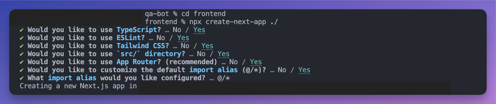
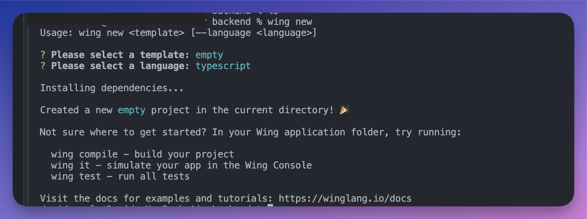
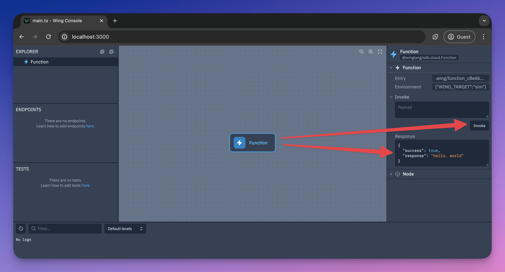
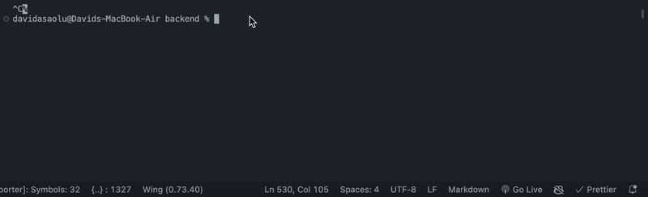

## TL;DR

In this tutorial, we will walk through: 

- How to build an AI-powered Q&A bot for your websites and documentation. 

- Fetch your website's content via sitemaps, accept user's queries, and provide answers based on the data provided.

We'll use Next.js for the frontend, LangChain for processing users' queries with LLMs, such as GPT-4, and Wing will power the backend of the application.

## What is Wing?

[Wing](https://github.com/winglang/wing) is an open-source framework for the cloud. It allows you to create your application's infrastructure and code combined as a single unit and deploy them safely to your preferred cloud providers.

Wing gives you complete control over how your application's infrastructure is configured. In addition to its easy-to-learn [programming language](https://www.winglang.io/docs/language-reference), Wing also supports Typescript.

In this tutorial, we'll use TypeScript. So, don't worry—your JavaScript and React knowledge is more than enough to understand this tutorial.


---

## Building the application interface with Next.js

Here, I'll walk you through building the application's interface. It displays a simple form that accepts the website's sitemap URL and a question that needs to be answered, then returns a response based on the data available on your website.

First, create a folder containing two sub-folders - `frontend` and `backend`. The `frontend` folder contains the Next.js app, and the `backend` folder is for Wing.

```bash
mkdir qa-bot && cd qa-bot
mkdir frontend backend
```

Within the **`frontend`** folder, create a Next.js project by running the following code snippet:

```bash
cd frontend
npx create-next-app ./
```



Copy the code snippet below into the **`app/page.tsx`** file to create the form that accepts the user's details:

```tsx
"use client";
import { useState } from "react";

export default function Home() {
	const [sitemapURL, setSitemapURL] = useState<string>("");
	const [question, setQuestion] = useState<string>("");
	const [websiteData, setWebsiteData] = useState<string | null>(null);
	const [response, setResponse] = useState<string | null>(null);
	const [disable, setDisable] = useState<boolean>(false);

	//👇🏻 Helper function to extract text nodes from an XML document
	function extractTextContents(xmlDoc: Document): string[] {
		let texts: string[] = [];
		const walker = document.createTreeWalker(
			xmlDoc,
			NodeFilter.SHOW_TEXT,
			null
		);

		let node: Node | null;
		while ((node = walker.nextNode())) {
			const text = node.nodeValue?.trim();
			if (text) {
				texts.push(text);
			}
		}
		return texts;
	}

	//👇🏻 fetch data from the sitemap URL
	const handleFetchSitemap = async (e: React.FormEvent) => {
		e.preventDefault();
		try {
			const response = await fetch(sitemapURL);
			if (!response.ok) {
				throw new Error(`Sitemap not found Status: ${response.status}`);
			}
			const text = await response.text();
			const xmlDoc = new DOMParser().parseFromString(text, "text/xml");
			const data = extractTextContents(xmlDoc);
			//👇🏻 convert the array result to string
			const stringData = data.join(" ");
			//👇🏻 update website data
			setWebsiteData(stringData);
			setSitemapURL("");
		} catch (err) {
			console.error(err);
		}
	};

	const handleUserQuery = async (e: React.FormEvent) => {
		e.preventDefault();
		setDisable(true);
		console.log({ websiteData, question });
	};
	
	return (/* --- 👉🏻 UI elements 👈🏼  ---*/)
	
}
```

- From the code snippet above,
    - The `sitemapURL` and `question` states hold the user's inputs and the `websiteData` contains the data retrieved from the sitemap URL.
    - The `extractTextContents` function is a helper function that accepts the sitemap's XML document and returns an array containing the website's content.
    - The `handleFetchSitemap` function is triggered on a button click. It uses the `extractTextContents` contents to retrieve the website's content and converts the array to a string before updating the `websiteData` React state.
    - The `handleUserQuery` function will process the user's requests and return a result. It will be updated later in the tutorial.

Update the component to return the necessary UI elements.

```tsx
return (
	<main className='w-full px-8 py-8'>
		<h2 className='font-bold text-2xl mb-8'>Q&A Web Bot</h2>
		{!websiteData && (
			<form onSubmit={handleFetchSitemap} className='mb-8'>
				<label className='block mb-2'>Sitemap URL</label>
				<input
					type='url'
					className='w-full mb-4 p-4 rounded-md border border-gray-300'
					placeholder='http://localhost:3001/api'
					required
					value={sitemapURL}
					onChange={(e) => setSitemapURL(e.target.value)}
				/>
				<button
					type='submit'
					className='bg-blue-500 text-white px-8 text-lg py-3 rounded'
				>
					Submit
				</button>
			</form>
		)}

		{websiteData && (
			<form onSubmit={handleUserQuery} className='mb-8'>
				<label className='block mb-2'>
					Ask any question based on the website sitemap
				</label>
				<input
					type='text'
					className='w-full mb-4 p-4 rounded-md border border-gray-300'
					placeholder='What is Winglang? OR Why should I use Winglang? OR How does Winglang work?'
					required
					value={question}
					onChange={(e) => setQuestion(e.target.value)}
				/>
				<button
					type='submit'
					disabled={disable}
					className='bg-blue-500 text-white px-8 text-lg py-3 rounded'
				>
					{disable ? "Loading..." : "Ask Question"}
				</button>
			</form>
		)}
		<div className='bg-gray-100 w-full p-8 rounded-sm shadow-md'>
			<p className='text-gray-600'>{response}</p>
		</div>
	</main>
);
```


Since we need to fetch a website's sitemap from another server, this can cause CORS issues. Therefore, let's create a dummy website sitemap within a Next.js API route.

Create an `api` folder containing a `route.ts` file within the Next.js app folder.

```bash
cd app
mkdir api && cd api
touch route.ts
```

Next, create an API endpoint that returns a website sitemap, as shown below.

```tsx
import { NextRequest } from "next/server";
export const dynamic = "force-dynamic"; // defaults to auto

export async function GET(req: NextRequest) {
	// Define the XML content
	return new Response(
		`<?xml version="1.0" encoding="UTF-8" ?>
<rss version="2.0">
 
<channel>
  <title>Winglang Documentation</title>
  <link>https://winglang.io/docs</link>
  <description>A programming language for the Cloud</description>
</channel>

<article>
    <title>What is Winglang?</title>
    <introduction>This article explains the basics of Winglang and why you should use it.</introduction>
    <sections>
        <section>
            <heading>Why Winglang?</heading>
            <paragraph>A programming language for the cloud, Wing combines infrastructure and runtime code in one language, enabling developers to stay in their creative flow, and to deliver better software, faster and more securely.</paragraph>
        </section>
        <section>
            <heading>Infrastructure and code in one language</heading>
            <paragraph>A unified programming model that combines both infrastructure and application code into a single programming language. It compiles to IaC and JavaScript, creates infrastructure resources as first-class citizens, and creates automatic IAM policies and other cloud mechanics.
    </paragraph>
        </section>
        <section>
            <heading>Winglang acts as a Local simulator</heading>
            <paragraph>Stay in your creative flow with minimal context switching and immediate feedback. Run your cloud application in your local environment. Visualize, interact, and debug locally. Write unit tests for complete cloud architectures.</paragraph>
        </section>
        <section>
            <heading>Apply DevOps at the right level with Winglang</heading>
            <paragraph> Use any cloud service and compile to multiple cloud providers and provisioning engines, with full control over how your infrastructure is configured and deployed. Cloud-agnostic SDK for maximum portability. Customizable infrastructure through plugins. Supports any provider in the Terraform ecosystem.</paragraph>
        </section>
    </sections>
    <conclusion>
       Winglang is easy to learn and interoperates with existing stacks and tools. Its syntax is inspired by modern application development languages like TypeScript, JavaScript, Swift, and more. It is a statically-typed and simple language with powerful IDE tooling and interoperates with npm modules, CDK constructs, and Terraform providers.
    </conclusion>
</article>

 
</rss>`,
		{
			headers: {
				"Content-Type": "text/xml",
			},
		}
	);
}
```


Congratulations! You've completed the application's user interface.

In the upcoming sections, you'll learn how to set up Winglang on your computer and process user's queries using LangChain.

---

## How to set up Winglang on your computer

Winglang provides a CLI that enables you to perform various Wing actions within your projects. 

It also provides [VSCode](https://marketplace.visualstudio.com/items?itemName=Monada.vscode-wing) and [IntelliJ](https://plugins.jetbrains.com/plugin/22353-wing) extensions that enhance the developer experience with features like syntax highlighting, compiler diagnostics, code completion and snippets, and many others.

Before we proceed, stop your Next.js development server for now and install the Winglang CLI by running the code snippet below in your terminal.

```bash
npm install -g winglang@latest
```

Run the following code snippet to ensure that the Winglang CLI is installed and working as expected:

```bash
wing -V
```

Next, navigate to the `backend` folder and create an empty Wing Typescript project. Ensure you select the `empty` template and Typescript as the language.

```bash
wing new
```



Copy the code snippet below into the `backend/main.ts` file.

```tsx
import { cloud, inflight, lift, main } from "@wingcloud/framework";

main((root, test) => {
	const fn = new cloud.Function(
		root,
		"Function",
		inflight(async () => {
			return "hello, world";
		})
	);
});
```

The **`main()`** function serves as the entry point to Wing. It creates a cloud function and executes at compile time. The **`inflight`** function, on the other hand, runs at runtime and returns a `Hello, world!` text.

Start the Wing development server by running the code snippet below. It automatically opens the Wing Console in your browser at `http://localhost:3000`.

```bash
wing it
```



Congratulations! You've successfully installed Winglang on your computer.

---

## How to connect Wing to a Next.js app

From the previous sections, you've created the Next.js frontend app within the `frontend` folder and the Wing backend within the `backend` folder.

In this section, you'll learn how to communicate and send data back and forth between the Next.js app and the Winglang backend.

First, install the [Winglang React](https://github.com/winglang/winglibs/tree/main/react) library within the backend folder by running the code below:

```bash
npm install @winglibs/react
```

Next, update the `main.ts` file as shown below:

```tsx
import { main, cloud, inflight, lift } from "@wingcloud/framework";
import React from "@winglibs/react";

main((root, test) => {
	const api = new cloud.Api(root, "api", { cors: true })
	;

	//👇🏻 create an API route
	api.get(
		"/test",
		inflight(async () => {
			return {
				status: 200,
				body: "Hello world",
			};
		})
	);

	//👇🏻 connects to the Next.js project
	const react = new React.App(root, "react", { projectPath: "../frontend" });
	//👇🏻 an environment variable
	react.addEnvironment("api_url", api.url);
});
```

The code snippet above creates an API endpoint (`/test`) that accepts GET requests and returns a `Hello world` text. The `main` function also connects to the Next.js project and adds the API url as an environment variable.

The API URL contained in the environment variable enables us to send requests to the Wing API route. Now, how do we retrieve the API URL within the Next.js app and make these requests?

Update the `RootLayout` component within the Next.js `app/layout.tsx` file as done below:

```tsx
export default function RootLayout({
	children,
}: Readonly<{
	children: React.ReactNode;
}>) {
	return (
		<html lang='en'>
			<head>
				{/** ---👇🏻  Adds this script tag 👇🏻 ---*/}
				<script src='./wing.js' defer />
			</head>
			<body className={inter.className}>{children}</body>
		</html>
	);
}
```

Re-build the Next.js project by running `npm run build`.

Finally, start the Wing development server. It automatically starts the Next.js server, which can be accessed at **`http://localhost:3001`** in your browser.


Congratulations! You've successfully connected the Next.js to Wing. You can also access data within the environment variables using `window.wingEnv.<attribute_name>`.


---

## Processing user's requests with LangChain and Wing

In this section, you'll learn how to send requests to Wing, process these requests with [LangChain and OpenA](https://js.langchain.com/docs/get_started/quickstart#llm-chain)I, and display the results on the Next.js frontend.

First, let's update the Next.js **`app/page.tsx`** file to retrieve the API URL and send the website's data and the user's question to a Wing API endpoint.

To do this, extend the JavaScript **`window`** object by adding the following code snippet at the top of the **`page.tsx`** file.

```tsx
"use client";
import { useState } from "react";
interface WingEnv {
	api_url: string;
}
declare global {
	interface Window {
		wingEnv: WingEnv;
	}
}
```

Next, update the `handleUserQuery` function to send a POST request containing the user's question and website's data to a Wing API endpoint.

```tsx
//👇🏻 sends data to the api url
const [response, setResponse] = useState<string | null>(null);

const handleUserQuery = async (e: React.FormEvent) => {
	e.preventDefault();
	setDisable(true);
	try {
		const request = await fetch(`${window.wingEnv.api_url}/api`, {
			method: "POST",
			headers: {
				"Content-Type": "application/json",
			},
			body: JSON.stringify({ question, websiteData }),
		});
		const response = await request.text();
		//👇🏻 response from the Wing API
		console.log({ response });
		setResponse(response);
		setDisable(false);
	} catch (err) {
		console.error(err);
		setDisable(false);
	}
};
```

Before you create the Wing endpoint that accepts the POST request, install the LangChain OpenAI integration package within the `backend` folder:

```tsx
npm install @langchain/openai
```

The LangChain OpenAI integration package uses the OpenAI language model; therefore, you'll need a valid API key. You can get yours from the [OpenAI Developer's Platform](https://platform.openai.com/api-keys).


Within the `main()` function, create the API endpoint that accepts the POST requests:

```tsx
import { main, cloud, inflight, lift } from "@wingcloud/framework";
import { ChatOpenAI } from "@langchain/openai";
import { ChatPromptTemplate } from "@langchain/core/prompts";
import React from "@winglibs/react";

main((root, test) => {
	const api = new cloud.Api(root, "api", { cors: true });

	api.post(
		"/api",
		inflight(async (ctx, request) => {
			//👇🏻 accepts data from the frontend
			const data = JSON.parse(request.body!);

			//👇🏻 initialize an OpenAI chat model
			const chatModel = new ChatOpenAI({ apiKey: "<YOUR_OPENAPI_KEY>" });

			const prompt = ChatPromptTemplate.fromMessages([
				[
					"system",
					"You are a webscraper that retrieves information about websites. Ask me anything about a website and I will try to answer it.",
				],
				["user", "{input}"],
			]);
			const chain = prompt.pipe(chatModel);

			const response = await chain.invoke({
				input: `${data.question} using this website information: ${data.websiteData}`,
			});

			if (typeof response.content === "string") {
				return {
					status: 200,
					body: response.content,
				};
			}

			return undefined;
		})
	);

	const react = new React.App(root, "react", { projectPath: "../frontend" });
	react.addEnvironment("api_url", api.url);
});
```

The API endpoint accepts data from the frontend and sends it as a prompt to LangChain to provide answers based on the user's question. It then returns the answer to the Next.js client.

From the code snippet above, the OpenAI API key is entered directly into the code; this could lead to security breaches, making the API key accessible to attackers. To prevent this data leak, Winglang allows you to save private keys and credentials in variables called `secrets`.

When you create a secret, Wing saves this data in a `.env` file, ensuring it is secured and accessible.

Update the `main()` function to fetch the OpenAI API key from the Wing Secret.

```tsx
main((root, test) => {
	const api = new cloud.Api(root, "api", { cors: true });
	//👇🏻 creates the secret variable
	const secret = new cloud.Secret(root, "OpenAPISecret", {
		name: "open-ai-key",
	});

	api.post(
		"/api",
		lift({ secret })
			.grant({ secret: ["value"] })
			.inflight(async (ctx, request) => {
				const apiKey = await ctx.secret.value();

				const data = JSON.parse(request.body!);

				const chatModel = new ChatOpenAI({ apiKey });

				const prompt = ChatPromptTemplate.fromMessages([
					[
						"system",
						"You are a webscraper that retrieves information about websites. Ask me anything about a website and I will try to answer it.",
					],
					["user", "{input}"],
				]);
				const chain = prompt.pipe(chatModel);

				const response = await chain.invoke({
					input: `${data.question} using this website information: ${data.websiteData}`,
				});

				if (typeof response.content === "string") {
					return {
						status: 200,
						body: response.content,
					};
				}

				return undefined;
			})
	);

	const react = new React.App(root, "react", { projectPath: "../frontend" });
	react.addEnvironment("api_url", api.url);
});
```

- From the code snippet above,
    - The `secret` variable declares a name for the secret (OpenAI API key).
    - The [`lift().grant()`](https://www.winglang.io/docs/typescript/inflights#permissions) grants the API endpoint access to the secret value stored in the Wing Secret.
    - The [`inflight()`](https://www.winglang.io/docs/typescript/inflights) function accepts the context and request object as parameters, makes a request to LangChain, and returns the result.
    - Then, you can access the `apiKey` using the `ctx.secret.value()` function.

Finally, save the OpenAI API key as a secret by running this command in your terminal.

```bash
wing secrets
```



Congratulations! You've successfully completed the project for this tutorial.

Here is a brief demo of the application:


---

## Wrapping It Up

So far, we went over the following:

- What is Wing?,
- How to use Wing to create a powerful cloud applications,
- How to connect it to a Next.js application,
- How to send data between a Next.js frontend and a Wing backend.

[Wing](https://github.com/winglang/wing) aims to bring back your creative flow and close the gap between imagination and creation. Another great advantage of Wing is that it is open-source. Therefore, if you are looking forward to building distributed systems that leverage cloud services or contribute to the future of cloud development, [Wing](https://github.com/winglang/wing) is your best choice.

Feel free to contribute to the [GitHub repository,](https://github.com/winglang/wing) and [share your thoughts](https://t.winglang.io/discord) with the team and the large community of developrs.

The source code for this tutorial is available [here](https://github.com/NathanTarbert/wing-nextjs-langchain).

Thank you for reading! 🎉
