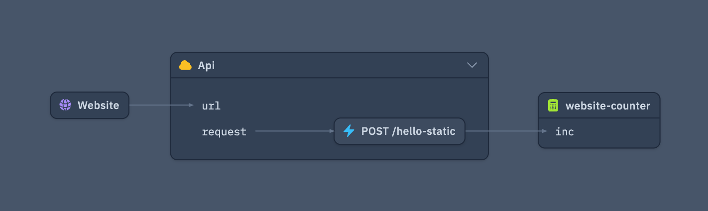

> The 10th issue of the Wing Inflight Magazine.
> <!--truncate-->

Howdy Wingnuts!

We are back with another monthly issue of the Wing Inflight Magazine and excited to share some updates about [Winglang](https://winglang.io/), an open source-programming language for the cloud.

New to Wing? Let’s get you up to date. Wing is a new programming language designed to help developers and platform engineers build cloud first applications with the best developer experience. The language combines cloud infrastructure *and* runtime into a single programming model and compiles to Terraform/CloudFormation and JavaScript that are ready to deploy to AWS, GCP and Azure (see our [support matrix](https://www.winglang.io/docs/api/standard-library/compatibility-matrix)).

We are designing Wing to be familiar and friendly for developers who come from modern object-oriented background, so it will take you [5 minutes](https://github.com/winglang/workshop-react/blob/main/cheatsheet.md) to learn.

Check out our [getting started tutorial](https://www.winglang.io/docs/) or hit the [Wing Playground](https://www.winglang.io/play/) for an online experience.


## In today’s issue

- [Wing 1.0 roadmap](#wing-10-roadmap)
- [Language updates](#language-updates)
    - [Internal access modifier](#internal-access-modifier)
    - [New cloud resource `cloud.Service`](#new-cloud-resource-cloudservice)
    - [AWS Lambda Layer API for Wing](#aws-lambda-layer-api-for-wing)
    - [Logging now supports more values](#logging-now-supports-more-values)
    - [Breaking changes](#breaking-changes)
        - [Goodbye elif, hello else if](#goodbye-elif-hello-else-if)
        - [inflight intrinsic has been removed](#inflight-intrinsic-has-been-removed)
        - [`cloud.Function` now accepts Json](#cloudfunction-now-accepts-json)
        - [Additional breaking changes](#additional-breaking-changes)
- [Wing Console updates](#wing-console-updates)
    - [New table component `ui.Table`](#new-table-component-uitable)
    - [Nodes can be collapsed or expanded](#nodes-can-now-be-collapsed-and-expanded)
    - [Ability to filter logs in the Wing console](#ability-to-filter-logs-in-the-wing-console)
- [WingLibs](#winglibs)
    - [New wing packages](#new-wing-packages)
- [Summary](#summary)

## Wing 1.0 roadmap

We're excited to share our [1.0 roadmap](https://www.winglang.io/contributing/roadmap), outlining our vision and the goals we aim to achieve in Wing 1.0.

Our mission with Wing is to empower developers to build cloud applications with an exceptional developer experience. To do this, we're focusing on establishing a stable foundation for the Wing programming language, defining [essential cloud primitives](https://www.winglang.io/docs/api/category/cloud), enabling the creation of libraries [(winglibs)](https://www.winglang.io/docs/winglibs/what-are-winglibs) and [custom platforms](https://www.winglang.io/docs/platforms/platforms), and [providing tools to simulate the cloud](https://www.winglang.io/docs/tools/wing-console) locally on your machine.

Building on the cloud shouldn’t be difficult, and we believe Wing can be a key part of the solution.

As we progress toward Wing 1.0, we'll be experimenting, learning, and making necessary adjustments. If you'd like to contribute or join us on this journey, we'd love to connect with you on [GitHub](https://github.com/winglang/wing) or through our [Discord server](https://t.winglang.io/discord).

## Language updates

To get the latest language updates you will need to update your wing version running the command below

```sh
npm install -g winglang
```

### Internal access modifier

Wing now supports the `internal` access modifier, which is particularly useful for library authors ([winglib authors)](https://www.winglang.io/docs/winglibs/what-are-winglibs). This modifier allows you to make classes or methods accessible only within the module or library you’re developing, keeping them hidden from external consumers.

Previously, the only option if you were splitting definitions across multiple files was to make everything public, exposing all methods and classes to the library users. With `internal`, you gain finer control over what parts of your code are exposed, ensuring that only what’s necessary is accessible.

This example shows a  `internal` class called `OrderProcessingUtils`. As a library author you can call `OrderProcessingUtils.calculateTax` within the module itself, but library consumers cannot (as it’s not exposed).

```js
internal class OrderProcessingUtils {
    static calculateTax(amount: num): num {
        // Internal method to calculate tax
        return amount * 0.1;
    }
}

// OK inside the module we are building
let value = OrderProcessingUtils.calculateTax(10);

// Will not work if we try to use the code outside the module
let value = OrderProcessingUtils.calculateTax(10); // error
```

You can read more on our documentation [about access modifiers](https://www.winglang.io/contributing/rfcs/language-spec#15-access-modifiers).

### New cloud resource `cloud.Service`

We have released the new [`cloud.Service` resource.](https://www.winglang.io/docs/api/standard-library/cloud/service) The `cloud.Service` class in Wing represents a cloud service with a defined lifecycle, including a start and an optional stop phase.

Example usage includes long-running processes like microservices or background data processing.

Cloud services will automatically start once deployed, you can opt out of this by specifying the `autoStart` option. 

```js playground
bring cloud;

// inflight (runtime code) that is run within the service
let handler = inflight () => {
	// Code is run on init/start of service
	// This example we can start a custom HTTP server
  log("Service started...");
  let server = startHttpServer();
  
  // Code is run when service stops
  return () => {
    log("Service stopped...");
    // Example would be to stop the HTTP server
    server.close();
  };
};

// By default services are started when deployed
let autoStartService = new cloud.Service(handler);

// You can configure services not to start on deploy
let manualStartService = new cloud.Service(handler, autoStart: false);
```

Cloud services also have an inflight API that allows you to start or stop the service yourself, if you want more fine-grained control.

```js playground
bring cloud;

let startCounter = new cloud.Counter() as "start counter";
let stopCounter = new cloud.Counter() as "stop counter";

let handler = inflight() => {
  let i = startCounter.inc();
  log("Service started for the ${i}th time...");
  return () => {
    let i = stopCounter.inc();
    log("Service stopped for the ${i}th time...");
  };
};

let service = new cloud.Service(handler, autoStart: false);

// Access service inflight API to start/stop the service in functions
new cloud.Function(inflight() => {
  service.start();
  assert(service.started());
}) as "start service";

new cloud.Function(inflight() => {
  service.stop();
  assert(!service.started());
}) as "stop service";
```

`cloud.Service`  currently supports the AWS platform (terraform and CDK), if you would like [Azure](https://github.com/winglang/wing/issues/1307) or [Google Cloud (GCP)](https://github.com/winglang/wing/issues/1308) support please comment and upvote the GitHub issues.

You can get started or [read more in the documentation](https://www.winglang.io/docs/api/standard-library/cloud/service).

### AWS Lambda Layer API for Wing

When compiling `cloud.Function` resources to the [AWS platform](https://www.winglang.io/docs/category/aws), AWS Lambda is used.

AWS Lambda supports [lambda layers](https://docs.aws.amazon.com/lambda/latest/dg/chapter-layers.html), which contain supplementary code or data for your Lambda functions. These can be useful for sharing library dependencies, a [custom runtime](https://docs.aws.amazon.com/lambda/latest/dg/runtimes-custom.html) or configuration files across your Lambda functions.

Wing now supports adding Lambda layers to `cloud.Function`. To add a Lambda layer to your function, you can now use the `aws.Function` class as shown below.

```js playground
bring aws;
bring cloud;

// define your cloud function
let f = new cloud.Function(inflight () => {
  log("Hello world!");
});

// attach lambda layer to the function
if let lambdaFn = aws.Function.from(f) {
	// add your lambda layer
  lambdaFn.addLambdaLayer("arn:aws:lambda:us-west-2:123456789012:layer:my-layer:1");
}
```

You can also attach Lambda layers to all your cloud functions by using a classe’s inflight method and the onLift hook. This allows you abstract and apply layers at a global level, ideal if you want to create [winglibs](https://www.winglang.io/docs/winglibs/what-are-winglibs) for your developers.

```js playground
bring aws;
bring cloud;

// Create Datadog class for wing application
class Datadog {
  pub inflight fetchMetrics() {
    // ...implementation...
  }
  // onLift hook, attach the lambda layer
  pub onLift(host: std.IInflightHost, ops: Array<str>) {
    if let lambdaFn = aws.Function.from(host) {
      lambdaFn.addLambdaLayer("arn:aws:lambda:us-west-2:123456789012:layer:datadog-layer:1");
    }
  }
}

let d = new Datadog();

let api = new cloud.Api();

// Lambda layer is attached to inflight function
api.get("/metrics", inflight () => {
  d.fetchMetrics();
});

```

If you want to learn more you can [read the documentation](https://www.winglang.io/docs/api/standard-library/cloud/function#adding-lambda-layers).

### Logging now supports more values

Logging now supports stringable values directly rather than wrapping them with quotes. 

```js
enum MyEnum { A, B, C }
let x = 5;

// before
log("{x}");
log("my string");
log("{42}");
log("{true}");
log("{Json { "cool": "beans" }}");
log("{MyEnum.A}");

// now
log(x);
log("my string");
log(42);
log(true);
log(Json { "cool": "beans" });
log(MyEnum.A);
```

## Breaking changes

As we move towards Wing 1.0, we will be making changes along the way. Some of these changes may break existing code, but we will do our best to document these and keep you updated. 

### Goodbye elif, hello else if

To align with other imperative languages and improve the ease of picking up Wing we have removed elif and replaced it with `else if` .

We recommend running a simple find and replacement over your codebase (like `find . -type f -name "*.w" -exec perl -pi -e 's/\belif\b/else if/g' {} +`) to update to the new syntax.

```js
let x: num = 11;

// before
if x <= 10 {
  log("{x} is less than or equal to 10");
} elif x > 10 {
  log("{x} is greater than 10");
}

// after
if x <= 10 {
  log("{x} is less than or equal to 10");
} else if x > 10 {
  log("{x} is greater than 10");
}
```

Read more in the pull request (https://github.com/winglang/wing/pull/6976)

### ex.Table and ex.Redis are now winglibs

`ex.Redis` and `ex.Table` have not been removed from [the standard library](https://www.winglang.io/docs/api/standard-library) in favour of dedicated libraries. You can now use the winglibs for [Redis](https://www.winglang.io/docs/winglibs/winglibs/redis), [DynamoDB](https://github.com/winglang/winglibs/tree/main/dynamodb) and [Postgres](https://www.winglang.io/docs/winglibs/winglibs/postgres).

### @inflight intrinsic has been removed

Wing supports interoperating with TypeScript and JavaScript code, these methods were previously using `externs` or `@inflight`. The interoperating with TypeScript allows you to use TypeScript code within your Wing applications.

After using `@inflight` and through user feedback we found a few DX issues with the intrinsic ([read pull request for more information](https://github.com/winglang/wing/pull/6988)). For this reason we decided to remove the intrinsic and recommend developers to use the [`extern` method](https://www.winglang.io/docs/api/language/using-javascript#using-extern-to-expose-javascripttypescript-functions-in-preflight-and-inflight) .

### `cloud.Function` now accepts Json

The input and return types for `cloud.Function` has been changed from optional string (`str?`) to optional JSON (`Json?`) to align with event formats used by major cloud providers like AWS, GCP and Azure.

```js
bring cloud;

// before
let x = new cloud.Function(inflight (payload: str?) => {
  let data = Json.stringify(payload);
  log(data);
});

// after 
let x = new cloud.Function(inflight (payload: Json?) => {
  log(Json.stringify(payload));
});
```

### Additional breaking changes

- winglib `cdk8s` has been renamed to `k8s` (https://github.com/winglang/winglibs/pull/298)
- `.node` has been removed in favor of `nodeof()` - https://github.com/winglang/wing/pull/6721
- Removed “Optional test” operator - https://github.com/winglang/wing/pull/6804
- change `cloud.Function` event type from `str` to `Json` - https://github.com/winglang/wing/pull/6219

## Wing console updates

[The Wing Console](https://www.winglang.io/docs/tools/wing-console) is a web application that is designed to enhance the developer experience when viewing, exploring and interacting with your Wing applications. The wing console provides instant feedback during cloud application development process.

### New table component `ui.Table`

Wing allows developers to create their own resources. These resources are shown in the Wing console. Using the `ui` [standard library](https://www.winglang.io/docs/api/category/ui) it’s possible to add custom components for interacting with your resources and displaying information, like [Buttons](https://www.winglang.io/docs/api/standard-library/ui/api-reference#button-), [Fields](https://www.winglang.io/docs/api/standard-library/ui/api-reference#field-), [FileBrowsers](https://www.winglang.io/docs/api/standard-library/ui/api-reference#filebrowser-) and now [Tables](https://www.winglang.io/docs/api/standard-library/ui/api-reference#table-).

In this example we create a new `Stripe` resource with a few public methods. When developers interact with this resource using the Wing console they can also see a list of customers in a table (using the `ui.Table` resource and populating it with custom data). 


Tables can be used to show any information represented by JSON into the wing console. 

To learn more and [get started you can read the documentation](https://www.winglang.io/docs/api/standard-library/ui/api-reference#table-).

## **Nodes can now be collapsed and expanded**

Nodes in the Wing console can now be **expanded or collapsed, helping you navigate the map view in the Wing console.**

You can try it out [yourself in our playground](https://www.winglang.io/play/?code=YgByAGkAbgBnACAAYwBsAG8AdQBkADsACgBiAHIAaQBuAGcAIAB1AHQAaQBsADsACgBiAHIAaQBuAGcAIABoAHQAdABwADsACgBiAHIAaQBuAGcAIABlAHgAcABlAGMAdAA7AAoACgBsAGUAdAAgAHcAZQBiAHMAaQB0AGUAIAA9ACAAbgBlAHcAIABjAGwAbwB1AGQALgBXAGUAYgBzAGkAdABlACgACgAgACAAcABhAHQAaAA6ACAAIgAuAC8AcwB0AGEAdABpAGMAIgAsAAoAKQA7AAoACgBsAGUAdAAgAGEAcABpACAAPQAgAG4AZQB3ACAAYwBsAG8AdQBkAC4AQQBwAGkAKAB7AAoAIAAgAGMAbwByAHMAOgAgAHQAcgB1AGUALAAKACAAIABjAG8AcgBzAE8AcAB0AGkAbwBuAHMAOgAgAHsACgAgACAAIAAgAGEAbABsAG8AdwBIAGUAYQBkAGUAcgBzADoAIABbACIAKgAiAF0ALAAKACAAIAAgACAAYQBsAGwAbwB3AE0AZQB0AGgAbwBkAHMAOgAgAFsAaAB0AHQAcAAuAEgAdAB0AHAATQBlAHQAaABvAGQALgBQAE8AUwBUAF0ALAAKACAAIAB9ACwACgB9ACkAOwAKAHcAZQBiAHMAaQB0AGUALgBhAGQAZABKAHMAbwBuACgAIgBjAG8AbgBmAGkAZwAuAGoAcwBvAG4AIgAsACAAewAgAGEAcABpADoAIABhAHAAaQAuAHUAcgBsACAAfQApADsACgAKAGwAZQB0ACAAYwBvAHUAbgB0AGUAcgAgAD0AIABuAGUAdwAgAGMAbABvAHUAZAAuAEMAbwB1AG4AdABlAHIAKAApACAAYQBzACAAIgB3AGUAYgBzAGkAdABlAC0AYwBvAHUAbgB0AGUAcgAiADsACgAKAGEAcABpAC4AcABvAHMAdAAoACIALwBoAGUAbABsAG8ALQBzAHQAYQB0AGkAYwAiACwAIABpAG4AZgBsAGkAZwBoAHQAIAAoAHIAZQBxAHUAZQBzAHQAKQAgAD0APgAgAHsACgAgACAAcgBlAHQAdQByAG4AIAB7AAoAIAAgACAAIABzAHQAYQB0AHUAcwA6ACAAMgAwADAALAAKACAAIAAgACAAaABlAGEAZABlAHIAcwA6ACAAewAKACAAIAAgACAAIAAgACIAQwBvAG4AdABlAG4AdAAtAFQAeQBwAGUAIgAgAD0APgAgACIAdABlAHgAdAAvAGgAdABtAGwAIgAsAAoAIAAgACAAIAAgACAAIgBBAGMAYwBlAHMAcwAtAEMAbwBuAHQAcgBvAGwALQBBAGwAbABvAHcALQBPAHIAaQBnAGkAbgAiACAAPQA%2BACAAIgAqACIALAAKACAAIAAgACAAfQAsAAoAIAAgACAAIABiAG8AZAB5ADoAIAAiADwAZABpAHYAIABpAGQAPQBcACIAaABlAGwAbABvAFwAIgAgAGMAbABhAHMAcwA9AFwAIgBtAHQALQA0AFwAIgA%2BAEgAZQBsAGwAbwAgAHsAYwBvAHUAbgB0AGUAcgAuAGkAbgBjACgAKQB9ADwALwBkAGkAdgA%2BACIALAAKACAAIAB9ADsACgB9ACkAOwAKAA%3D%3D).




### Ability to filter logs in the Wing console

New filter capabilities have now been added to the console. This gives developers the ability to quickly filter logs within the Wing Console.


## Winglibs

[Wing libraries](https://www.winglang.io/docs/winglibs/what-are-winglibs) (winglibs) are packages you can [import into your wing application](https://www.winglang.io/docs/winglibs/using-winglibs). Anybody can [create a winglib](https://www.winglang.io/docs/winglibs/creating-winglibs) and add them to our [eco system of libraries](https://github.com/winglang/winglibs).

### New wing packages

Here is a list of new wing packages that have been released

- [@winglibs/momento](https://www.winglang.io/docs/winglibs/winglibs/momento) -  Use the [Momento](https://www.gomomento.com/) cache with Wing.
- [@winglibs/slack](https://www.winglang.io/docs/winglibs/winglibs/slack) - Integrate with [Slack](https://slack.com/intl/en-gb) using Wing.
- [@winglibs/ses](https://www.winglang.io/docs/winglibs/winglibs/ses) - Interact with the AWS SES ervice
- [@winglibs/sns](https://www.winglang.io/docs/winglibs/winglibs/sns) - Interact with the AWS SNS service

Have an idea for a new winglib? Feel free to [reach out to us on Discord](https://t.winglang.io/discord) or make a [pull request on GitHub](https://github.com/winglang/winglibs).

### Summary

That’s it for this edition!

You are invited to join the [Wing Discord](https://t.winglang.io/discord)! Come say hello and hang out with fellow Wingnuts! Give [winglang.io](https://winglang.io/) a visit and take Wing out for a spin. If you're not already, stay updated on the latest changes in our [repo](https://github.com/winglang/wing).

Catch you next month!

*- The Wing Team*
