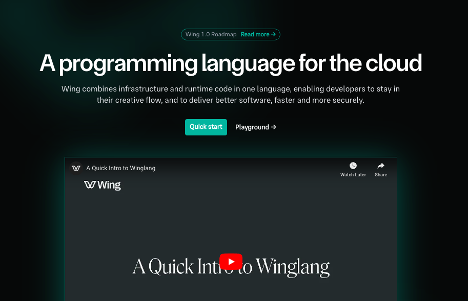
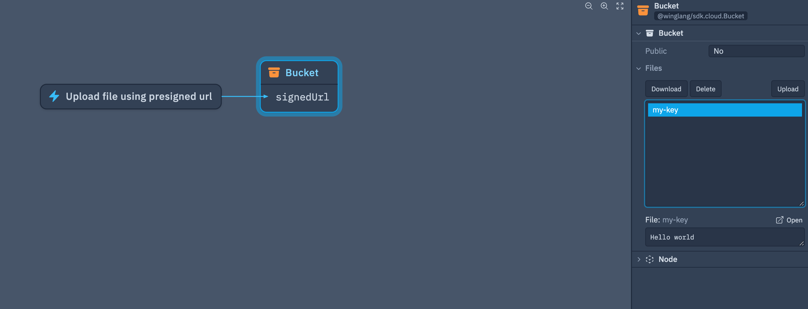

> The 11th issue of the Wing Inflight Magazine.
> <!--truncate-->

Howdy Wingnuts!

We are back with another monthly issue of the Wing Inflight Magazine and excited to share some updates about [Winglang](https://winglang.io/), an open source-programming language for the cloud.

New to Wing? Let’s get you up to date. Wing is a new programming language designed to help developers and platform engineers build cloud first applications with the best developer experience. The language combines cloud infrastructure *and* runtime into a single programming model and compiles to Terraform/CloudFormation and JavaScript that are ready to deploy to AWS, GCP and Azure (see our [support matrix](https://www.winglang.io/docs/api/standard-library/compatibility-matrix)).

We are designing Wing to be familiar and friendly for developers who come from modern object-oriented background, so it will take you [5 minutes](https://github.com/winglang/workshop-react/blob/main/cheatsheet.md) to learn.

Check out our [getting started tutorial](https://www.winglang.io/docs/) or hit the [Wing Playground](https://www.winglang.io/play/) for an online experience.


## In today’s issue

- [New homepage for Wing](#new-homepage-for-wing)
- [Introducing Wing by example](#introducing-wing-by-example)
- [New Bytes type in Wing](#new-bytes-type-in-wing)
- [CORS Configuration for Cloud Buckets](#cors-configuration-for-cloud-buckets)
- [New Wing intrinsics for @app and @filename](#new-wing-intrinsics-for-app-and-filename)
- [Generate API documentation using the Wing CLI](#generate-api-documentation-using-the-wing-cli)
- [Wing Console updates](#wing-console-updates)
    - [Presigned URLS now supported in the console](#presigned-urls-now-supported-in-the-console)
- [winglibs](#winglibs)
    - [New email winglib](#new-wing-packages)
    - [DynamoDB billing mode and deletion protection now enabled](#new-wing-packages)
- [Summary](#summary)

## New homepage for Wing

We’re excited to unveil the updated [Winglang.io](http://winglang.io/) landing page. It now features live Wing code examples, a streamlined search function to quickly find documentation, and easy access to the broader Wing ecosystem and programming language resources.

<a href="https://winglang.io">
  
</a>
<!--  -->

If you encounter any issues or have feedback, please share them with us via our [docs site repository](https://github.com/winglang/docsite).

## Introducing Wing by example

Many programming languages, such as [Go](https://gobyexample.com/), [Rust](https://doc.rust-lang.org/rust-by-example/), [Haskell](https://lotz84.github.io/haskellbyexample/), and [Python](https://www.learnbyexample.org/python/), feature "by example" pages. These resources offer quick code snippets and examples to help developers grasp various language concepts efficiently.

Drawing inspiration from these, we’ve launched our own [Wing by Example](https://www.winglang.io/docs/learn) page. It provides a hands-on introduction to Wing through annotated example programs. [You can explore over 30 examples on our website.](https://www.winglang.io/docs/learn)

<a href="https://winglang.io/docs/learn">
  
</a>

Feel free to contribute any missing examples or suggest improvements to our documentation through our [docs site repository](https://www.winglang.io/docs/learn). Your feedback and contributions help us enhance the learning experience for the entire community.

## New Bytes type in Wing

When working with binary files like images, audio, or other binary formats, you often need to manipulate data at the byte level. Wing now introduces a new `bytes` type, allowing you to easily handle byte values from strings, hexadecimal values, and files.

```js
// get bytes from raw value
let rawData: bytes = bytes.fromRaw([104, 101, 108, 108, 111]);

// get the bytes from a string
let rawString: bytes = bytes.fromString("hello");

// get bytes from base64 encoded value
let base64: bytes = bytes.fromBase64("aGVsbG8=");

// get bytes from hex value
let hex: bytes = bytes.fromHex("68656c6c6f");
```

You can also use the [`fs` module](https://www.winglang.io/docs/api/standard-library/fs/api-reference) to read and write bytes to disk, making it easier to manage binary data in your applications.

```js
bring fs;

// get bytes from file
let rawData: bytes = fs.readBytes("path/to/file");

// write bytes to a file
fs.writeBytes("path/to/file", rawData);
```

The `bytes` type in Wing is immutable. While mutable bytes (`mutbytes`) are not currently supported, they are on [our roadmap](https://github.com/winglang/wing/issues/7144). If you'd like to see this feature added, please consider upvoting the issue to show your support.

To learn more, you can refer to the new `bytes` type in the [Language Reference](https://www.winglang.io/docs/api/language-reference#114-bytes-type) or try it out yourself with this [playground example](https://www.winglang.io/play/?code=LwAvACAAZwBlAHQAIABiAHkAdABlAHMAIABmAHIAbwBtACAAcgBhAHcAIAB2AGEAbAB1AGUACgBsAGUAdAAgAHIAYQB3AEQAYQB0AGEAOgAgAGIAeQB0AGUAcwAgAD0AIABiAHkAdABlAHMALgBmAHIAbwBtAFIAYQB3ACgAWwAxADAANAAsACAAMQAwADEALAAgADEAMAA4ACwAIAAxADAAOAAsACAAMQAxADEAXQApADsACgAKAC8ALwAgAGcAZQB0ACAAdABoAGUAIABiAHkAdABlAHMAIABmAHIAbwBtACAAYQAgAHMAdAByAGkAbgBnAAoAbABlAHQAIAByAGEAdwBTAHQAcgBpAG4AZwA6ACAAYgB5AHQAZQBzACAAPQAgAGIAeQB0AGUAcwAuAGYAcgBvAG0AUwB0AHIAaQBuAGcAKAAiAGgAZQBsAGwAbwAiACkAOwAKAAoALwAvACAAZwBlAHQAIABiAHkAdABlAHMAIABmAHIAbwBtACAAYgBhAHMAZQA2ADQAIABlAG4AYwBvAGQAZQBkACAAdgBhAGwAdQBlAAoAbABlAHQAIABiAGEAcwBlADYANAA6ACAAYgB5AHQAZQBzACAAPQAgAGIAeQB0AGUAcwAuAGYAcgBvAG0AQgBhAHMAZQA2ADQAKAAiAGEARwBWAHMAYgBHADgAPQAiACkAOwAKAAoALwAvACAAZwBlAHQAIABiAHkAdABlAHMAIABmAHIAbwBtACAAaABlAHgAIAB2AGEAbAB1AGUACgBsAGUAdAAgAGgAZQB4ADoAIABiAHkAdABlAHMAIAA9ACAAYgB5AHQAZQBzAC4AZgByAG8AbQBIAGUAeAAoACIANgA4ADYANQA2AGMANgBjADYAZgAiACkAOwAKAAoAbABvAGcAKABKAHMAbwBuAC4AcwB0AHIAaQBuAGcAaQBmAHkAKAByAGEAdwBEAGEAdABhACkAKQA7AAoAbABvAGcAKABKAHMAbwBuAC4AcwB0AHIAaQBuAGcAaQBmAHkAKAByAGEAdwBTAHQAcgBpAG4AZwApACkAOwAKAGwAbwBnACgASgBzAG8AbgAuAHMAdAByAGkAbgBnAGkAZgB5ACgAYgBhAHMAZQA2ADQAKQApADsACgBsAG8AZwAoAEoAcwBvAG4ALgBzAHQAcgBpAG4AZwBpAGYAeQAoAGgAZQB4ACkAKQA7AAoA) for a hands-on experience.

## CORS Configuration for Cloud Buckets

CORS (Cross-Origin Resource Sharing) support for [`cloud.Bucket`](https://www.winglang.io/docs/api/standard-library/cloud/bucket) has now been added with the default option set to true. `cors` and `corsOptions` have now been added as properties on the `cloud.Bucket` resource.

```js
bring cloud;
bring http;

let uploads = new cloud.Bucket(
  // these are the default values, override them if you need too
  public: false,
  cors: true,
  corsOptions: {
    allowedMethods: [http.HttpMethod.GET, http.HttpMethod.POST, http.HttpMethod.PUT, http.HttpMethod.DELETE, http.HttpMethod.HEAD],
    allowedOrigins: ["*"],
    allowedHeaders: ["*"],
    exposeHeaders: [],
    maxAge: 0s
  },
);
```

You can disable the CORS configuration and apply custom rules to your buckets as needed.

```js
bring cloud;
bring http;

let bucket = new cloud.Bucket(
  cors: false, // disable any default CORS rules
);

// example of custom CORS rule
bucket.addCorsRule({
  allowedOrigins: ["https://example.com"],
  allowedMethods: [http.HttpMethod.GET],
});
```

When CORS is enabled (`cors: true`), signed URLs will work automatically, allowing you to upload or download files directly from your browser to your bucket without additional configuration.

If your bucket is public or you're heavily using signed URLs, you may want to customize the `corsOptions` settings or disable CORS entirely based on the needs of your application.

For more details, you can [read the documentation](https://www.winglang.io/docs/api/standard-library/cloud/bucket#configuring-cors) or [try it out in our playground](https://www.winglang.io/play/?code=YgByAGkAbgBnACAAYwBsAG8AdQBkADsACgBiAHIAaQBuAGcAIABoAHQAdABwADsACgAKAGwAZQB0ACAAdQBwAGwAbwBhAGQAcwAgAD0AIABuAGUAdwAgAGMAbABvAHUAZAAuAEIAdQBjAGsAZQB0ACgACgAgACAALwAvACAAdABoAGUAcwBlACAAYQByAGUAIAB0AGgAZQAgAGQAZQBmAGEAdQBsAHQAIAB2AGEAbAB1AGUAcwAKACAAIABwAHUAYgBsAGkAYwA6ACAAZgBhAGwAcwBlACwACgAgACAAYwBvAHIAcwA6ACAAdAByAHUAZQAsAAoAIAAgAGMAbwByAHMATwBwAHQAaQBvAG4AcwA6ACAAewAKACAAIAAgACAAYQBsAGwAbwB3AGUAZABNAGUAdABoAG8AZABzADoAIABbAGgAdAB0AHAALgBIAHQAdABwAE0AZQB0AGgAbwBkAC4ARwBFAFQALAAgAGgAdAB0AHAALgBIAHQAdABwAE0AZQB0AGgAbwBkAC4AUABPAFMAVAAsACAAaAB0AHQAcAAuAEgAdAB0AHAATQBlAHQAaABvAGQALgBQAFUAVAAsACAAaAB0AHQAcAAuAEgAdAB0AHAATQBlAHQAaABvAGQALgBEAEUATABFAFQARQAsACAAaAB0AHQAcAAuAEgAdAB0AHAATQBlAHQAaABvAGQALgBIAEUAQQBEAF0ALAAKACAAIAAgACAAYQBsAGwAbwB3AGUAZABPAHIAaQBnAGkAbgBzADoAIABbACIAKgAiAF0ALAAKACAAIAAgACAAYQBsAGwAbwB3AGUAZABIAGUAYQBkAGUAcgBzADoAIABbACIAKgAiAF0ALAAKACAAIAAgACAAZQB4AHAAbwBzAGUASABlAGEAZABlAHIAcwA6ACAAWwBdACwACgAgACAAIAAgAG0AYQB4AEEAZwBlADoAIAAwAHMACgAgACAAfQAsAAoAKQA7AA%3D%3D).

## New Wing intrinsics for @app and @filename

**Intrinsic functions** are a special call-like expressions built into the Wing compiler. Wing now supports two new instrinc functions called `@filename` and `@app`.

- `@filename` can be used to get the absolute path of the source file ([example](https://www.winglang.io/play/?code=bABlAHQAIABuAGEAbQBlACAAPQAgAEAAZgBpAGwAZQBuAGEAbQBlADsACgAKAGwAbwBnACgAbgBhAG0AZQApADsA))
- `@app` represents a wing application ([see documentation](https://www.winglang.io/docs/api/standard-library/std/node#iapp-))

```js
// bring http;
bring cloud;

// absolute path of the source file
let name = @filename;

// the root of the construct tree 
let app = @app;

// true if this is a testing environment.
let isTest = app.isTestEnvironment;

// The application's parameter registrar.
let params = app.parameters;

// The directory of the entrypoint of the current Wing application.
let entrypointDir = app.entrypointDir;

// The .wing directory into which you can emit intermediate artifacts during preflight.
let workdir = app.workdir;
```

Wing application developers and library authors can use intrinsic functions to help them. You can discover and read more intrinsic functions via our documentation.

## Generate API documentation using the Wing CLI

Wing now supports a new command called `wing docs`. Running this command will generate a [`API.md`](http://API.md) file in your current directory. These files can be shared with developers to help them understand your Wing code (see [DynamoDB winglib example](https://github.com/winglang/winglibs/blob/main/dynamodb/API.md)).

Here is an example using doc comments (///) in your Wing code. Running `wing docs` compiles this into a markdown file.

```js
/// Winglib example that send messages to people
pub class Email {

    /// Name of the person to say hello too
    pub name: str;

    new(name: str){
        this.name = name;
    }
    /// Say Hello to everyone in the world
    pub sendMessage(message:str){
        log("Sending message to {this.name}: {message}");
        // ... logic to send message
    }
}
```

**Generated markdown**

```md
## API Reference

### Table of Contents

- **Classes**
  - <a href="#my-wing-app.Email">Email</a>

### Email (preflight class) <a class="wing-docs-anchor" id="my-wing-app.Email"></a>

Winglib example that send messages to people

#### Constructor

``
new(name: str): Awesome
``

#### Properties

| **Name** | **Type** | **Description** |
| --- | --- | --- |
| <code>name</code> | <code>str</code> | Name of the person to say hello too |

#### Methods

| **Signature** | **Description** |
| --- | --- |
| <code>sendMessage(message: str): void</code> | Say Hello to everyone in the world |
```

`wing docs` can be useful for developers building [winglibs](https://www.winglang.io/docs/winglibs/all-winglibs). Using this new command can help you document your libraries and examples for other wing developers.

If you want to learn more about winglibs or start creating your own you can read our [getting started guide](https://www.winglang.io/docs/winglibs/creating-winglibs).

# Wing console updates

[The Wing Console](https://www.winglang.io/docs/tools/wing-console) is a web application that is designed to enhance the developer experience when viewing, exploring and interacting with your Wing applications. The wing console provides instant feedback during cloud application development process.

## Presigned URLS now supported in the console

Uploading and downloading files using presigned URLS with the `cloud.Bucket` resource is now also supported in the Wing console. When your application uploads files to the bucket you can now visually see the files, interact with them and delete them.

```js
bring cloud;
bring http;

// Create a new bucket
let bucket = new cloud.Bucket(cors: true);

// create new function
new cloud.Function(inflight () => {

	// generate presigned url
  let url = bucket.signedUrl("my-key", {
    action: cloud.BucketSignedUrlAction.UPLOAD,
    duration: 2m
  });

  // Example uploading file using the url
  // This would be your web application...
  let response = http.put(url, {
    headers: {
        "Content-Type": "text/plain",
        "Content-Disposition": "attachment; filename=text.txt"
    },
    body: "Hello world"
  });


  // 200
  log(response.status);

}) as "Upload file using presigned url";
```

Wing console output. You can see and explore [this example in our playground](https://www.winglang.io/play?code=YgByAGkAbgBnACAAYwBsAG8AdQBkADsACgBiAHIAaQBuAGcAIABoAHQAdABwADsACgAKAGwAZQB0ACAAYgB1AGMAawBlAHQAIAA9ACAAbgBlAHcAIABjAGwAbwB1AGQALgBCAHUAYwBrAGUAdAAoAGMAbwByAHMAOgAgAHQAcgB1AGUAKQA7AAoACgBuAGUAdwAgAGMAbABvAHUAZAAuAEYAdQBuAGMAdABpAG8AbgAoAGkAbgBmAGwAaQBnAGgAdAAgACgAKQAgAD0APgAgAHsACgAKACAAIABsAGUAdAAgAHUAcgBsACAAPQAgAGIAdQBjAGsAZQB0AC4AcwBpAGcAbgBlAGQAVQByAGwAKAAiAG0AeQAtAGsAZQB5ACIALAAgAHsACgAgACAAIAAgAGEAYwB0AGkAbwBuADoAIABjAGwAbwB1AGQALgBCAHUAYwBrAGUAdABTAGkAZwBuAGUAZABVAHIAbABBAGMAdABpAG8AbgAuAFUAUABMAE8AQQBEACwACgAgACAAIAAgAGQAdQByAGEAdABpAG8AbgA6ACAAMgBtAAoAIAAgAH0AKQA7AAoACgAgACAALwAvACAARQB4AGEAbQBwAGwAZQAgAHUAcABsAG8AYQBkAGkAbgBnACAAZgBpAGwAZQAgAHUAcwBpAG4AZwAgAHQAaABlACAAdQByAGwACgAgACAALwAvACAAVABoAGkAcwAgAHcAbwB1AGwAZAAgAGIAZQAgAHkAbwB1AHIAIAB3AGUAYgAgAGEAcABwAGwAaQBjAGEAdABpAG8AbgAuAC4ALgAKACAAIABsAGUAdAAgAHIAZQBzAHAAbwBuAHMAZQAgAD0AIABoAHQAdABwAC4AcAB1AHQAKAB1AHIAbAAsACAAewAKACAAIAAgACAAaABlAGEAZABlAHIAcwA6ACAAewAKACAAIAAgACAAIAAgACAAIAAiAEMAbwBuAHQAZQBuAHQALQBUAHkAcABlACIAOgAgACIAdABlAHgAdAAvAHAAbABhAGkAbgAiACwACgAgACAAIAAgACAAIAAgACAAIgBDAG8AbgB0AGUAbgB0AC0ARABpAHMAcABvAHMAaQB0AGkAbwBuACIAOgAgACIAYQB0AHQAYQBjAGgAbQBlAG4AdAA7ACAAZgBpAGwAZQBuAGEAbQBlAD0AdABlAHgAdAAuAHQAeAB0ACIACgAgACAAIAAgAH0ALAAKACAAIAAgACAAYgBvAGQAeQA6ACAAIgBIAGUAbABsAG8AIAB3AG8AcgBsAGQAIgAKACAAIAB9ACkAOwAKAAoACgAgACAALwAvACAAMgAwADAACgAgACAAbABvAGcAKAByAGUAcwBwAG8AbgBzAGUALgBzAHQAYQB0AHUAcwApADsACgAKAH0AKQAgAGEAcwAgACIAVQBwAGwAbwBhAGQAIABmAGkAbABlACAAdQBzAGkAbgBnACAAcAByAGUAcwBpAGcAbgBlAGQAIAB1AHIAbAAiADsA).



## winglibs

[Wing libraries](https://www.winglang.io/docs/winglibs/what-are-winglibs) (winglibs) are packages you can [import into your wing application](https://www.winglang.io/docs/winglibs/using-winglibs). Anybody can [create a winglib](https://www.winglang.io/docs/winglibs/creating-winglibs) and add them to our [ecosystem of libraries](https://github.com/winglang/winglibs).

## New wing packages

Here is a list of new wing packages or improvements that have been made

- [@winglibs/email](https://www.winglang.io/docs/winglibs/winglibs/email) - Send emails using Wing.
- [@winglibs/dynamodb](https://www.winglang.io/docs/winglibs/dynamodb) - Now supports [BillingMode](https://www.winglang.io/docs/winglibs/dynamodb#@winglibs/dynamodb.BillingMode) and [deletion protection](https://www.winglang.io/docs/winglibs/dynamodb#tableprops-struct-).

Have an idea for a new winglib? Feel free to [reach out to us on Discord](https://t.winglang.io/discord) or make a [pull request on GitHub](https://github.com/winglang/winglibs).

### Summary

That’s it for this edition!

You are invited to join the [Wing Discord](https://t.winglang.io/discord)! Come say hello and hang out with fellow Wingnuts! Give [winglang.io](https://winglang.io/) a visit and take Wing out for a spin. If you're not already, stay updated on the latest changes in our [repo](https://github.com/winglang/wing).

Catch you next month!

*- The Wing Team*
