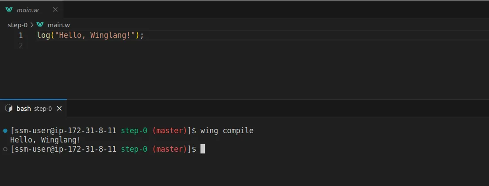
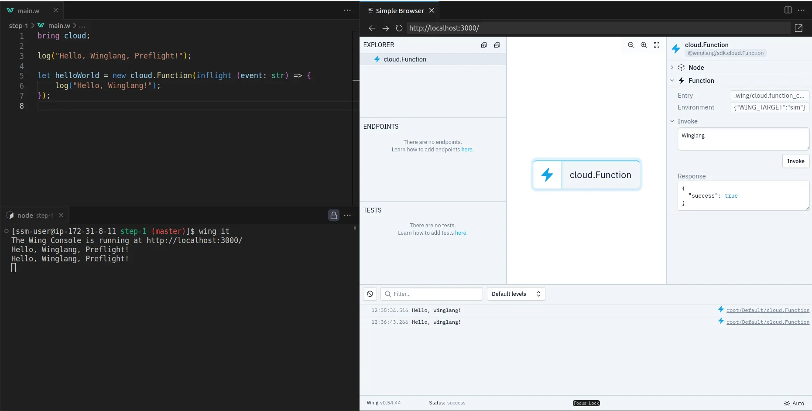
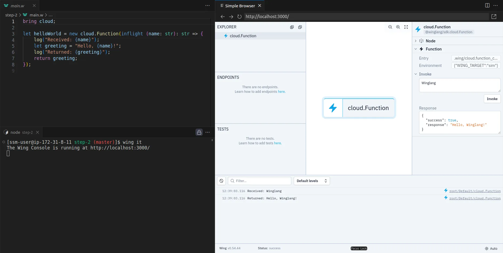
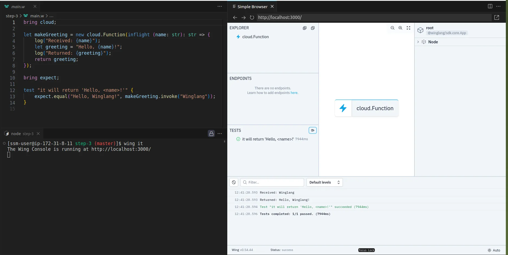
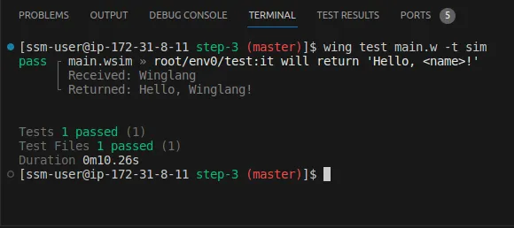
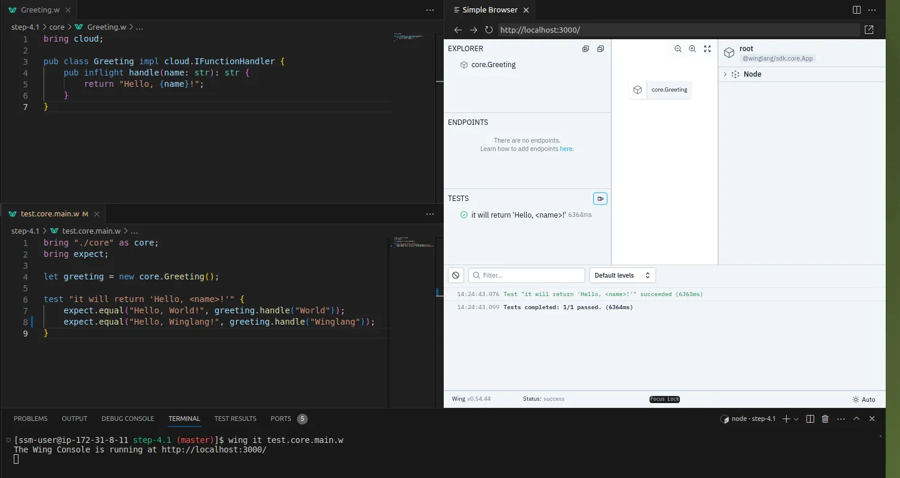
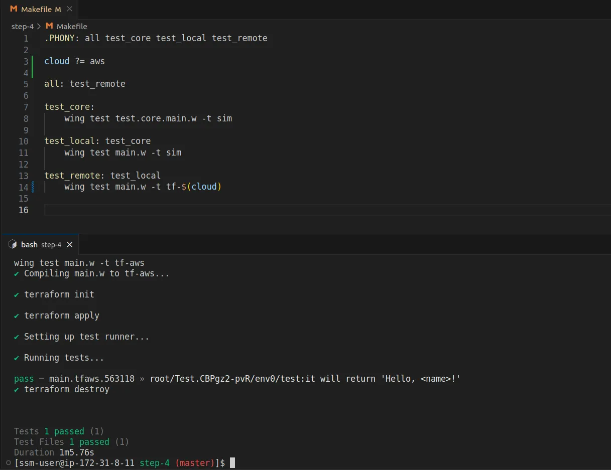
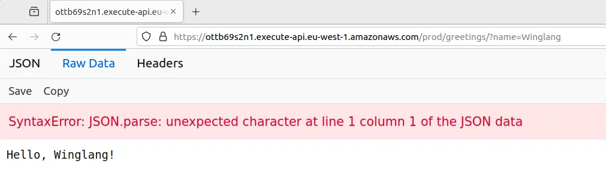
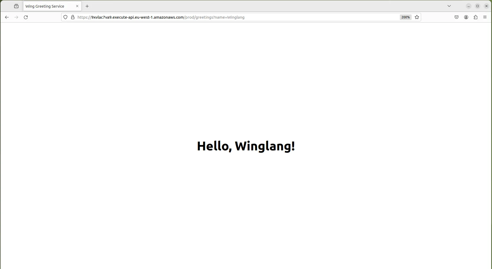

## Exploring Cloud Hexagonal Design with Winglang, TypeScript, and Ports & Adapters

As I argued [elsewhere](https://medium.com/@asher-sterkin/cloud-application-infrastructure-from-code-ifc-398140babf13), automatically generating cloud infrastructure specifications directly from application code represents “The Next Logical Step in Cloud Automation.” This approach, sometimes referred to as “Infrastructure From Code” (IfC), aims to:

> ensure automatic coordination of four types of interactions with cloud services: life cycle management, pre- and post-configuration, consumption, and operation, while making pragmatic choices of the most appropriate levels of API abstraction for each cloud service and leaving enough control to the end-user for choosing the most suitable vendor, based on personal preferences, regulations or brownfield deployment constraints

While analyzing the [IfC Technology Landscape](https://medium.com/@asher-sterkin/ifc-2023-technology-landscape-91e11934f7ab) a year ago, I identified five attributes essential for analyzing major offerings in this space:

- **Programming Language** — is an IfC product based on an existing mainstream programming language(s) or embarks on developing a new one?
- **Runtime Environment** — does it still use some existing runtime environment (e.g. [NodeJS](https://nodejs.org/en))?
- **API** — is it proprietary or some form of standard/open source? Cloud-specific or cloud-agnostic?
- **IDE** — does it assume its proprietary, presumably cloud-based, Integrated Development Environment or could be integrated with one or more of existing IDEs?
- **Deployment** — does it assume deployment applications/services to its own cloud account or produced artifacts could be deployed to the customer’s own cloud account?

At that time, [Winglang](https://github.com/winglang/wing) appeared on my radar as a brand-new cloud programming-oriented language running atop the [NodeJS](https://nodejs.org/en) runtime. It comes with an optional plugin for [VSCode](https://code.visualstudio.com/), its own console, and fully supports cloud self-hosting via popular cloud orchestration engines such as [Terraform](https://www.terraform.io/) and [AWS CDK](https://aws.amazon.com/cdk/).

Today, I want to explore how well [Winglang](https://github.com/winglang/wing) is suited for supporting the [Clean Architecture](https://blog.cleancoder.com/uncle-bob/2012/08/13/the-clean-architecture.html) style, based on the [Hexagonal Ports and Adapters](https://alistair.cockburn.us/hexagonal-architecture/) pattern. Additionally, I’m interested in how easily [Winglang](https://github.com/winglang/wing) can be integrated with [TypeScript](https://www.typescriptlang.org/), a representative of mainstream programming languages that can be compiled into [JavaScript](https://developer.mozilla.org/en-US/docs/Web/JavaScript) and run atop the [NodeJS](https://nodejs.org/en) runtime engine.

## Disclaimer

This publication is a technology research report. While it could potentially be converted into a tutorial, it currently does not serve as one. The code snippets in [Winglang](https://github.com/winglang/wing) are intended to be self-explanatory. The language syntax falls within the common Algol-60 family and is, in most cases, straightforward to understand. In instances of uncertainty, please consult the [Winglang Language Reference](https://www.winglang.io/docs/language-reference), [Library](https://www.winglang.io/docs/category/standard-library), and [Examples](https://github.com/winglang/wing/tree/main/examples). For introductory materials, refer to the [References](#6888).

## Acknowledgements

Many thanks to [Elad Ben-Israel](https://www.linkedin.com/in/hackingonstuff/), [Shai Ber](https://www.linkedin.com/in/shai-ber-245b1226/), and [Nathan Tarbert](https://www.linkedin.com/in/nathan-tarbert/) for the valuable feedback on the early draft of this paper.

## Table of Contents

1.  [Disclaimer](#disclaimer)
2.  [Acknowledgements](#acknowledgements)
3.  [Part One: Creating the Core](#part-one-creating-the-core)  
    3.1 [Step Zero: “Hello, Winglang!” Preflight](#step-zero-hello-winglang-preflight)  
    3.2 [Step One: “Hello, Winglang!” Inflight](#step-one-hello-winglang-inflight)  
    3.3 [Step Two: Generalizing Functionality by Accepting the Argument](#step-two-generalizing-functionality-by-accepting-the-argument)  
    3.4 [Deciding if the Hexagon Approach is Right for You](#deciding-if-the-hexagon-approach-is-right-for-you)
4.  [Part Two: Encapsulating the Core within Hexagon](#part-two-encapsulating-the-core-within-hexagon)  
    4.1 [Step Four: Extracting Core](#step-four-extracting-core)  
    4.2 [Step Five: Extracting the makeGreeting(name) Request Handler](#step-five-extracting-the-makegreetingname-request-handler)  
    4.3 [Step Six: Connecting the Handler via Cloud Function Port](#step-six-connecting-the-handler-via-cloud-function-port)  
    4.4 [Step Seven: Reimplementing the Core in TypeScript](#step-seven-reimplementing-the-core-in-typescript)  
    4.5 [Step Eight: Implementing the REST API Port](#step-eight-implementing-the-rest-api-port)  
    4.6 [Step Nine: Extracting the REST API Request Adapter](#step-nine-extracting-the-rest-api-request-adapter)  
    4.7 [Step Ten: Testing the REST API Request Adapter](#step-ten-testing-the-rest-api-request-adapter)  
    4.8 [Step Eleven: Extracting the GreetingService](#step-eleven-enhancing-the-greetingservice)  
    4.9 [Step Twelve: Enhancing REST API Request Adapter for Content Negotiation](#step-twelve-enhancing-rest-api-request-adapter-for-content-negotiation)
5.  [References](#references)  
    6.1 [Winglang Publications](#winglang-publications)  
    6.2 [My Publications on “Infrastructure From Code”](#my-publications-on-infrastructure-from-code)  
    6.3 [Hexagonal Architecture](#hexagonal-architecture)

## Part One: Creating the Core

## Step Zero: “Hello, Winglang!” Preflight

Creating the simplest possible “Hello, World!” application is a crucial, yet often overlooked, validation step in new software technology. Although such an application lacks practical utility, it reveals the general accessibility of the technology to newcomers. As a marketing wit once told me, “We have only one chance to make a first impression.” So, let’s begin with a straightforward one-liner in [Winglang](https://github.com/winglang/wing).

**About** [**Winglang**](https://github.com/winglang/wing): [Winglang](https://github.com/winglang/wing) is an innovative cloud-oriented programming language designed to simplify cloud application development. It integrates seamlessly with cloud services, offering a unique approach to building and deploying applications directly in the cloud environment. This makes [Winglang](https://github.com/winglang/wing) an intriguing option for developers looking to leverage cloud capabilities more effectively.

Installing [Winglang](https://github.com/winglang/wing) is straightforward, assuming you already have [npm](https://www.npmjs.com/) and [terraform](https://www.terraform.io/) installed and configured on your computer. As a technology researcher, I primarily work with remote desktops. Therefore, I won’t delve into the details of preparing your workstation here. My personal setup, once stabilized, will be shared in a separate publication.

My first step is to create a one-line application that prints the sentence “Hello, Winglang!” In [Winglang](https://github.com/winglang/wing), this is indeed could be done in a single line:

```
log(“Hello, Winglang!”);
```

However, to _execute_ this one line of code, we need to _compile_ it by typing `wing compile`:



[Winglang](https://github.com/winglang/wing) adopts an intriguing approach by distinctly separating the phases of programmatic definition of cloud resources during compilation and their use during runtime. This is articulated in [Winglang](https://github.com/winglang/wing) as [Preflight and Inflight](https://www.winglang.io/docs/concepts/inflights) execution phases.

Simply put, the [Preflight](https://www.winglang.io/docs/concepts/inflights#preflight-code) phase occurs when application code is compiled into a target orchestration engine template, such as a local simulator or [Terraform](https://www.terraform.io/), while the [Inflight](https://www.winglang.io/docs/concepts/inflights#inflight-code) phase is when the application code executes within a Cloud Function or Container.

The ability to use the same syntax for programming the compilation phase and even print logs is quite a unique feature. For comparison, consider the ability to use the same syntax for programming “C” macros or C++ templates to print debugging logs of the compilation phase, just as you would program the runtime phase.

## Step One: “Hello, Winglang!” Inflight

Now, I aim to create the simplest possible application that prints the sentence “Hello, Winglang!” during runtime, that is during the [Inflight](https://www.winglang.io/docs/concepts/inflights#inflight-code) phase. In [Winglang](https://github.com/winglang/wing), accomplishing this requires just a couple of lines, similar to what you’d expect in any mainstream programming language:

```js
bring cloud;

log("Hello, Winglang, Preflight!");

let helloWorld = new cloud.Function(inflight (event: str) => {
    log("Hello, Winglang!");
});
```

By typing wing it in the [VSCode Terminal](https://code.visualstudio.com/docs/terminal/basics), you can bring up the [Winglang](https://github.com/winglang/wing) simulator (I prefer the preview in the editor). Click on `cloud.Function`, then on `Invoke`, and you will see the following:



This is pretty cool and [Winglang](https://github.com/winglang/wing) definitely passes the initial smoke test.

## Step Two: Generalizing Functionality by Accepting the `name`` Argument

To move beyond simply printing static text, we’re going to slightly modify our initial function to return the greeting “Hello,`<name>!`”, where `<name>` is the function’s argument. The updated code, along with the simulator’s output, will look something like this:



Keep in mind, there’s no need to close the simulator. Simply edit the file, hit CTRL+S to save, and the simulator will automatically load the new version.

In today’s world, a system without test automation support hardly has a right to exist. Let’s add some tests to our simple function (now renamed to `makeGreeting`):



Again, there’s no need to close the simulator. The entire process is interactive and flows quite smoothly.

You can also run the tests via the command line in the [VSCode Terminal](https://code.visualstudio.com/docs/terminal/basics):



The same test can also be run automatically in the cloud by typing, for example, `wing test -t tf-aws`. Additionally, the same code can be deployed on a target cloud.

Cloud neutrality support in [Winglang](https://github.com/winglang/wing) is important and fascinating topic, which will be covered in more details in the next [Step Four: Extracting Core](#c484) section.

# Deciding if the Hexagon Approach is Right for You

If all you need is to develop simple [Transaction Scripts](https://martinfowler.com/eaaCatalog/transactionScript.html) that:

- Are triggered by an event happening to a cloud resource, e.g., [REST API Gateway](https://www.winglang.io/docs/standard-library/cloud/api).
- Optionally retrieve data from another Cloud Resource, like a [Blob Storage Bucket](https://www.winglang.io/docs/standard-library/cloud/bucket).
- Perform some very simple calculations.
- Optionally send data to another Cloud Resource, such as a [Blob Storage Bucket](https://www.winglang.io/docs/standard-library/cloud/bucket).
- Can ideally be written once and require minimal maintenance.

Then you may choose to stop here. Explore [Winglang Examples](https://github.com/winglang/wing/tree/main/examples) to see what can be achieved today, and visit [Winglang Issues](https://github.com/winglang/wing/issues) for insights on current limitations and future plans. However, if you’re interested in exploring how [Winglang](https://github.com/winglang/wing) supports complex software architectures with potentially intricate computational logic and long-term support requirements, you are welcome to proceed to Part Two of this publication.

# Part Two: Encapsulating the Core within Hexagon

[Hexagonal Architecture](https://alistair.cockburn.us/hexagonal-architecture/), introduced by [Alistair Cockburn](https://en.wikipedia.org/wiki/Alistair_Cockburn) in 2005, represented a significant shift in the way software applications were structured. Also known as the Ports and Adapters pattern, this architectural style was designed to create a clear separation between an application’s core logic and its external components. It enables applications to be equally driven by users, programs, automated tests, or batch scripts, and allows for development and testing in isolation from runtime devices and databases. By organizing interactions through ‘ports’ and ‘adapters’, the architecture ensures that the application remains agnostic to the nature of external technologies and interfaces. This approach not only prevented the infiltration of business logic into user interface code but also enhanced the flexibility and maintainability of software, making it adaptable to various environments and technologies.

While I believe that [Alistair Cockburn](https://en.wikipedia.org/wiki/Alistair_Cockburn), like many other practitioners, may have misinterpreted the original intent of layered software architecture as introduced by [E.W. Dijkstra](https://en.wikipedia.org/wiki/Edsger_W._Dijkstra) in his seminal work, [“The Structure of ‘THE’ Multiprogramming System”](https://www.eecs.ucf.edu/~eurip/papers/dijkstra-the68.pdf) (a topic I plan to address in a separate publication), the foundational idea he presents remains useful. As I argued in my [earlier publication](https://medium.com/analytics-vidhya/if-your-computer-is-cloud-how-its-operating-system-should-look-like-24f62e274a95), the Ports metaphor aligns well with cloud resources that trigger specific events, while software modules interacting directly with the cloud SDK effectively function as Adapters.

Numerous attempts (see [References](#6888)) have been made to apply [Hexagonal Architecture](https://alistair.cockburn.us/hexagonal-architecture/) concepts to cloud and, more specifically, serverless development. A notable example is the blog post [“Developing Evolutionary Architecture with AWS Lambda,”](https://aws.amazon.com/blogs/compute/developing-evolutionary-architecture-with-aws-lambda/) which showcases a repository structure closely aligned with what I envision. However, even this example employs a more complex application than what I believe is necessary for initial exploration. I firmly hold that we should fully understand and explore the simplest possible applications, at the “Hello, World!” level, before delving into more complex scenarios. With this in mind, let’s examine how far we can go in building a straightforward Greeting Service.

# Step Four: Extracting Core

First and foremost, our goal is to extract the Core and ensure its complete independence from any external dependencies:

```js
bring cloud;

pub class Greeting impl cloud.IFunctionHandler {
    pub inflight handle(name: str): str {
        return "Hello, {name}!";
    }
}
```

At the moment, the [Winglang Module System](https://www.winglang.io/docs/language-reference#4-module-system) does not support public functions. I does, however, support public static class functions, which semantically are equivalent. Unfortunately, I cannot directly pass a public static inflight function to `cloud.Function` (it only works for closures), and I need to implement the `cloud.IFunctionHandler` interface. These limitations are fairly understandable and quite typical for a new programming system.

By extracting the core into a separate module, we can focus on what brings the application to life in the first place. This also enables extensive testing of the core logic independently, as shown below:

```js
bring "./core" as core;
bring expect;

let greeting = new core.Greeting();

test "it will return 'Hello, <name>!'" {
    expect.equal("Hello, World!", greeting.handle("World"));
    expect.equal("Hello, Winglang!", greeting.handle("Winglang"));
}
```

Keeping the simulator up with only the core test allows us to quickly explore application logic and discuss it with stakeholders without worrying about cloud resources. This approach often epitomizes what a true MVP (Minimum Viable Product) is about:



The main file is now streamlined, focusing on system-level packaging and testing:

```js
bring cloud;
bring "./core" as core;


let makeGreeting = new cloud.Function(inflight (name: str): str => {
    log("Received: {name}");
    let greeting = core.Greeting.makeGreeting(name);
    log("Returned: {greeting}");
    return greeting;
});


bring expect;

test "it will return 'Hello, `<name>`!'" {
 expect.equal("Hello, Winglang!", makeGreeting.invoke("Winglang"));
}

```

To consolidate everything, it’s time to introduce a `Makefile` to automate the entire process:

```js

.PHONY: all test_core test_local test_remote

cloud ?= aws

all: test_remote

test_core:
 wing test test.core.main.w -t sim

test_local: test_core
 wing test main.w -t sim

test_remote: test_local
 wing test main.w -t tf-$(cloud)

```

Here, I’ve defined a `Makefile` variable `cloud` with the default value `aws`, which specifies the target cloud platform for remote tests. By using [Terraform](https://www.terraform.io/) as an orchestration engine, I ensure that the same code and `Makefile` will run without any changes on any cloud platform supported by [Winglang](https://github.com/winglang/wing), such as `aws`, `gcp`, or `azure`.

The output of remote testing is worth examining:



As we can see, [Winglang](https://github.com/winglang/wing) automatically converts the [Preflight](https://www.winglang.io/docs/concepts/inflights#preflight-code) code into [Terraform](https://www.terraform.io/) templates and invokes [Terraform](https://www.terraform.io/) commands to deploy the resulting stack to the cloud. It then runs the same test, effectively executing the [Inflight](https://www.winglang.io/docs/concepts/inflights#inflight-code) code on the actual cloud, `aws` in this case, and finally deletes all resources. In such cases, I don't even need to access the cloud console to monitor the process. I can treat the cloud as a supercomputer, working with it through [Winglang](https://github.com/winglang/wing)'s [cross-compilation](https://en.wikipedia.org/wiki/Cross_compiler) mechanism.

The project structure now mirrors our architectural intent:

```js

greeting-service/
│
├── core/
│ └── Greeting.w
│
├── main.w
├── Makefile
└── test.core.main.w

```

# Step Five: Extracting the `makeGreeting(name)` Request Handler

The core functionality should be purely computational, stateless, and free from side effects. This is crucial to ensure that the core does not depend on any external framework and can be fully tested automatically. Introducing states or external side effects would generally hinder this possibility. However, we still aim to isolate application logic from the real environment represented by Ports and Adapters. To achieve this, we introduce a separate Request Handler module, as follows:

```js

bring cloud;
bring "../core" as core;

pub class Greeting impl cloud.IFunctionHandler {
 pub inflight handle(name: str): str {
 log("Received: {name}");
 let greeting = core.Greeting.makeGreeting(name);
 log("Returned: {greeting}");
 return greeting;
 }
}

```

In this case, the `GreetingHandler` is responsible for logging, which is a side effect. In more complex applications, it would communicate with external databases, message buses, third-party services, etc., via Ports and Adapters.

The core logic is now encapsulated as a plain function and is no longer derived from the `cloud.IFunctionHandler` interface:

```js

pub class Greeting {
 pub static inflight makeGreeting(name: str): str {
 return "Hello, {name}!";
 }
}

```

The unit test for the core logic is accordingly simplified:

```js
bring "./core" as core;
bring expect;

test "it will return 'Hello, <name>!'" {
    expect.equal("Hello, World!", core.Greeting.makeGreeting("World"));
    expect.equal("Hello, Wing!", core.Greeting.makeGreeting("Wing"));
}
```

The responsibility of connecting the handler and core logic now falls to the `main.w` module:

```js
bring cloud;
bring "./handlers" as handlers;


let greetingHandler = new handlers.Greeting();
let makeGreetingFunction = new cloud.Function(greetingHandler);

bring expect;

test "it will return 'Hello, <name>!'" {
    expect.equal("Hello, Wing!", makeGreetingFunction.invoke("Wing"));
}
```

Once again, the project structure reflects our architectural intent:

```js
greeting-service/
│
├── core/
│   └── Greeting.w
├── handlers/
│   └── Greeting.w
├── main.w
├── Makefile
└── test.core.main.w
```

It should be noted that for a simple service like Greeting, such an evolved structure could be considered over-engineering and not justified by actual business needs. However, as a software architect, it’s essential for me to outline a general skeleton for a fully-fledged service without getting bogged down in application-specific complexities that might not yet be known. By isolating different system components from one another, we make future system evolution less painful, and in many cases just practically feasible. In such cases, investing in a preliminary system structure by following best practices is fully justified and necessary. As [Grady Booch](https://en.wikipedia.org/wiki/Grady_Booch) famously said, “One cannot refactor a doghouse into a skyscraper.”

In general, keeping core functionality purely stateless and free from side effects, and isolating stateful application behavior with potential side effects into separate handlers, is conceptually equivalent to the [monadic programming](<https://en.wikipedia.org/wiki/Monad_(functional_programming)>) style widely adopted in Functional Programming environments.

# Step Six: Connecting the Handler via Cloud Function Port

We can now remove the direct `cloud.Function` creation from the main module and encapsulate it into a separate `GreetingFunction` port as follows:

```js
bring "./handlers" as handlers;
bring "./ports" as ports;


let greetingHandler = new handlers.Greeting();
let makeGreetingService = new ports.GreetingFunction(greetingHandler);

bring expect;

test "it will return 'Hello, <name>!'" {
    expect.equal("Hello, Wing!", makeGreetingService.invoke("Wing"));
}
```

The `GreetingFunction` is defined in a separate module like this:

```js
bring cloud;

pub class GreetingFunction {
    \_f: cloud.Function;
    new(handler: cloud.IFunctionHandler) {
        this.\_f = new cloud.Function(handler);
    }
    pub inflight invoke(name: str): str {
        return this.\_f.invoke(name);
    }
}
```

This separation of concerns allows the `main.w` module to focus on connecting different parts of the system together. Specific port configuration is performed in a separate module dedicated to that purpose. While such isolation of `GreetingHandler` might seem unnecessary at this stage, it becomes more relevant when considering the nuanced configuration supported by [Winglang cloud.Function](https://www.winglang.io/docs/standard-library/cloud/function), including execution platform (e.g., AWS Lambda vs Container), environment variables, timeout, maximum resources, etc. Extracting the `GreetingFunction` port definition into a separate module naturally facilitates the concealment of these details.

The project structure is updated accordingly:

```js
greeting-service/
│
├── core/
│   └── Greeting.w
├── handlers/
│   └── Greeting.w
├── ports/
│   └── greetingFunction.w
├── main.w
├── Makefile
└── test.core.main.w
```

The adopted naming convention for port modules also allows for the inclusion of multiple port definitions within the same project, enabling the selection of the required one based on external configuration.

# Step Seven: Reimplementing the Core in TypeScript

There are several reasons why a project might consider implementing its core functionality in a mainstream programming language that can still run atop the underlying runtime environment. For example, using [TypeScript](https://www.typescriptlang.org/), which compiles into [JavaScript](https://developer.mozilla.org/en-US/docs/Web/JavaScript), and can be integrated with [Winglang](https://github.com/winglang/wing). Here are some of the most common reasons:

- **Risk Mitigation:** Preserving the core regardless of the cloud programming environment in use.
- **Available Skills:** It’s often easier to find developers familiar with a mainstream language than with a new one.
- **Existing Code Base:** Typical brownfield situations.
- **3rd Party Libraries:** Essential for core functionality, such as specific algorithms.
- **Automation Ecosystem Maturity:** More options are available for exhaustive testing of core functionality in mainstream languages.
- **Support for Specific Styles:** For instance, better support for pure functional programming.

The Greeting service core functionality, redeveloped in [TypeScript](https://www.typescriptlang.org/), would look like this:

```js
export function makeGreeting(name: string): string {
    return \`Hello, ${name}!\`;
}
```

Its unit test, developed using the [jest](https://jestjs.io/) framework, would be:

```js
import { makeGreeting } from "@core/makeGreeting";

describe("makeGreeting", () => {
  it("should return a greeting with the provided name", () => {
    const name = "World";
    const expected = "Hello, World!";
    const result = makeGreeting(name);
    expect(result).toBe(expected);
  });
});
```

To make it accessible to [Winglang](https://github.com/winglang/wing) language modules, a simple wrapper is needed:

```js
pub inflight class Greeting {
    pub extern "../target/core/makeGreeting.js" static inflight  makeGreeting(name: str): str;
}
```

The main technical challenge is to place the compiled [JavaScript](https://developer.mozilla.org/en-US/docs/Web/JavaScript) version where the [Winglang](https://github.com/winglang/wing) wrapper can find it. For this project, I decided to use the `target` folder, where the [Winglang](https://github.com/winglang/wing) compiler puts its artifacts. To achieve this, I created a dedicated `tsconfig.build.json`:

```json
{
    "extends": "./tsconfig.json",
    "compilerOptions": {
      "outDir": "./target",
      // ... production-specific compiler options ...
    },
    "exclude": \[
      "core/\*.test.ts"
    \]
}
```

The `Makefile` was also modified to automate the process:

```js
.PHONY: all install test\_core test\_local test\_remote

cloud ?= aws

all: test\_remote

install:
 npm install

test\_core: install
 npm run test

build\_core: test\_core
 npm run build

test\_local: build\_core
 wing test main.w -t sim

test\_remote: test\_local
 wing test main.w -t tf-$(cloud)
```

The folder structure reflects the changes made:

```js
greeting-service/
│
├── core/
│   └── Greeting.w
│   └── makeGreeting.ts
│   └── makeGreeting.test.ts
├── handlers/
│   └── Greeting.w
├── ports/
│   └── greetingFunction.w
├── jest.config.js
├── main.w
├── Makefile
├── package-lock.json
├── package.json
├── tsconfig.build.json
└── tsconfig.json
```

## Step Eight: Implementing the REST API Port

Now, let’s consider making our Greeting service accessible via a REST API. This could be necessary, for instance, to enable demonstrations from a web browser or to facilitate calls from external services that, due to security or technological constraints, cannot communicate directly with the `GreetingFunction` port. To accomplish this, we need to introduce a new Port definition and modify the `main.w` module, while keeping everything else unchanged:

```js
bring cloud;
bring http;


pub class GreetingApi{
    pub apiUrl: str;

    new(handler: cloud.IFunctionHandler) {
        let api = new cloud.Api();

        api.get("/greetings", inflight (request: cloud.ApiRequest): cloud.ApiResponse => {
            return cloud.ApiResponse{
                status: 200,
                body: handler.handle(request.query.get("name"))
            };
        });

        this.apiUrl = api.url;
    }

    pub inflight invoke(name: str): str {
        let result = http.get("{this.apiUrl}/greetings?name={name}");
        assert(200 == result.status);
        return result.body;
    }

}
```

To maintain a consistent testing interface, I implemented an `invoke` method that functions similarly to the `GreetingFunction` port. This design choice is not mandatory but rather a matter of convenience to minimize the amount of change.

The `main.w` module now allocates the `GreetingApi` port:

```js
bring "./handlers" as handlers;
bring "./ports" as ports;


let greetingHandler = new handlers.Greeting();
let makeGreetingService = new ports.GreetingApi(greetingHandler);

bring expect;

test "it will return 'Hello, <name>!'" {
    expect.equal("Hello, Wing!", makeGreetingService.invoke("Wing"));
}
```

Since there is now something to use externally, the `Makefile` was modified to include `deploy` and `destroy` targets,as follows:

```js

.PHONY: all install test\_core build\_core update test\_adapters test\_local test\_remote compile tf-init deploy destroy

cloud ?= aws
target := target/main.tf$(cloud)

all: test\_remote

install:
 npm install

test\_core: install
 npm run test

build\_core: test\_core
 npm run build

update:
 sudo npm update -g wing

test\_adapters: update
 wing test test.adapters.main.w -t sim

test\_local: build\_core test\_adapters
 wing test test.main.w -t sim

test\_remote: test\_local
 wing test test.main.w -t tf-$(cloud)

compile:
 wing compile main.w -t tf-$(cloud)

tf-init: compile
 ( \\
  cd $(target) ;\\
  terraform init \\
 )

deploy: tf-init
 ( \\
  cd $(target) ;\\
  terraform apply -auto-approve \\
 )

destroy:
 ( \\
  cd $(target) ;\\
  terraform destroy -auto-approve \\
 )
```

The browser screen looks almost as expected, but notice a strange `JSON.parse` error message (will be addressed in the forthcoming section):

The project structure is updated to reflect these changes:



```js
greeting-service/
│
├── core/
│   └── Greeting.w
│   └── makeGreeting.ts
│   └── makeGreeting.test.ts
├── handlers/
│   └── Greeting.w
├── ports/
│   └── greetingApi.w
│   └── greetingFunction.w
├── jest.config.js
├── main.w
├── Makefile
├── package-lock.json
├── package.json
├── tsconfig.build.json
└── tsconfig.json
```

## Step Nine: Extracting the REST API Request Adapter

The `GreetingApi` port implementation introduced in the previous section slightly violates the [Single Responsibility Principle](https://en.wikipedia.org/wiki/Single_responsibility_principle), which states: “A class should have only one reason to change.” Currently, there are multiple potential reasons for change:

1.  **HTTP Routing Conventions:** URL path with or without variable parts.
2.  **HTTP Request Processing.**
3.  **HTTP Response Formatting.**

We can generally agree that while HTTP Request Processing and HTTP Response Formatting are closely related, HTTP Routing stands apart. To decouple these functionalities, we introduce an `ApiAdapter` responsible for converting `cloud.ApiRequest` to `cloud.ApiResponse`, thereby extracting this functionality from the `GreetingApi` port.

To achieve this, we introduce a new `IRestApiAdapter` interface:

```js
bring cloud;


pub interface IRestApiAdapter {
    inflight handle(request: cloud.ApiRequest): cloud.ApiResponse;
}
```

The `GreetingApiAdapter` class is defined as follows:

```js
bring cloud;
bring "./IRestApiAdapter.w" as restApiAdapter;

pub class GreetingApiAdapter impl restApiAdapter.IRestApiAdapter {
    \_h: cloud.IFunctionHandler;
    new(handler: cloud.IFunctionHandler) {
        this.\_h = handler;
    }
    inflight pub handle(request: cloud.ApiRequest): cloud.ApiResponse {
        return cloud.ApiResponse{
            status: 200,
            body: this.\_h.handle(request.query.get("name"))
        };
    }
}
```

The modified `GreetingApi` port class is now:

```js
bring cloud;
bring http;
bring "../adapters/IRestApiAdapter.w" as restApiAdapter;

pub class GreetingApi{
    \_apiUrl: str;
    \_adapter: restApiAdapter.IRestApiAdapter;
    new(adapter: restApiAdapter.IRestApiAdapter) {
        let api = new cloud.Api();
        this.\_adapter = adapter;

        api.get("/greetings", inflight (request: cloud.ApiRequest): cloud.ApiResponse => {
            return this.\_adapter.handle(request);
        });
        this.\_apiUrl = api.url;
    }
    pub inflight invoke(name: str): str {
        let result = http.get("{this.\_apiUrl}/greetings?name={name}");
        assert(200 == result.status);
        return result.body;
    }
}
```

The `main.w` module is updated accordingly:

```js
bring "./handlers" as handlers;
bring "./ports" as ports;
bring "./adapters" as adapters;

let greetingHandler = new handlers.Greeting();
let greetingStringAdapter = new adapters.GreetingApiAdapter(greetingHandler);
let makeGreetingService = new ports.GreetingApi(greetingStringAdapter);
bring expect;
test "it will return 'Hello, <name>!'" {
    expect.equal("Hello, Wing!", makeGreetingService.invoke("Wing"));
}
```

The project structure reflects these changes:

```js
greeting-service/
│
├── adapters/
│   └── greetingApiAdapter.w
│   └── IRestApiAdapter.w
├── core/
│   └── Greeting.w
│   └── makeGreeting.ts
│   └── makeGreeting.test.ts
├── handlers/
│   └── Greeting.w
├── ports/
│   └── greetingApi.w
│   └── greetingFunction.w
├── jest.config.js
├── main.w
├── Makefile
├── package-lock.json
├── package.json
├── tsconfig.build.json
└── tsconfig.json
```

## Step Ten: Testing the REST API Request Adapter

Extracting the `GreetingApiAdapter` from the `GreetingApi` port might seem like a purist action, performed to demonstrate the potential value of Adapters, even if artificially and not strictly necessary. However, this perspective changes when we consider serious testing. The `GreetingApiAdapter` implementation from the previous section assumes that the `name` argument always comes within the `query` part of the HTTP request. But what happens if it doesn't? The system will crash, while according to standard it should respond with the [HTTP 400 (Bad Request)](https://developer.mozilla.org/en-US/docs/Web/HTTP/Status/400) status code in such cases. The modified structure allows us to introduce a separate unit test fully dedicated to testing the `GreetingApiAdapter`:

```js
bring cloud;
bring expect;
bring "./adapters" as adapters;
bring "./handlers" as handlers;

let greetingHandler = new handlers.Greeting();
let greetingStringAdapter = new adapters.GreetingStringRestApiAdapter(greetingHandler);

test "it will return 200 and correct answer when name supplied" {
    let request = cloud.ApiRequest{
        method: cloud.HttpMethod.GET,
        path: "/greetings",
        query: {"name" => "Wing"},
        vars: {}
    };
    let response = greetingStringAdapter.handle(request);
    expect.equal(200, response.status);
    expect.equal("Hello, Wing!", response.body);
}

test "it will return 400 and error message when name is not supplied" {
    let request = cloud.ApiRequest{
        method: cloud.HttpMethod.GET,
        path: "/greetings",
        query: {"somethingElse" => "doesNotMatter"},
        vars: {}
    };
    let response = greetingStringAdapter.handle(request);
    expect.equal(400, response.status);
    expect.equal("Query name=<name> is missing", response.body);
}
```

Running this test with the existing implementation will result in failure, necessitating the following changes:

```js
bring cloud;
bring "./IRestApiAdapter.w" as restApiAdapter;


pub class GreetingStringRestApiAdapter impl restApiAdapter.IRestApiAdapter {
    \_h: cloud.IFunctionHandler;

    new(handler: cloud.IFunctionHandler) {
        this.\_h = handler;
    }

    inflight pub handle(request: cloud.ApiRequest): cloud.ApiResponse {
        if let name = request.query.tryGet("name") {
            return cloud.ApiResponse{
                status: 200,
                body: this.\_h.handle(name)
            };
        } else {
            return cloud.ApiResponse{
                status: 400,
                body: "Query name=<name> is missing"
            };
        }
    }
}
```

The main lesson from this story is that system complexity can exist in multiple places, not always within the core logic. Separation of concerns aids in managing this complexity through dedicated and isolated test suites.

# Step Eleven: Extracting the `GreetingService`

After all the modifications made, the resulting version of the `main.w` module has become quite complex, incorporating the logic of wiring system handlers, ports, and adapters. Additionally, maintaining end-to-end system tests within the same module is only feasible up to a point. Different testing and production environments may be necessary to address various security and cost considerations. To tackle these issues, it's advisable to extract the `GreetingService` configuration into a separate module:

```js
bring "./handlers" as handlers;
bring "./ports" as ports;
bring "./adapters" as adapters;


pub class Greeting {
    pub api: ports.GreetingApi;

    new() {
        let greetingHandler = new handlers.Greeting();
        let greetingStringAdapter = new adapters.GreetingStringRestApiAdapter(greetingHandler);
        this.api = new ports.GreetingApi(greetingStringAdapter);
    }
}
```

Ideally, the creation of the Greeting service object should be implemented using a static method, following the [Factory Method](https://en.wikipedia.org/wiki/Factory_method_pattern) design pattern. However, I encountered difficulties in this approach, as [Preflight](https://www.winglang.io/docs/concepts/inflights#preflight-code) static functions require a context, which I was unable to determine how to obtain. Nonetheless, even in this form, extracting the Greeting service class opens up multiple possibilities for different configurations in testing and production environments. The main.w module can now be relieved of the testing code:

```js
bring "./service.w" as service;


let greetingService = new service.Greeting();
```

The system end-to-end test is now placed in its dedicated `test.main.w` module:

```js
bring "./service.w" as service;

let greetingService = new service.Greeting();
bring expect;
test "it will return 'Hello, <name>!'" {
    expect.equal("Hello, Wing!", greetingService.api.invoke("Wing"));
}
```

In this case, code duplication is minimal, and as previously mentioned, a real system will have different configurations for test and production environments. The detailed specifications for these will be passed to the `Greeting` service class constructor.

## Step Twelve: Enhancing REST API Request Adapter for Content Negotiation

Now, I aim to put the resulting architecture to the final test by partially implementing [HTTP Content Negotiation](https://developer.mozilla.org/en-US/docs/Web/HTTP/Content_negotiation). Specifically, the `Greeting` service should support returning a greeting statement as plain text, HTML, or JSON, depending on the client's request. The appropriate way to express these requirements is to modify the `GreetingApiAdapter` unit test as follows:

```js
bring cloud;
bring expect;
bring "./adapters" as adapters;
bring "./handlers" as handlers;

let greetingHandler = new handlers.Greeting();
let greetingStringAdapter = new adapters.GreetingApiAdapter(greetingHandler);

test "it will return 200 and plain text answer when name is supplied without headers" {
    let request = cloud.ApiRequest{
        method: cloud.HttpMethod.GET,
        path: "/greetings",
        query: {"name" => "Wing"},
        vars: {}
    };
    let response = greetingStringAdapter.handle(request);
    expect.equal(200, response.status);
    expect.equal("Hello, Wing!", response.body);
    expect.equal("text/plain", response.headers?.get("Content-Type"));
}

test "it will return 200 and json answer when name is supplied with headers Accept: application/json" {
    let request = cloud.ApiRequest{
        method: cloud.HttpMethod.GET,
        path: "/greetings",
        query: {"name" => "Wing"},
        headers: {"Accept" => "application/json"},
        vars: {}
    };
    let response = greetingStringAdapter.handle(request);
    expect.equal(200, response.status);
    expect.equal("application/json", response.headers?.get("Content-Type"));
    let data = Json.tryParse(response.body);
    let expected = Json.stringify(Json {
        greeting: "Hello, Wing!"
    });
    expect.equal(expected, response.body);
}

test "it will return 200 and html answer when name is supplied with headers Accept: text/html" {
    let request = cloud.ApiRequest{
        method: cloud.HttpMethod.GET,
        path: "/greetings",
        query: {"name" => "Wing"},
        headers: {"Accept" => "text/html"},
        vars: {}
    };
    let response = greetingStringAdapter.handle(request);
    expect.equal(200, response.status);
    expect.equal("text/html", response.headers?.get("Content-Type"));
    let body = response.body ?? "";
    assert(body.contains("Hello, Wing!"));
}

test "it will return 400 and error message when name is not supplied" {
    let request = cloud.ApiRequest{
        method: cloud.HttpMethod.GET,
        path: "/greetings",
        query: {"somethingElse" => "doesNotMatter"},
        vars: {}
    };
    let response = greetingStringAdapter.handle(request);
    expect.equal(400, response.status);
    expect.equal("Query name=<name> is missing", response.body);
    expect.equal("text/plain", response.headers?.get("Content-Type"));
}
```

Suddenly, having a separate class for HTTP request/response handling doesn’t seem like a purely theoretical exercise, but rather a very pragmatic architectural decision. To make these tests pass, substantial modifications are needed in the `GreetingApiAdapter` class:

```js
bring cloud;
bring "./IRestApiAdapter.w" as restApiAdapter;
bring "../core" as core;


pub class GreetingApiAdapter impl restApiAdapter.IRestApiAdapter {
    \_h: cloud.IFunctionHandler;

    new(handler: cloud.IFunctionHandler) {
        this.\_h = handler;
    }

    inflight static \_textPlain(greeting: str): str {
        return greeting;
    }

    inflight static \_applicationJson(greeting: str): str {
        let responseBody = Json {
            greeting: greeting
        };
        return Json.stringify(responseBody);
    }

    inflight \_findContentType(formatters: Map<inflight (str): str>, headers: Map<str>): str {
        let contentTypes = (headers.tryGet("Accept") ?? "").split(",");
        for ct in contentTypes {
            if formatters.has(ct) {
                return ct;
            }
        }
        return "text/plain";
    }

    inflight \_buildOkResponse(headers: Map<str>, name: str): cloud.ApiResponse {
        let greeting = this.\_h.handle(name) ?? "";  // TODO: guard against empty greeting or what??
        let formatters = {
            "text/plain" => GreetingApiAdapter.\_textPlain,
            "text/html"  => core.Greeting.formatHtml,
            "application/json" => GreetingApiAdapter.\_applicationJson
        };
        let contentType = this.\_findContentType(formatters, headers);
        return cloud.ApiResponse{
            status: 200,
            body: formatters.get(contentType)(greeting),
            headers: {"Content-Type" => contentType}
        };
    }

    inflight pub handle(request: cloud.ApiRequest): cloud.ApiResponse {
        if let name = request.query.tryGet("name") {
            return this.\_buildOkResponse(request.headers ?? {}, name);
        } else {
            return cloud.ApiResponse{
                status: 400,
                body: "Query name=<name> is missing",
                headers: {"Content-Type" => "text/plain"}
            };
        }
    }
}
```

Notice how quickly the complexity escalates. We’re not done yet, as we need a proper HTML formatter. The easiest way to implement it seemed to be in [TypeScript](https://www.typescriptlang.org/), so I decided to place it in the core package:

```js
export function formatHtml(greeting: string): string {
    return \`
    <!DOCTYPE html>
    <html lang="en">
    <head>
        <meta charset="UTF-8">
        <meta name="viewport" content="width=device-width, initial-scale=1.0">
        <title>Wing Greeting Service</title>

        <!-- Tailwind CSS Play CDN https://tailwindcss.com/docs/installation/play-cdn -->
        <script src="https://cdn.tailwindcss.com"></script>
    </head>
    <body class="flex items-center justify-center h-screen">
        <div class="text-center", id="greeting">
            <h1 class="text-2xl font-bold">${greeting}</h1>
        </div>
    </body>
    </html>
    \`
}
```

There is, of course, a separate unit test for it:

```js
import { formatHtml } from "@core/formatHtml";

describe("formatHtml", () => {
  it("should return a properly formatted HTML greeting page", () => {
    const greeting = "Hello, World!";
    const result = formatHtml(greeting);
    expect(result).toContain(greeting);
  });
});
```

Placing the HTML response formatter in the core package could be debated as a violation of [Hexagonal Architecture](https://alistair.cockburn.us/hexagonal-architecture/) principles. Indeed, formatting an HTML response doesn’t seem to belong to the core application logic. Technically, relocating it wouldn’t be too hard, and in a larger real-world system, that’s probably what should be done. However, I chose to place it there to consolidate all [TypeScript](https://www.typescriptlang.org/)\-related components in one place and to test and build them through the same set of `Makefile` targets.

Now, the browser gets response in format it could understand and render properly:



As stated at the outset, the objectives of this technology research report were to explore:

- How well [Winglang](https://github.com/winglang/wing) supports the [Clean Architecture](https://blog.cleancoder.com/uncle-bob/2012/08/13/the-clean-architecture.html) style, based on the [Hexagonal Ports and Adapters](https://alistair.cockburn.us/hexagonal-architecture/) pattern.
- The ease of integrating [Winglang](https://github.com/winglang/wing) with [TypeScript](https://www.typescriptlang.org/), a mainstream programming language that compiles into [JavaScript](https://developer.mozilla.org/en-US/docs/Web/JavaScript) and runs on the [NodeJS](https://nodejs.org/en) runtime engine.

The exploration was conducted using the simplest “Hello, World!” application, which evolved into the `GreetingService` through twelve incremental steps, each introducing a minor modification to the previous code base. This resulted in the following project structure:

```js
greeting-service/
│
├── adapters/
│   └── greetingApiAdapter.w
│   └── IRestApiAdapter.w
├── core/
│   └── Greeting.w
│   └── makeGreeting.ts
│   └── makeGreeting.test.ts
├── handlers/
│   └── Greeting.w
├── ports/
│   └── greetingApi.w
│   └── greetingFunction.w
├── jest.config.js
├── main.w
├── Makefile
├── package-lock.json
├── package.json
├── service.w
├── test.adapters.main.w
├── test.main.w
├── tsconfig.build.json
└── tsconfig.json
```

In my view, this structure reflects the overall service architecture quite well. As a minor improvement, I would consider relocating the [TypeScript](https://www.typescriptlang.org/) related files to a sub-level within the `core` folder.

Overall, the [Winglang Module System](https://www.winglang.io/docs/language-reference#4-module-system) passed the initial test, providing substantial support for the separation of concerns as prescribed by the [Hexagonal Ports and Adapters](https://alistair.cockburn.us/hexagonal-architecture/) pattern. It also offers reasonable support for interoperability with [NodeJS](https://nodejs.org/en) runtime engine-based languages, such as [TypeScript](https://www.typescriptlang.org/). My wish list for potential improvements includes:

- Support for [Preflight](https://www.winglang.io/docs/concepts/inflights#preflight-code) static functions in modules other than `main.w`, essential for the effective implementation of the [Factory Method](https://en.wikipedia.org/wiki/Factory_method_pattern) design pattern, crucial for supporting non-trivial service configurations.
- Automatic lifting of [Inflight](https://www.winglang.io/docs/concepts/inflights#inflight-code) static functions in modules other than `main.w` (this worked for [TypeScript](https://www.typescriptlang.org/) external functions), to eliminate the need for some extra boilerplate.
- Automatic generation of [Winglang](https://www.winglang.io/) wrappers for external functions.

This report evaluates the [Winglang](https://github.com/winglang/wing) programming language for implementing one sequential _stage_ of a more general [Staged Event-Driven Architecture (SEDA)](https://en.wikipedia.org/wiki/Staged_event-driven_architecture). The assessment of how well [Winglang](https://github.com/winglang/wing) supports the full-fledged Event-Driven part and asynchronous stage implementation (most likely for Handlers) will be the subject of future research. Stay tuned.

# References

## Winglang Publications

1.  Elad Ben-Israel, [“Cloud, why so difficult?”](https://medium.com/@hackingonstuff/cloud-why-so-difficult-%EF%B8%8F-4e9ef1446a64)
2.  Pouya Hallaj, [“Wing: Programing language for the cloud”](https://medium.com/@pouyahallaj/wing-programing-language-for-the-cloud-5b8e52348b17)
3.  Artem Sokhin, [“Revolutionize Cloud Programming with Wing: A New Cloud-Oriented Language”](https://artemsokhin.medium.com/cloud-oriented-language-or-deploy-your-infrastructure-anywhere-with-wing-34f1d32bf336)
4.  Jin, [“Wing Language: Streamlining Cloud-Oriented Programming for Human-AI Collaboration”](https://medium.com/p/ffc4ec57a192)
5.  Sebastian Korfmann, [“A Cloud Development Troubleshooting Treasure Hunt”](https://dev.to/skorfmann/a-cloud-development-troubleshooting-treasure-hunt-495c)
6.  Jesse Warden, [“Wing — Programming Language for the Cloud”](https://www.linkedin.com/pulse/wing-programming-language-cloud-jesse-warden/)
7.  Shai Ber, [“Winglang: Cloud Development Programming for the AI Era”](https://thenewstack.io/winglang-cloud-development-programming-for-the-ai-era/)

## My Publications on “Infrastructure From Code”

1.  Asher Sterkin, [“If your Computer is the Cloud, what should its Operating System look like?”](https://medium.com/analytics-vidhya/if-your-computer-is-cloud-how-its-operating-system-should-look-like-24f62e274a95)
2.  Asher Sterkin, [“Cloud Application Infrastructure from Code (IfC): The Next Logical Step in Cloud Automation”](https://medium.com/@asher-sterkin/cloud-application-infrastructure-from-code-ifc-398140babf13)
3.  Asher Sterkin, [“4 Pillars of the “Infrastructure from Code”](https://medium.com/@asher-sterkin/4-pillars-of-the-infrastructure-from-code-5146c8f1dd59)
4.  Asher Sterkin, [“IfC-2023: Technology Landscape”](https://medium.com/@asher-sterkin/ifc-2023-technology-landscape-6953ff9ab9e5)

## Hexagonal Architecture

1.  Alistar Cockburn, [“Hexagonal architecture”](https://alistair.cockburn.us/hexagonal-architecture/)
2.  Robert C. Martin, [“Clean Architecture”](https://blog.cleancoder.com/uncle-bob/2012/08/13/the-clean-architecture.html)
3.  Krzysztof Słomka, [“Hexagonal Architecture with Nest.js and TypeScript”](https://kisztof.medium.com/hexagonal-architecture-with-nest-js-and-typescript-f181cc7b6452)
4.  Sairyss, [“Domain-Driven Hexagon”](https://github.com/Sairyss/domain-driven-hexagon)
5.  Carlos Cunha, [“A Hexagonal Approach to Writing Microservices for Scalable and Decentralized Business: How to use Ports and Adapter with TypeScript”](https://betterprogramming.pub/how-to-ports-and-adapter-with-typescript-32a50a0fc9eb)
6.  Walid Karray, [“Building a Todo App with TypeScript Using Clean Architecture: A Detailed Look at the Directory Structure”](https://medium.com/@walid.karray/building-a-todo-app-with-typescript-using-clean-hexagonal-architecture-a-detailed-look-at-the-d9e177f9f31)
7.  Andy Blackledge, [“Hexagonal Architecture with CDK, Lambda, and TypeScript”](https://aws.hashnode.com/hexagonal-architecture-with-cdk-lambda-and-typescript)
8.  Dyarlen Iber, [“Hexagonal Architecture and Clean Architecture (with examples)”](https://dev.to/dyarleniber/hexagonal-architecture-and-clean-architecture-with-examples-48oi)
9.  Khalil Stemmler, [“Clean Node.js Architecture”](https://khalilstemmler.com/articles/enterprise-typescript-nodejs/clean-nodejs-architecture/)
10. James Beswick, Luca Mezzalira, [“Developing evolutionary architecture with AWS Lambda”](https://aws.amazon.com/blogs/compute/developing-evolutionary-architecture-with-aws-lambda/)
11. Adam Fanello, [“Hexagonal Architecture by Example (in TypeScript)**”**](https://github.com/onicagroup/hexagonal-example)
12. Royi Benita, [“Clean Node.js Architecture — With NestJs and TypeScript”](https://betterprogramming.pub/clean-node-js-architecture-with-nestjs-and-typescript-34b9398d790f)
