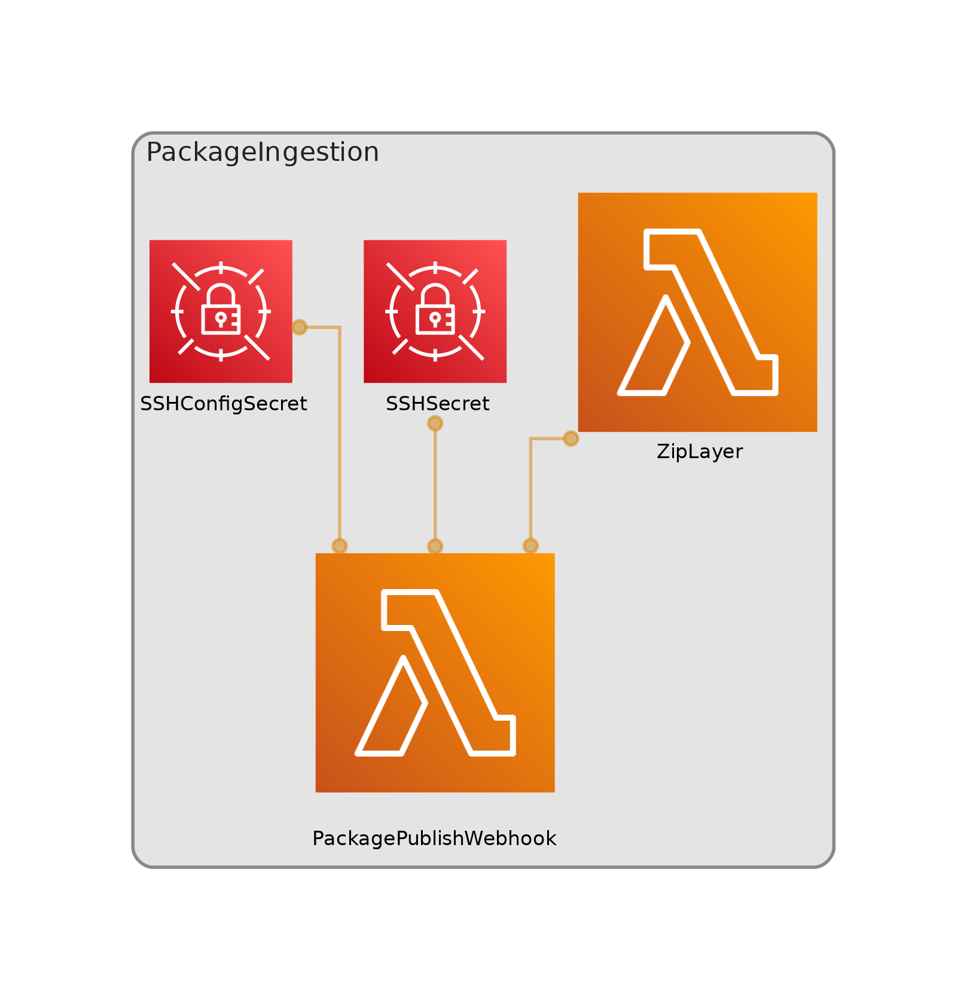

# Docs Infrastructure

This project is the infrastructure to support the docs website.

## Reference Docs Webhook (PackageIngestion)

A webhook has been set up to respond to releases of the WingSDK. When a new release is created:

* retrieve those release assets
* the API.md file is extracted and headmatter is added
* copied into the docs/reference/WingSDK.md 
* copied into the docs/reference/previous_versions/WingSDK/<release>.md
* branch is created named `docs/wingsdk-<release>`
* create a PR

After the PR is created a workflow will deploy it to a GitHub Pages site for testing.

Mergify will automatically merge the PR.



### Configuring

There are two secrets used to configure this webhook. 

The `SSHConfigSecret` secret:

```json
{
  "pat":"ghp_01234....",
  "username":"monadabot",
  "email":"monadabot@monada.co"
}
```

The GitHub PAT should have full access to the winglang-docs repo.

The `SSHSecret` secret stored an SSH private key for use by the Lambda to authenticate against GitHub for SSH access.
The public keys needs to be registered against a user that has full read/write access to the winglang-docs repo.


# Contributing

Make changes, run tests.
